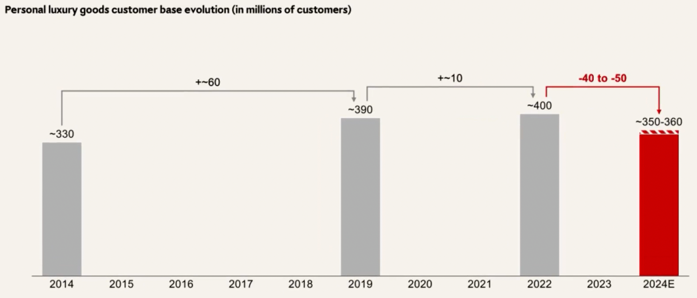
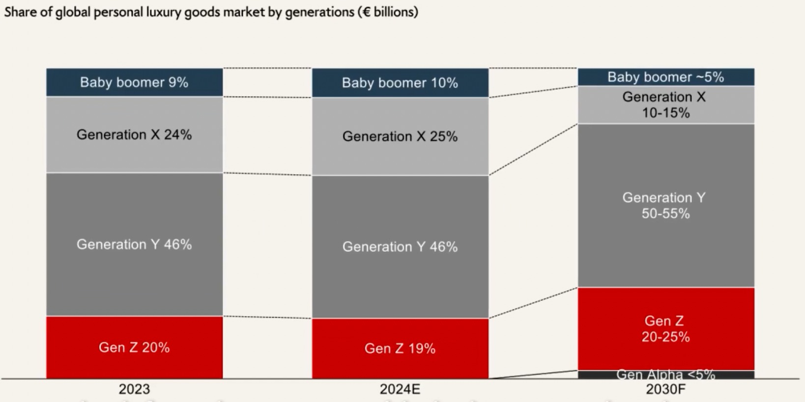
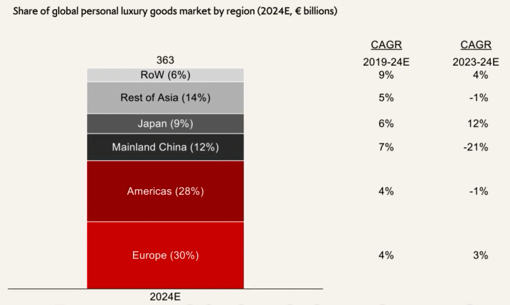
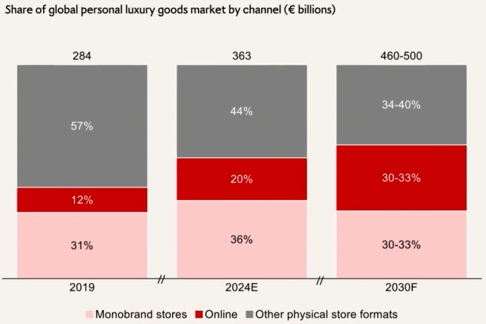
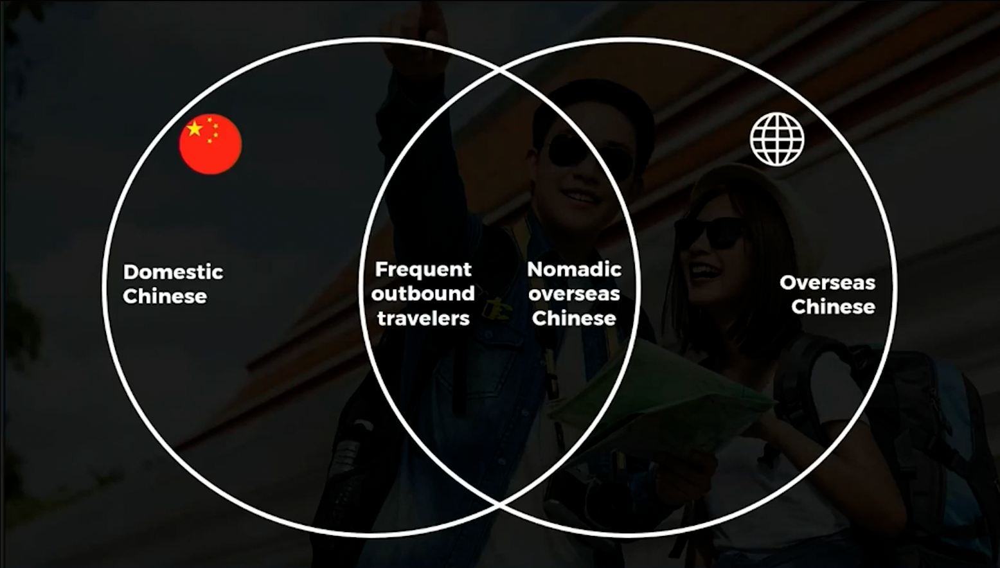
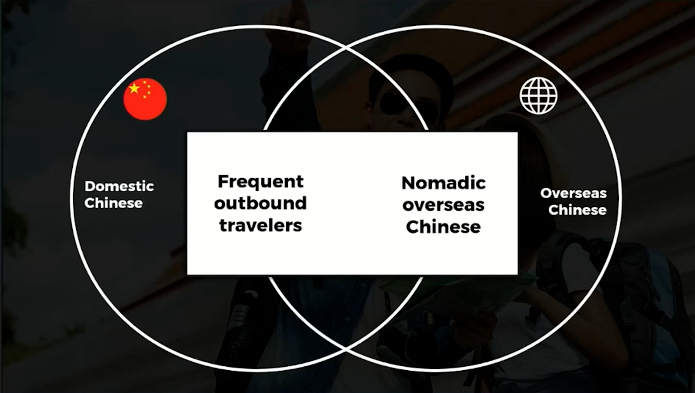
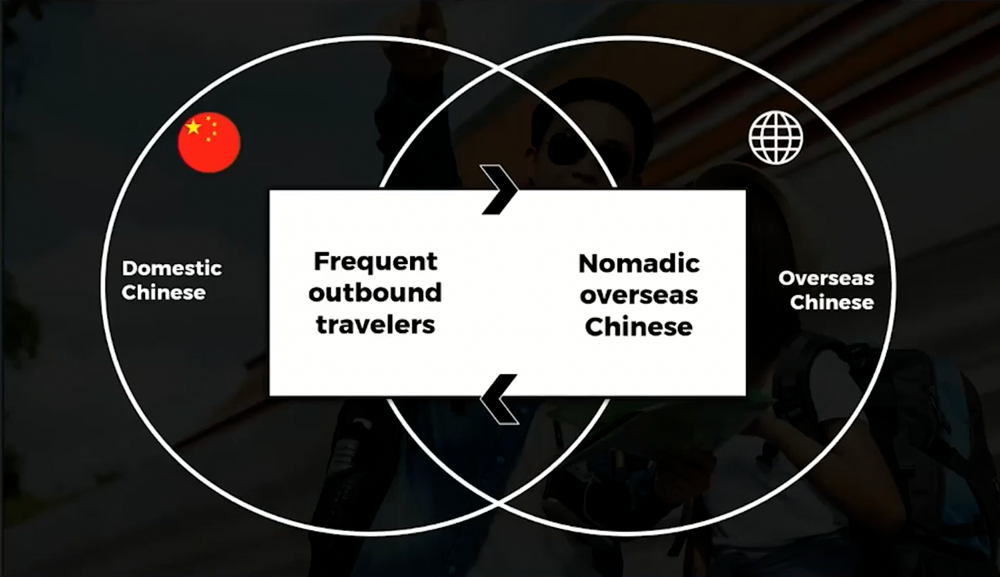

# LVMH & the Luxury Industry
## Welcome

### Welcome to your INSIDE LVMH Certificate
Dear learner,

At LVMH, we are committed to transmit our passion, knowledge and savoir-faire to the next generations of talents.

This learning program is designed to deep dive into the fundamentals of LVMH and the Luxury Industry. Cultivate the essential knowledge to boost your candidate profile!

Through your chosen path, you will gain invaluable insights into the trends and key challenges shaping the luxury industry today and tomorrow.
Furthermore, you will have the privilege to uncover the inner workings of our teams and Maisons all around the world.

But before you deep dive into the first module,

#### YOUR CERTIFICATE JOURNEY
- LVMH & THE LUXURY INDUSTRY
- LUXURY & SOCIETY
- ELECTIVE 1
- ELECTIVE 2
- FINAL ASSESSMENT

#### HOW THE LEARNING JOURNEY WORKS
- **EACH COURSE** includes activities and quizzes
- **A MINIMUM SCORE OF 70%** is required to validate each course's quizzes
- **UNLIMITED ATTEMPTS** for the course's quizzes
- **FINAL ASSESSMENT UNLOCKS** after completion of all 4 courses
- **A MINIMUM SCORE OF 70%** is required to validate the Final Assessment
- **1 ATTEMPT ONLY** is allowed for the Final Assessment

#### SOME TIPS ON THE COURSES
- Your **INSIDE LVMH Certificate** is composed of 4 courses (such as **LVMH & THE LUXURY INDUSTRY**) and **1 Final Assessment**.
- Each one of them is broken into sections like **LVMH AT A GLANCE** and several activities.
- All sections must be completed in order. To access an activity, simply click on its title.
- You can track your progress via the indicators, which change from grey to green once the activity has been completed.

#### SOME TIPS TO KEEP IN MIND
- Use < and > icons to move from one page to another
- On certain pages, click on the blue button to learn more
- At the end of each activity, click on the blue button to continue

### Welcome to your first course

In the first course, you will discover the world of LVMH and get an overview of the luxury industry through several modules:
1. **LVMH at a glance**: To begin, challenge yourself and reflect on your knowledge of the Group and our Maisons.
2. **LVMH business sectors and Maisons**: From our business sectors to our iconic Maisons, we will give you a first glimpse of the unparalleled LVMH ecosystem and our unique business model.
3. **People at heart**: At LVMH, people make the difference. Discover how LVMH talents are the key assets for the success of the Group.
4. **Immersion into the luxury industry**: This section focuses first on the definition of luxury and provides an overview of important figures, trends, and stakes.
5. **Test your knowledge**: A 10-question quiz to assess your understanding of LVMH and the luxury industry. You need at least 70% right answers to pass and can retake it several times.

## LVMH AT A GLANCE

### How much do you know about LVMH?
LVMH is the world leader in luxury and has since its founding in 1987, deployed a business model marked by creative momentum and a constant quest for excellence. LVMH owns more than 75 exceptional Maisons, each of which creates high quality products and experiences. It is the only Group present in all six major sectors of the luxury market: Wines and Spirits, Fashion and Leather Goods, Perfumes and Cosmetics, Watches and Jewelry, Selective Retailing and Other Activities that include hospitality. The Group drives long term momentum to develop its 75 Maisons, respecting their distinctive identities. Throughout the world, they are all ambassadors of our vision of crafting dreams. Welcome to the LVMH family!

- LVMH was founded in **1987**, ushering in a **new era for the luxury industry**. The Group had 10 Maisons, 12,000 employees and a revenue sales of 3 billion euros at that time.
- LVMH was created in **1987** through the merger of Moët Hennessy and Louis Vuitton.
- **Bernard Arnault** has led the LVMH Group since **1989**.
- LVMH is the **world leader in luxury**, distinguished by an **unprecedented portfolio of iconic brands** that makes it **unique**. LVMH is also a **family-run group**, which strives to ensure the long-term development of each of its Maisons in keeping with their **identity**, their **heritage** and their **expertise**.
- LVMH is home to **more than 75 distinguished Maisons**. LVMH's Maisons maintain a focus on **high-quality products and experiences** while honoring their unique heritage.
- LVMH is the only group present in all **6 major business sectors** of the luxury industry. You will discover each business sector as you delve into this module.
- **Kenzo**, **Benefit**, **Cosmetics**, **Fred**, **Le Bon Marché**, **Belmond**, and **Chandon** are all part of the LVMH ecosystem.
- With **215,000** employees across **81 countries** and representing **over 190 nationalities**, LVMH provides an unparalleled playground for career development.
- LVMH Maisons believe their product desirability is linked to **sustainability**, leading to the establishment of an **environmental department in 1992**, making it one of the first groups to do so. The LVMH Group's LIFE 360 program aims to **achieve sustainability goals by 2030**, focusing on **circularity**, **biodiversity**, **climate action**, and **transparency**.
- All LVMH Maisons craft products and services that **strive for excellence** and meet the **highest ethical**, **social and environmental standards**. They all champion the Group's mission, **The Art of Crafting Dreams**.

#### LVMH, the world leader in luxury
$1^{st}$: LVMH is the **world leader** in luxury products and experiences.
75+: LVMH is home to **more than 75 distinguished Maisons** rooted in **six different sectors**: Wines & Spirits, Fashion & Leather Goods, Perfumes & Cosmetics, Watches & Jewelry, Selective Retailing & Other activities.
84.7bn€: LVMH achieved a revenue of **84.7bn€ in 2024**. The economic impact of the LVMH Group largely surpasses the positive impact of its business activities alone. LVMH has a broad range of positive impacts on the economic and social fabric, both direct and indirect, as well as beneficial economic externalities.
6370: LVMH operates more than **6,000 stores worldwide**, with Sephora accounting for more than 3,000 stores.
500+: LVMH offers a diverse and dynamic ecosystem with **over 500 métiers**, fostering unparalleled creativity and expertise across its Maisons. Did you know that **more than 50% of LVMH employees work in Retail**? The remainder are employed in various fields, including workshops, vineyards, warehouses, and offices.

#### Discover which Regions contribute to LVMH's global revenue.
LVMH's global revenue at the end of 2024
France: 8%
Europe (excluding France): 17%
Asia (excluding Japan): 28% (Including Australia?)
Japan: 9%
United States: 25%
Other markets: 13%

LVMH's business performance is joined by an extensive **social, environmental and cultural engagement**.
Find out more about the **long-term vision** that made it all possible.

#### A FAMILY GROUP AND A UNIQUE BUSINESS MODEL
"Our business model is anchored in a **long-term vision** that builds on the heritage of our Maisons while encouraging **forward thinking** and **excellence**. This unique approach underpins the Group's ongoing success."
BERNARD ARNAULT
Chairman and Chief Executive Officer

#### A UNIQUE BUSINESS MODEL BUILT ON 7 PILLARS
- DECENTRALIZED ORGANIZATION: The way LVMH works guarantees that our Maisons are **autonomous and reactive**. This allows them to form close links with customers, to ensure that **quick, effective and fair decisions** can be made, and that the Group's employees are **motivated in the long term**, which encourages them to put their entrepreneurial spirit into practice.
- INTERNAL *GROWTH*: The LVMH Group gives priority to **internal growth** and is committed to doing everything in its power to **develop its Maisons** and to encourage and protect **creativity**. The **employees** are integral to this model, and supporting them throughout their careers and giving them the opportunity to develop is essential.
- VERTICAL *INTEGRATION*: In order to **foster excellence** from top to bottom, vertical integration helps to manage **all the aspects of the value chain**, from sources of supply to selective retailing, not forgetting manufacturing equipment. This management means that the images of our Maisons are strictly controlled.
- IMPLEMENTATION *OF SYNERGIES*: The **sharing of resources** on a Group scale to create **intelligent synergies** is carried out with respect for the **identity and independence of the Maisons**. The combined strength that LVMH represents as a Group must be able to benefit each of its Maisons individually.
- *SUSTAINING* SAVOIR-FAIRE: To preserve the **identity and excellence** of the Maisons, LVMH has set up a number of **initiatives** to help promote **craftsmanship and design** among the younger generations and people undergoing professional retraining organized around **LVMH Métiers d'Excellence**.
- *INNOVATION* DEDICATED TO EXCELLENCE: LVMH owes its long-term success to its pursuit of excellence. In an ever-changing world, **innovation** is a powerful tool for achieving this, making our products ever more appealing and the experiences we offer our customers ever more **unforgettable**. Driven by our employees, innovation is based on several pillars: our in-house **R&D centres**, our network of **start-ups**, our partnerships with the world of **academia** and numerous **expert companies**.
- BALANCE ACROSS *BUSINESS SEGMENTS AND GEOGRAPHIES*: LVMH's success is based on the richness of its activities and its extensive **global presence**. Present in all the luxury sectors and in 81 countries, the Group maintains a balance between **diversity** of activities, **desirability** of products and **international scope**, guaranteeing its continued development and giving it resilience in the face of crises and economic fluctuations.

## LVMH BUSINESS SECTOR AND MAISONS

### LVMH Business Sectors
Discover the uniqueness and diversity of our ecosystem ...
**75+** Maisons
**over 6** business sectors

LVMH is home to **75+ distinguished Maisons** rooted in **6 different sectors**. True to tradition, each of our brands builds on a **specialty legacy** while keeping an unwavering focus on the **exquisite caliber of its products**.

### Wines and Spirits
Moët & Chandon, Krug, Veuve Clicquot, Hennessy, and Château d'Yquem are just some world-renowned wines and spirits brands that have become synonymous with the most prestigious origins and terroirs.

Located in Champagne, Bordeaux, and across a collection of wine Estates around the world in countries such as New Zealand, Australia, Argentina, Spain, India, and China, **many of these are centuries-old Maisons** with a unique character. They share a strong culture of excellence.

Overseen by the division **Moët Hennessy**, these exceptional champagnes, wines, and spirits from around the world come together as a collection of rare brands where **heritage and innovation, authenticity and creativity converge**.

To support future growth and maintain the very high quality that has made the Maisons successful, the Wines & Spirits business sector pursues a dynamic and responsible procurement policy. **All the vineyards owned within the division have had sustainable wine growing certification since 2017**, and the Maisons forge partnerships with winegrowers by helping their grape supplier comply with these certifications.

Drink responsibly

| Year | Wines                 |
| ---- | --------------------- |
| 1365 | DOMAINE DES LAMBRAYS  |
| 1593 | CHÂTEAU D'YQUEM       |
| 1668 | DOM PÉRIGNON          |
| 1729 | RUINART               |
| 1743 | MOËT & CHANDON        |
| 1765 | HENNESSY              |
| 1772 | VEUVE CLICQUOT        |
| 1792 | CHÂTEAU GALOUPET      |
| 1815 | ARDBEG                |
| 1832 | CHÂTEAU CHEVAL BLANC  |
| 1843 | GLENMORANGIE          |
| 1843 | KRUG                  |
| 1858 | MERCIER               |
| 1936 | MINUTY                |
| 1959 | CHANDON               |
| 1973 | JOSEPH PHELPS         |
| 1977 | NEWTON VINEYARD       |
| 1985 | CLOUDY BAY            |
| 1992 | COLGIN CELLARS        |
| 1993 | BELVEDERE             |
| 1994 | TERRAZAS DE LOS ANDES |
| 1998 | BODEGA NUMANTHIA      |
| 1999 | CHEVAL DES ANDES      |
| 2006 | ARMAND DE BRIGNAC     |
| 2006 | CHATEAU D'ESCLANS     |
| 2010 | WOODINVILLE           |
| 2013 | AO YUN                |
| 2017 | VOLCAN DE MI TIERRA   |
| 2020 | EMINENTE              |
| 2024 | SIRDAVIS              |

30 Maisons
€5.9bn Revenue in 2024

#### Veuve Clicquot: The journey from grape to glass
Founded in 1772 in Reims (France), for the past 250 years, Veuve Clicquot has been pushing the boundaries of champagne inspired by Madame Clicquot's audacity, inventive spirit, and societal commitment. In 1805, Madame Clicquot unexpectedly became a young widow. At just 27 years old, she took the reins of the champagne Maison with skill and grace, which she led driven by her vision, taste for excellence, and inventive spirit.

Making Veuve Clicquot champagne has always been a creative act, requiring **unique expertise** grounded in a love for Pinot Noir and the art of aging. From harvest to shipment, Veuve Clicquot is inspired by the Maison's longstanding motto, "**only one quality, the finest**."

In this video, the Veuve Clicquot winemaking team, Lison (Wine Educator), Marie (Winemaker), and Antoine (Vineyard Development Manager), gives the lowdown on making their famous champagne, **step by step**. Every harvest is unique, and every year the challenge remains the same: **to create consistency of style and quality**, from picking the finest grapes in the vineyard to aging the bottled blend in chalk cellars.

#### From the Soil to your glass, *VEUVE CLICQUOT*
##### The Soil
Veuve Clicquot's most valuable asset is underneath our feet. It is our soil. Our soil is alive and we have to keep it in good health so it can give its full potential to our wine. Preserving this treasure is an absolute must. So we are learning, every day, to improve our work.

We have been herbicide-free since 2018. So we have got two options: We practise the mix between cultivating our soil and managing cover crops.

Cover crops are challenging, but definitely worth it. For example, here we have got a cover crop of bluegrass, which is really good in summer for its low competition for water and nitrogen.

Despite 250 years of savoir-faire, every year is a new challenge in the vineyard.

##### The Grape
Our challenge is to be consistent in a world that is always changing. One thing that is consistent for Veuve Clicquot is Pinot Noir.

We are in the middle of the Montagne de Reims, the kingdom of the Pinot Noir.

As you can see, two parts of the leaf have facing each other. So this is the type to recognise the leaf of Pinot Noir. So we call it "crȇte de coq", and it means the "comb of the rooster".

Pinot Noir has got a black skin with a white flesh, so we have got the choice either of transforming it into a white wine, or if we crush the skin, we can also transform it into the red wine. The red wine-making, we do it in Bouzy. And that is the village over there.

##### The blending process
Yellow Label is the house icon. We create it every year.

To create the blend, we blind taste base and reserve wines. It is 24 samples a day, and overall we taste 1,000 different wines during 5 to 6 months.

By the end of the tasting, the Cellar Master, Didier Mariotti, and the tasting committee will have in their hands all the information that they need and they can pick among the collection of these wines and reserve wines.

##### The art of aging
We are here in the heart of our cellars, called "les crayères", in Reims.

Thanks to the chalk, we have got down here perfect conditions: We have got a constant temperature. It is 50 up to 55-degrees Fahrenheit all year long. And we also have the right humidity. So perfect condition to age all of our wines.

Once the blend is done, we bottle the wine and add what we call a "liqueur of tirage", which is made of wine, yeast and sugar.

At such temperature, it takes the yeast several weeks to transform the sugar into alcohol.

Depending on the style of champagne you want to create, we leave the bottles for 3, 5, 10 years, or even more.

So be patient, you might taste one of these bottles one day!

#### Quiz
Jardin d'Acclimation is part of Other activities
Bvlgari of Watches and Jewelry

### Fashion & Leather Goods

Faithful to their roots and heritage, the Maisons continually reinvent themselves to resonate with contemporary aspirations, embodying **vibrant creativity** and **timeless appeal**.

Iconic Maisons and more recent brands alike design exceptional products and experiences. Respecting their **distinctive identities** and **unique savoir-faire**, the Group supports their development thanks to shared resources.

| Year | Fashion & Leather Goods |
| ---- | ----------------------- |
| 1846 | LOEWE                   |
| 1849 | MOYNAT                  |
| 1854 | LOUIS VUITTON           |
| 1895 | BERLUTI                 |
| 1898 | RIMOWA                  |
| 1914 | PATOU                   |
| 1924 | LORO PIANA              |
| 1925 | FENDI                   |
| 1945 | CELINE                  |
| 1947 | CHRISTIAN DIOR          |
| 1947 | PUCCI                   |
| 1952 | GIVENCHY                |
| 1957 | VUARNET                 |
| 1970 | KENZO                   |
| 1984 | MARC JACOBS             |
| 2007 | BARTON PERREIRA         |

16 Maisons
€41bn Revenue in 2024

#### Berluti: Perpetuating success through personalization and craftsmanship
Founded by Alessandro Berluti in 1895, **Maison Berluti** has become an icon in men's luxury footwear. Known for its exceptional craftsmanship and savoir-faire, Berluti caters to men who create their own sense of style through carefully chosen and remarkable pieces.
##### Master of Elegance
As masters of elegance, Berluti does not just create luxury items --- **they create timeless symbols of taste and refinement**. Each piece is a representation of the **brand's deep-rooted craftsmanship**. Magnified like pieces of art, the Maison highlights the expertise of the brand's artisans through all its creations.
##### Artisans of Allure
As artisans of allure, Berluti's appeal is more than just good looks --- it is about **attracting attention through quiet confidence and subtle elegance**.
The charm of Berluti's pieces comes from the Maison's craftsmen: they create items that are not only appreciated both style and quality.
In essence, Berluti's **commitment to craftsmanship and personalization** has kept the Maison at the forefront of luxury shoemaking. **Rooted in tradition, yet pushing the boundaries of design**, Berluti's timeless approach secures its status as an iconic brand for the future.

#### Quiz
Founded in 1898 by Paul Morszeck, RIMOWA embodies a pioneering spirit. Inspired by aviation, the company introduced grooved aluminum, making RIMOWA suitcases lightweight. With a focus on technology, quality, and timeless design, RIMOWA suitcases have become a global companion, requiring approximately **200 components** to assemble.

### Perfumes & Cosmetics

The LVMH Maisons that are part of the Perfumes & Cosmetics sector benefit from **exceptional dynamism** that relies on both the longevity and development of key lines, and on **the boldness of new creations**.
These brands cultivate that makes them unique and this guarantees they stand out to their devotees in a **highly competitive global market**. The success of the Perfumes & Cosmetics division depends on finding **the right balance between major historic Maisons**, and younger brands with strong potential.
Yes, these brands are driven by the same value: **a quest for excellence, creativity, innovation and perfect mastery of their image**.

All brands are accelerating the implementation of their online sales platforms and stepping up their **digital content initiatives**. **Excellence in retailing is key**, requiring expertise and attentiveness from beauty consultant, as well as innovation at points of sales. Our brands are actively incorporating digital tools to enhance the customer experience and attract new consumers.

| Year | Perfumes & Cosmetics     |
| ---- | ------------------------- |
| 1803 | OFFICINE UNIVERSELLE BULY |
| 1828 | GUERLAIN                  |
| 1916 | ACQUA DI PARMA            |
| 1947 | PARFUMS CHRISTIAN DIOR    |
| 1957 | GIVENCHY PARFUMS          |
| 1972 | LOEWE PERFUMES            |
| 1976 | BENEFIT COSMETICS         |
| 1983 | OLEHENRIKSEN              |
| 1984 | MAKE UP FOR EVER          |
| 1988 | KENZO PARFUMS             |
| 1991 | FRESH                     |
| 2008 | KVD BEAUTY                |
| 2009 | MAISON FRANCIS KURKDJIAN  |
| 2016 | CHA LING                  |
| 2017 | FENTY BEAUTY BY RIHANNA   |

15 Maisons
€8.4bn Revenue in 2024

#### Focus on Benefit Cosmetics
In 1976, twin sisters Jean & Jane Ford opened their first beauty shop in San Francisco. Thanks to their **playful vision of beauty, powered by laughter and fun**, they pioneered a true cosmetic revolution. Today, Benefit is known worldwide for its feel-good products and services.

Get an exclusive look into the inner workings of one of the world's most innovative and fun beauty brands. Christie Fleischer, CEO of Benefit Cosmetics discusses the company's commitment to corporate social responsibility, and offers invaluable advice on teamwork, active listening, and empathy.

Christie Fleischer

All About the Benefit Brand

Rocsi: Hi, Christie!

Christie: Hey Rocsi!

Rocsi: It is so good to see you.

Christie: Great to see you, too. Welcome to the global headquarters of Benefit Cosmetics in San Francisco.

Rocsi: Can you see the excitement right now? I am trying to contain myself. I am such a huge fan of Benefit and it is such an iconic brand. I cannot wait to learn everything and of course about your career and we are going to meet some early career professionals as well today, right?

Christie: That is right. That is right!

Rocsi:  Okay. so are we going to get going?

Christie: Let us do this.

Rocsi: Okay, can we do the brow pencil first?

Christie: Let us go.

Rocsi: It is one of my favourites.

###### Get to Know Benefit's Business Model
Rocsi: So we are going to start off talking about Benefit's business model. I am super excited for this. And from the finance team, we have Abigail that is going to be joining us. So we are ready to get into it. Thank you so much for being here.

Abigail: Happy to be here.

Rocsi: Alright, so here we go Christie. How did you land here at Benefit? And what attracted you to be in the beauty business?

Christie: Well, I have worked in retail merchandise for a long time, but it was always important for me to be in a feel-good business. You know, one that people want to opt into and engage with a brand. So beauty definitely was inspiring to me from that perspective. But honestly Benefit is a brand that is so welcoming and engaging and really has unique positioning. So I was excited very specifically to join Benefit with the beauty industry. Also LVMH, I mean, it is a group that has so many aspirational brands really values creativity and innovation and believes people make the difference. So I was inspired to join the industry of beauty but more importantly, Benefit and LVMH.

Abigail: So what surprised you most when you first joined Benefit?

Christie: What definitely surprises me the most was the amount of time and precision and detail that goes into development of the products. It can take four years for one mascara to get the formula right, and every bristle on the brush so that it interacts and is a real high performance product. So I thought that was really interesting to see how the art meets the science to make sure that we have incredible product.

Rocsi: Wow. I am not going to look at a bottle of mascara the same again! That is so cool to know.  And the journey of Benefit is a remarkable one. Back in 1976, I remember those days so well. It started in 1976, and now it has grown into such a global beauty powerhouse. What do you think is the secret to Benefit's success?

Christie: You know, we are very authentically who we are. We make no apologies for our brand and we stay really true to that. So we actually say we are unapologetically Benefit. So I think the brand in and of itself, is one key thing. We also are very consumer-centric. We put the consumer at the centre of all of our decision-making from what products we are deciding to make to how we connect with them on social media. So that is also key to our success. We also are relentless innovators in product for sure, but also in ways of working. We really think of ourselves as a disruptive, innovative brand. And then last but absolutely not least, we prioritize team. We have the best team and we care very much about the team and the culture here. I mean, so much so we were just recently certified a great place to work, which we are so proud of... Really, really cool. So I would absolutely say brand, you know, customer, innovation, and team are things that have really driven our success.

Rocsi: Is that what you would say makes Benefit unique?

Christie: Absolutely. Absolutely. You know, I think when we think about the unique positioning of Benefit, we really we have four categories of business that are important to us: Brows, pores, lashes and face colour. They are not the biggest categories within the makeup business, but we want to own those four categories. So that is unique to us. We are also problem-solvers. We look to find something that a consumer wants us to solve, and that is how we go about making sure that we are making the best solution to that. We are three-axis brand, but not in the traditional sense. We are known for makeup - which is true, we are a large makeup company. But we also do have pore care, which is in skin care. And we also have services. So we do three axes of business, just non traditional to how most most companies would be organized. You know, I mentioned services, that is probably the most unique to us. We have over 5000 brow and beauty experts who are trained around the world to provide services every single day. They have one-on-one interactions with our customers every single day and create true engagement. So I would say that  is really what makes us unique.


Abigail: So, I have to know, what is so important about services at Benefit?

Christie: Well, services is really authentic to the roots of the brand. Our founders, Jean and Jane they were waxing brows in 1976 with the first location. So it is really true to the heritage and we have been waxing brows ever since and have expanded even beyond brows. So beyond the fact that it is true to the roots of the Brand, also it really sets us apart. You know, the 5000 brow and beauty experts around the world is a competitive advantage that would be difficult for anybody else to replicate.

Rocsi: What do you think is going to be next for Benefit? Like, what are the priorities for the business?

Christie: We will never stop being very true and authentic to our brand. We will not stop putting our team and people first. We will continue to innovate and disrupt - innovate and disrupt ourselves even. But if I am going to call out two, like, new things, one is we will have a new lock and feel to our stores and brow bars and online that really pays homage to the roots of Benefit from the beginning and feels modern and fresh for what will be years and years to come. We are also going to take connecting to the consumer to a whole new level. You know, we have a services, as I have mentioned before, and we are going to make sure that we understand our consumer an even deeper level though online booking other platforms so that we can really make a personalized experience for every single customer and client that engages with us, wherever they engage.

Rocsi: I am so excited for all future things Benefit. Christie, thank you so much for taking the time out to speak to us about Benefit's business model. And of course, Abigail, thank you so much for being here as well. Coming up next, we are going to dive more into Benefit's unique brand positioning, and we are going to learn about what exactly makes the beauty brand so loved, so iconic and so chic in the business.

###### All about the Benefit Brand
Rocsi: I am excited because this conversation is going to be all about Benefit the brand. And joining us in this chat is Jessica. You are an associate manager and packaging engineer at Kendo. So welcome. Thanks for entering the chat room over here. There is going to be a lot of fun. Christie, off camera, I have been talking to you about Benefit the brand, Benefit the brand, you guys just stand out like no other brand. What do you think is the secret to the success of Benefit the brand?

Christie: We are rule-breakers, trailblazers. When everyone goes left, we go right. We zig when they zag. When Benefit launched the Brow collection in 2016, it was basically a non-existent category and Benefit just saw an authentic way in, it was rooted in the DNA of the brand and there was a real consumer need. And we exploded the category. And now we are the number one world-wide brow brand.

Rocsi: That is right. Number four and number five or my particular colours, if anybody wants to know. But I am curious if I were to ask you, what is Benefit's mission... What would you say?

Christie: We would say it is to ignite joy. Now whether that be it puts a smile on your face because the product is so great or it makes you laugh because the marketing is clever...it is really about those joyful moments. Beauty should really lift us up, not bring us down. And that is how we think about the brand.

Jessica: Yeah and how would you say that Benefit shows that in the world? I would say first and foremost, it comes through our people. We live and breathe the DNA of this brand, whether you are in Korea or you are here in San Francisco or you are in France. Through our people, you really, really feel the spirit of the brand. But we also, you know, explode the personality in all that we do. So exuberant, fun, unexpected, and bold, whether that be in creative packaging, or in our pop-up events or anything that we do, we really bring that personality to life.

Rocsi: So I am curious because I am pretty sure that there are tons of things that is thrown your way. How do you know when something is Benefit?

Christie: When it is the perfect blend of innovation and fun. It is not one without the other. It is the combination that makes Benefit Benefit. So we are relentless about the innovation, but we show up in such a playful, fun way that it makes it really unique.

Jessica: Can you give us an example of a product, or a launch that truly embodies Benefit's DNA?

Rocsi: This question was for me, it was not...I am just playing, just playing!

Christie: We recently launched the POREfessional Pore Care. It was rooted in Benefit DNA, in heritage. We had a primer, the POREfessional primer, that was a bestselling primer - but we also saw a real consumer need for a comprehensive solution for pores. So, in real Benefit fashion, we exploded the category like we did with brows - with innovative, high performance product that also was a really fun packaging and a campaign that was also really fun.

Rocsi: This has been such a fun conversation learning all about Benefit's DNA. Jessica, I could not have done it without you, also thank you for joining us, appreciate it. And coming up next, we are going to learn all about Benefit's CSR efforts.

Christie: Sounds great.

###### CSR is Who We Are
Rocsi: So in this segment, Christie, we are going to get into all things relating to corporate social responsibility. And we have Yadira here joining us, a supply program trainee as Sephora. Thank you, Yadira. So let us jump right into it. What is Benefit's philosophy when it comes to corporate social responsibility?

Christie: Quite simply, it is do the right thing. We want to make the best possible decision we can for people, and for the planet. As a feel-good beauty brand who ignites joy. We simply have to do that. Do the right thing, make the best decisions. It is not about a marketing message for us. It is about the choices that we make every day.

Rocsi: So how does this philosophy actually get put into action?

Christie: Diversity, equity, and inclusion is a big focus for us. As a global beauty brand in nearly 60 countries around the world, we have to be representative of the communities that we are in. So we are very focused on an internal culture of belonging here where everyone can show up as their authentic self. We also have education and training for leaders and teams around the world. We are also focused on recruitment and development. And beyond our people goals, we want to make sure that when we put out hero products, they too are representative of the communities we are in around the world, as are the marketing materials.

Rocsi: So how does Benefit give back?

Christie: Giving back is really part of the culture here. And from the start of the brand. We really think about it like a global vision and mission for everyone. We have a platform in which teams around the world are able to volunteer. We give volunteer days, and that is one organization really thinking about that in totality.

Yadira: What are some of the key initiatives Benefit is currently involved in?

Christie: Bold is Beautiful is a great program that was started in 2015. And in August every year, the proceeds from brow waxes are donated to charities that empower women and girls. That can be through health and wellness, our education, or financial self-sufficiency. And to date, we have raised over 25 million US Dollars.

Rocsi: Now you mentioned doing right for not only just people but also the planets, so I am really curious what steps is Benefit taken to reduce environmental impact?

Christie: Yeah, we have partnered with LVMH to ensure that we are looking at sustainable raw materials. We also have a reduced and remove packaging program. So minimal packaging. Nothing in excess, because the best is to not have it at all.

Rocsi: exactly.

Christie: And then when we do, we use post-consumer recycled materials. Beyond our raw materials, our formulas, logistics and operations can be the largest footprint on the earth. So we have a local sourcing program to ensure that we actually minimize the amount of transportation of aromatherapy is around the world. Beyond that we have sustainable sourcing partners and we have an environmental impact audit.

Rocsi: Looking ahead, what are the goals to continue making an impact and drive positive change in the future?

Christie: This work will never end. To become a diverse, equitable, inclusive organization, one that gives back and makes the best decisions for the planet. It is a long term journey. And we have internal goals against all of those. And when we need those goals, we make new goals. So again, it is a journey just that will never end and be long term for us.

Rosic: Yadira, thank you once again for joining us. We really do appreciate it. And Christie, thank you for walking us through Benefit's commitment to CSR, because I do believe that it is very important for brands today to use their platform for good. And since you have an amazing platform, our next segment is all about career tips and advice from you. Are you ready for that?

Christie: Yes, sounds good.

###### Christie's Career Tips

Rosic: I think that we may have saved the best for last. We have the whole crew back together. And Christie, no pressure. But this is your segment, and it is all about career advice and goals that we could set for ourselves. Are you ready?

Christie: Ready.

Rosic: Alright, the one that you probably get the most is what would you say to young people who are starting out in their careers? And what skills and qualities you think are the most important to succeed? Because a lot of people want to be in that CEO bracket of the world.

Christie: Yeah. I think the most important thing to me is to find the things that give you energy. And be honest with yourself about the things that do not. Because there is not really a correct clear path to get there, and I do firmly believe that you will be successful at the things that bring you energy and it will propel you. And that is incredibly difficult to be successful at the things that do not give you energy. From a skill set perspective, I mean, of course there are hard skills that are required for different types of jobs, but I think generally speaking, teamwork, active listening, curiosity, those are the things that I think will drive you to success in the long term.

Abigail: So is there any advice you would wish you had received early on in your career?

Christie: Trust your gut. It will be right most of the time. And do not worry too much about the small things. They are small.

Rosic: I like that. Now there is always different challenges that may arise throughout somebody's journey and path. Everyone having a different one, of course. So what are some of the challenges that you have faced, and how do you overcome those times?

Christie: Yeah, I mean it is hard for us to sit here and not acknowledge the collective challenge we all face, which was the global pandemic. And, you know, I think being clear on vision, concise and communicating what that is and taking on partners as you do that, it is the path through conflict. The challenges never go away. They just look different over time. And it always really seems to be those same things. Pause, be clear about your actions, concise about communicating that, and do not do it on your own, take on partners.

Yadira: who inspires you and why?

Christie: I am so inspired by my team, and we have talked a lot about Benefit today, but it really is a wonderful, diverse group of leaders and team members that are performance driven but also come with new thoughts every single day and all really very supportive of each other. So I am definitely inspired by my team.

Rosic: Do you think there is any secrets to being a strong, effective leader such as yourself?

Christie: Yeah, I think you have to have clarity of vision and you have to be able to communicate it simply. No points for confusing anyone. So simple and clear vision. But beyond that, I think it is a lot of things that are in balance. So empowering your teams but supporting them at the same time. Encouraging feedback, but two-way feedback - giving and receiving feedback. Being an active listener but also being transparent at the same time. And then perhaps the most important is that empathy and strength are not in conflict with each other. And so those two things should live together.

Jessica: What is something that drives you and keeps you going every day?

Christie: You know, this ties back to the first answer I gave, it is the work itself. You know, I am not driven by that the next step or where can I go after this if I have to be really engaged in the work and and I love the work that I do right now.

Rosic: Looking ahead in the future, how do you hope to continue to learn and grow professionally? Because a lot of us sitting on this couch were like, she is the CEO, that is it. But how do you keep motivated and setting new goals for yourself?

Christie: Yeah, I am really curious by nature. I try to find something that somebody else knows more about than me every single day. So I think learning is an active role that you have to take. I also think take those opportunities when they arise, whether that be development classes or just talking to other leaders or cross-functional partners in different roles, you know, that learning that you can take on for yourself I think is really critical.

Rosic: Well, we have had the best time actively listening to all of your responses. Christie, really thank you for sharing your insight and your time today with career advice and all things Benefit. We really appreciate you.

#### Quiz

1,100 Guerlain olfactory creations have been created since 1828.

It all began with Pierre-François-Pascal Guerlain. A perfumer, chemist, inventor and researcher, the Maison's founder settled his first boutique in the heart of Paris which quickly became an essential destination for dandies and elegant women. Since then, five successive generations of Guerlain perfumers have held the Maison's creative reins with an olfactory legacy of more than 1,100 fragrances.

### Watches & Jewelry

Counted among the most dynamic brands on the market, the Maisons in the Watches & Jewelry sector of LVMH operate in two segments: **high-quality watchmaking** on the one hand, and **jewelry and high jewelry** on the other. A quest for excellence, creativity and innovation guide the Maisons in this area every day.

The watchmaking side capitalizes on the complementary positioning of its Maisons: **TAG Heuer**'s international stature, Hublot's strong dynamic of innovation and **Zenith**'s age-old savoir-faire. In jewelry and high jewelry, the Maisons of **Bvlgari**, **Tiffany & Co.**, **Chaumet**, **Fred**, and **Repossi** employ their bold creativity and perfectly mastered savoir-faire to constantly surprise their customers and offer them the objects they desire.

The division is focusing on the quality and productivity of its **retail networks** and on developing its **online sales**. Multi-brand retailers are selected very carefully in order to ensure its **high standards** are met. In an equally selective approach, the Maisons also continue to refurbish and open their own stores in buoyant markets in key cities.

| Year | Watches & Jewelry |
| ---- | ----------------- |
| 1780 | CHAUMET           |
| 1837 | TIFFANY & CO.     |
| 1839 | L'EPÉE 1839       |
| 1860 | TAG HEUER         |
| 1865 | ZENITH            |
| 1884 | BVLGARI           |
| 1936 | FRED              |
| 1957 | REPOSSI           |
| 1969 | GÉRALD GENTA      |
| 1980 | HUBLOT            |
| 1988 | DANIEL ROTH       |

11 Maisons
€10.6bn Revenue in 2024

#### TAG Heuer's Watchmaking Excellence

Since 1860, watchmaking pioneer TAG Heuer has blending **technological innovations**, high-precision **timekeeping**, and cutting-edge designs to create products who performance continues to shape the passing of time.

In 1860, at the age of just 20, Edouard Heuer founded his own brand and was to revolutionize the watchmaking industry by breaking away from the established rules. Ever since that time, TAG Heuer has been creating incredible **watches and chronographs of extreme precision**.

The world of TAG Heuer is intimately linked to motor racing and the division of time into infinitely small units, but its aura extends well beyond this arena.

TAG Heuer has spearheaded innovations that have left their **mark on history** and still define the foundations of the watchmaking industry today.

In this video, discover how each Swiss-made watch exudes the Maison's know-how and **high precision standards**.

#### Quiz

Founded in 1837 by Charles Lewis Tiffany in New York City, Tiffany & Co. is one of the world’s most prestigious Maisons for jewelry and accessories. Love has been the driving force of Tiffany & Co. since its inception, uniting the jeweler’s core values of inventiveness, craft and joy in designs that endure across generations. 4,000 dedicated artisans are working in Tiffany & Co's workshops.

### Selective Retailing

The Selective Retailing Maisons in the LVMH Group share the same objective: **to transform shopping into a unique experience**. Specialist product selection, upgrading of stores and services, constant innovation, digitalization, and personalization of relationships, these are the key **drivers** for their daily activities.

Operating in Europe, the Americas, Asia, and the Middle East, our Maisons are active in two spheres:

- **retail designed for international traveler customers** (travel retail), with DFS;
- **and selective retailing concepts** represented by Sephora, the most innovative name in the world of beauty, and Le Bon Marché Rive Gauche, the department store with a unique atmosphere located in Paris.

| Year | Selective Retailing         |
| ---- | --------------------------- |
| 1852 | LE BON MARCHÉ RIVE GAUCHE   |
| 1870 | SAMARITAINE                 |
| 1923 | LA GRANDE ÉPICERIE DE PARIS |
| 1960 | DFS                         |
| 1969 | SEPHORA                     |
| 2017 | 24S                         |

6 Maisons
€18.3bn Revenue in 2024

#### Le Bon Marché: The world’s first department store

What a story! In 19th-century France, the advent of innovative technology and new ways of thinking revolutionized every part of life, from architecture and medicine to dining and retail.

Founded in Paris in 1852, Le Bon Marché was at the heart of this transformation, progressing—under the masterful reins of owners Aristide and Marguerite Boucicaut—from a simple novelty shop on Rue du Bac into the world’s first Grand magasin (department store) - “a new kind of store to thrill all the senses”. Along the way, not only would it generate commercial models copied the world over, but also supply chain and sales norms still relevant in today’s hyper-digitalized society. 

##### Did you know Le Bon Marché was the first French retailer to offer fixed prices?

Until Le Bon Marché, the norm was to haggle. When Aristide Boucicaut came up with a fixed-price model, word spread that the sellers at Le Bon Marché could be trusted. In addition, entry into the store was free, with no obligation to try, and you could touch the products. A revolution! 

##### Did you know Aristide Boucicaut was the first French entrepreneur to constantly diversify the offer?

In 1882, the store had 35 departments; by 1887 it had 74. Merchandise came from all over France: silk from Lyon, lace from Calais, wool from Roubaix, and drapes from Sedan - cities whose emblems are still visible on the building’s façade today.

##### Did you know Le Bon Marché was the first  to champion low profit margins?

Aristide Boucicaut convinced his partners to lower prices, preferring to sell more of an item for less and regularly renew stock than sell goods at high prices for a lower turnover. It was daring for the era, but it worked. And it broke the established sales model.

##### Did you know Le Bon Marché was the first to introduce mail order? 

In 1867, the Boucicauts invented the catalogue, allowing the company to penetrate people’s homes and increase sales. The catalogue was such a hit that it influenced fashion all over France and abroad, thrusting the image of the elegant Parisian into the public psyche. 

##### Did you know Le Bon Marché was a forerunner of home delivery? 

In the 19th century, culture slowly changed, and women were increasingly allowed to shop unaccompanied. Through his home delivery service, Aristide Boucicaut further emancipated his female clients by enabling them to move around without their bags, and thus their male, bag-carrying chaperones. 

##### Did you know Le Bon Marché initiated the self-service stand?  

With its multiple floors and endless departments, the Bon Marché became a place to see and be seen, with people often spending the entire day in the store. Aristide and Marguerite Boucicaut wanted their time there to be as agreeable as possible, so they set up the self-service stand, where clients could succumb to temptation at their own rhythm.

##### Did you know Le Bon Marché contributed to the modern changing room? 

Until Le Bon Marché arrived, clothing was the affair of tailors who would make made-to-measure clothes in people’s homes. Aristide Boucicaut realized that tailoring could be done under their roof, providing changing rooms for women and waiting areas in which to entertain their husbands.

##### Did you know Aristide Boucicaut was a pioneer in understanding the importance of retail architecture and design? 

He knew that to entice clients, his ‘cathedral of modern shopping’ needed to be immediately identifiable. In 1869, he ordered architect Alexandre Laplanche to create a monumental entrance and rotundas topped by domes that could be seen from afar. In 1872, he asked Louis-Charles Boileau and Gustave Eiffel to give the building the aesthetics you see today, notably the vast glass roof, which allowed natural light to pour into the shop.

##### Did you know Le Bon Marché developed both the in-store event and the seasonal sale?  

To keep their clientele interested, ‘surprise’ was the name of the game. And in 1880, to keep them surprised, Marguerite Boucicaut created a calendar of events, listing the opening of the season’s collections, perfume sales, promotions, art shows, and even concerts.

##### Did you know Le Bon Marché created France’s first animated Christmas window? 

Most shops do it now, but in 1909, when the store created a mechanised display  (dedicated to Robert Peary, the first person to reach the North Pole on April 6th 1909), they were well and truly ahead of their time.  

#### Quiz

Sephora connects customers and beauty brands in a vibrant beauty community, with 52,000 employees across 35 markets. Its global omnichannel network includes over 3,000 stores, flagship locations, and digital platforms, offering personalized experiences to millions of beauty enthusiasts​

### Other Activities

In this business group, LVMH brings together people who share a passion for lifestyle, culture, and the arts.

Being ambassadors for culture and a certain "**art de vivre**" is the raison d’être for the Maisons in this area of our business. They all benefit from a vertical integration system, in order to offer high-quality products and services to their customers.

This approach is part of the **quest for excellence** pursued by each of these Maisons: from the Les Echos group, which includes key titles from the economic and cultural **press** to Royal Van Lent, which markets custom-designed **yachts** under the name of Feadship; and Cheval Blanc which is developing a collection of exceptional **hotels**.

| Year | Other Activities       |
| ---- | ---------------------- |
| 1817 | COVA                   |
| 1849 | ROYAL VAN LENT         |
| 1860 | JARDIN D'ACCLIMATATION |
| 1908 | LES ECHOS              |
| 1944 | LE PARISIEN            |
| 1949 | PARIS MATCH            |
| 1952 | CONNAISSANCE DES ARTS  |
| 1974 | INVESTIR               |
| 1976 | BELMOND                |
| 1983 | RADIO CLASSIQUE        |
| 2006 | CHEVAL BLANC           |

#### Belmond: Pushing boundaries of hospitality and exceptional travel experiences

Step inside the legendary world of **Belmond** and discover how they craft transformative luxury journeys with nearly 50 unique properties worldwide.

**Dan Ruff**, its CEO, unveils his vision ​of the Maison's strategy, ambition, and commitment that make Belmond the ultimate travel curator.​

Kayla: Welcome to the special interview for INSIDE LVMH. Today we have the privilege of speaking with the CEO of Belmond, Dan Ruff. Hi, Dan.

Dan: Hi.

Kayla: I am so excited to take you into the legendary world of Belmond, a brand that continues to push the boundaries of Hospitality and exceptional travel experiences. And I am also joined by two next generation talents from within the LVMH group. We have Claire, who is a Sales Manager for Trains and Cruisers in the Belmond Corporate Office, and Josh, a Senior Ecommerce Manager from Kendo from LVMH's Beauty Division. Thank you for joining us today.

Claire: Thank you for having us.

Josh: Thank you. Pleasure to be here.

Kayla: Well, if you guys are all already, let us dive right in.

Dan: Let us do it.

Kayla: Dan, it is such an honor to have you here with us, and to start, I would love to hear more about your personal career path. You went from investment banking to leading Belmond. That is quite a transition. Can you tell us about it?

Dan: For me, investment banking was really kind of foundational because in undergraduate I study histories and languages and cultures, which were really my passions growing up. But I knew that to run a business someday, I needed to have strong financial foundations. From there, it allowed me to bounce into Hospitality. I worked in mergers and acquisitions for a very large hotel company, which gave me the opportunity to travel around the world. That gave me the opportunity eventually to work in different sectors of Hospitality. So I have managed to work from Luxury to Economy in  owned estate, in managed estate, in the franchised world. So I have seen all aspects of Hospitality now and I have come home to the one I love the most, which is, really, Luxury Hospitality.

###### ALL ABOUT BELMOND

Kayla: Transitioning now to Belmond. What should we know about Belmond?

Dan: Belmond is really an exceptional portfolio of almost 50 properties around the world, from our hotels, our trains, our cruises, our safaris. From the Mount Nelson Hotel in Cape Town to the Copacabana Hotel in Rio, in Brazil, to the Manoir aux Quat'Saisons here in the United Kingdom. And of course, our trains. Our iconic Venice-Simplon-Orient-Express is really the epitome and the door to the Belmond brand. Each of these trains and hotels are cruises in safari, they each have their own identity, their own brand in themselves, and that is really critical to who we are. And Belmond is a curator bringing this red thread of who we are across all of the portfolio.

Kayla: Let us talk about the business aspect. I am really curious, what is the strategy of Belmond? What is the vision?

Dan: We came into the LVMH Group five years ago, and over the last five years we have been hugely focused on two things. One is delivering exceptional guest experience across every touchpoint of our guest journey, and really making sure that all of our brands, the property brands and Belmond itself are the most desirable Hospitality brands in the world. And we have taken a big step. Five years ago, when we looked at who we are, we said:"You know, we are almost the best, across any metric we can find." Now we are very confident that our foundation is at the next level. Across, when we look at guest experience, when we look at market share, we are real leaders in the industry, which gives us an amazing hopping off point for the next five years. The next five years is going to be doubling down on the concept of Slow Luxury. Slow Luxury is truly what differentiates us in the industry, and it allows us to really deliver our purpose, which is to perpetuate the legendary art of travel.

Kayla: So, you mentioned Slow Luxury, and I am so intrigued by this. What is it exactly and why is it so appealing to today's travelers?

Dan: I think the greatest luxury for our guests today is the concept of time, of valuing time. As Slow Luxury for Belmond is two things. One is around this concept of the time being incredibly valuable. The second is around mindful living. So it is our job, it is our opportunity to create experiences throughout our entire guest journey, to give them the option to disconnect from the crazy world that they are living in every day and to reconnect. Reconnect with the people they are traveling with, to the places they are in, but also to themselves. And this is where this mindful living comes in. I think Slow Luxury defines who we are. It defines who we have always been. And I think it is really an amazing opportunity for us to differentiate from the rest of Hospitality and Luxury Hospitality in the years to come.

Kayla: Thank you so much. Well, and, Claire, you are on the Belmond team. Do you have a question specifically around the brand for Dan?

Claire: Yes. Dan, I am just curious what you think makes Belmond stand out in the Luxury Hospitality Industry?

Dan: Besides our amazing trains and cruises, which really, truly are differentiating. Because if you think about the industry, it was built by hotel companies and Belmond, through entrepreneurship, we were the first, really, to expanded it into journeys, to to talk about trans, to talk about boats. And this is really unique and special to us. But the thing that really differentiates Belmond, really makes Belmond stand out, is our people. Our people who we encourage to be genuine versions of themselves. And in an word, a Hospitality world, it is very scripted and very standardized. It differentiate us and our guests really react to our people speaking to them as human beings. They react to the personal connections that they develop with our teams. And this is true across our entire population. This is true from our gardeners to our waiters, to our general managers. It really is who we are and it is really something that we hear in all of our guests reviews:"Wow, your team, they are really special."

Kayla: That is so wonderful. Josh, what question does this bring up for you?

Josh: Yes. Thank you. Could you give us a few more examples of Belmond's visionary spirit?

Dan: I think we have been pushing boundaries really since our inception. But a latest greatest example is what we have done with that the artist J.R on the Observatoire carriage for the Venice Simplon Orient Express. We took a derelict carriage. We worked with J.R to create something that is somehow a piece of art, and at the same time it is a room, it is a place where a guest will stay on a journey. I have never seen anything else it in Hospitality. It is so special. You can be lost in it for days upon days. Trying to figure out all of the quicks and the intricacies in J.R's creativity. It is really, really special. And the way we launched it was pretty amazing as well. So, it was a throwback to what our founder, James Sherwood, did when he launched the Venice-Simplon-Orient-Express 40 years ago. We took this carriage in Biennale, where the world of, you know, the who is who in art are in Venice for Biennale. We put the carriage on a barge and we floated it in through the canals of Venice. It was the star of the Biennale and the most talked about thing in  Venice. And if you have not seen it, go Google it. It is wow.

Kayla: Thank you so much. So now that we have been able to understand what the core values of Belmond are, let us explore how they connect and align with LVMH's commitments to sustainability and to society.

###### BELMOND'S COMMITMENT

Kayla: I know the LVMH has a really ambitious sustainability roadmap called it Life 360, and it consists of quantified objectives around strategic pillars like creative circularity, biodiversity, climate, traceability and transparency. And I am curious, how does Belmond align with this ambitious roadmap that is Life 360.

Dan: The roadmap for us has been fantastic because sustainability is part of who we are and actually who we have always been. We talk about our purpose as perpetuating the legendary art of travelling. Perpetuation means sustainability, it means that you are bringing it to the next generation and the next generation after that. So it is really kind of fundamental to who we are. The Life 360 Program gave us a roadmap, and it is something that we have not had. It gave us structure. So over the last couple of years, we have really aligned with it. And it has given us great advantages. We spent a lot of time getting baselines, baselines on all the metrics to make sure that we can measure what we are doing and measure the improvements that we are making. We also aligned with EarthCheck. EarthCheck in our industry is the gold standard in certification, and I am super proud that all of our properties participating in EarthCheck have now been certified, which again, is just another way of demonstrating that we are foundationally in a good place. But, like our whole strategy, we are now at this level and it is time for us to really step up. So we are focused on different areas. One is around our people. I talked earlier about how people are everything for us at Belmond, and that is about fair wage, that is about benefits. Fundamentally, it is about taking care of our people who work with us, but also taking care of communities that we live within. That is huge. The second is around our habitats. Now we are so fortunate that so many of our properties are located in some of the most pristine, beautiful nature in the world. And it is our job to protect that, to ensure that that is perpetuated for generations to come. And then the last one and this is just an amazing thing, it is around gastronomy. Obviously, gastronomy plays a huge role in Luxury Hospitality, and Belmond's world. Amazingly, more than 50% of our carbon emissions come through Food and Beverage: scope one, scope two and scope three. So we are making a really big effort to make sure that we are sourcing locally, that we are working not just locally but locally with farmers who are really passionate about this like we are. And making sure that our chefs will continue to deliver the most refined, the most elevated food, but in a way that is more sustainable than anybody else is doing. From a guest experience, it will be seamless, it will be beautiful. They will have incredible food and beverage and they will be helping us and the world reduce its carbon footprint along the way.

Kayla: And perpetuating, I love that word and I love how you have been able to make that an advantage, something that you offer. Well, it sounds like sustainability is very present for all of the people involved at Belmond. How it is for you too, Claire?

Claire: It is really wonderful to see the sustainability initiatives that are on property teams, including myself, incorporate into our daily lives. And Dan, I was just curious, we know about Belmond's global partnership with Parley for the Oceans. I was curious your thoughts on this initiative?

Dan: sure I love this partnership. It is a global partnership that is starting at Maroma. Maroma, actually we just finished an amazing renovation, reimagination of our beautiful hotel in Mexico. And the setting is perfect to work with Parley for the Oceans, because it is alongside on the most beautiful beaches in the world and one of the most beautiful oceans in the world. So, we took this opportunity to really look at what we can do with Parley for a great sustainability effort. It has two components. One is about education. And this is so crucial because it not only educates our guests, but it gives our team, our people in the hotel, the opportunity to learn and work next to some world-class scientists, learning about the ocean, learning about the coral reefs, learning about the opportunity to use sargassum for something incredibly sustainable. It is a great thing for our teams, and it is a great thing for our teams to teams share with our guests. The second thing is actually real hardcore work, and this involves making sure that our beach is the most impeccable and well-maintained beach in the world. That the coral reefs that we have outside the hotels are mapped to ensure that they are sustained for generations to come. So, I love this partnership, and I can not wait to see how we can expand it around the world.

Kayla: It sounds really comprehensive, hitting on the education and getting your hands in their. We are going to switch gears a little bit now because Josh is coming from Beauty Industry and he had a question around other ways that Belmond gives back to society.

Josh: Yes. Thank you so much. We know that LVMH Group is deeply invested in supporting art and culture. How does that commitment manifest at Belmond?

Dan: So I think that Luxury and Luxury Hospitality and culture and art are intrinsically linked. And certainly in the Belmond brand, we consider art and culture a key element to who we are and the red thread that we curate around all of our individual properties. So, we have lots of examples. I mentioned earlier this incredible carriage that we built with J.R, the contemporary artist, that is a a flagship art project. Actually, I think for the first time in Hospitality, the art Is actually a room rather than a room having art in it. It is really amazing. Another example would be our Legends campaign. This is where we work with upcoming contemporary photographers. And we  brief them on something that can be both an advertising campaign. So you will see our print media will look significantly different from anyone else because it is art. It is not advertising. And to that point, we can then use it in displays. We can work with galleries and we can have actual exhibitions of the Legends campaign around the world. And lastly, it is translated into books. So, we have started to do contemporary photography books and they are selling very well. So it is a nice element that, I think, helps secure the link and make us truly sound in the idea that Belmond and contemporary photography are linked.

Kayla: That also reminds me of what you were saying in the beginning about how Belmond is continuously pushing the limits and pushing boundaries of Hospitality. It is not every day that you think of Hospitality and maybe art or photography and it is really wonderful to see how that plays out for you guys. For our last topic that we are going to get into today, especially for bright next generation talents like Claire and Josh, I am sure that they are eager to hear your tips for how to grow their careers.

###### DAN RUFF'S CAREER TIPS

Josh: Well, it is not every day you get to ask a CEO question, so I am curious to know what piece of advice would you give yourself at the beginning of your career?

Dan: I actually got this advice back in the dark ages when I was a young and bright, rising talent, and someone said to me, my mentor said to me:"Always be a corporate entrepreneur." It means that you do not wait to be given a job. You actually do not look at an org chart and assume that it is static. You identify opportunities in the business where you can create value and then you go in your pitch it. And sometimes, it means that you expand your job and you take on more responsibilities. And sometimes it means that whoever you speak to says:"Wow, that was really not a good idea! But thank you for your effort." And both are okay because you have to keep pushing. And, I actually found this in my career. I had plenty of rejections along the way, but I kept asking. I kept trying to grow my personal opportunities and to do in a way that creates value for the company. Fundamentally, the most important thing, along this path though, is you can never do it at the expense of someone else who is trying to do the same.

Kayla: That is great advice. What about you, Claire?

Claire: My question: I feel so lucky to be in an industry that I love. And I am curious your tips for a professional looking to pursue a career in Hospitality, especially in the Luxury Hospitality sector?

Dan: It is that passion, it is that love that makes people successful in our industry. Our industry is not an easy one. Our industry never stops. It goes 365 days a year, 24 hours a day, holidays, weekends, nights. And you have to love what you are doing to be successful in our industry. You couple that passion, that love for the game with incredible attention to detail. And this is true across the industry in any one of the roles that we have across our entire guest journey. When you couple that attention to detail with the incredible passion for delivering exceptional experiences for our guests, you will be in great shape.

Kayla: Well, we can definitely hear the passion in your voice as you are saying it. And I was wondering, how would you pitch Belmond to somebody who might not be considering a career in Hospitality like Claire already is. Why should they join?

Dan: Oh, it is a double question. So, the first question is Hospitality and Luxury Hospitality. I think that Luxury Hospitality is the most special version of Luxury today. I believe when we talk about what Luxury is and we talk about this concept of Slow Luxury and experiential Luxury, this is what we do. We make sure that every moment in the guests' journey, from the moment that they consider a holiday to when they return home, is totally curated. That is special and that is the future of Luxury. And we are doing this already. So, Luxury Hospitality: the best. Then, why Belmond? Because in Belmond, you can be a version of yourself. We do not script you. We want you to be genuine because we know that is what our guest react to. And I think if you are passionate about delivering exceptional experiences to guests and you can be yourself all doing it, I think it is the best place to work in the world.

Kayla: Dan, thank you so much. This entire conversation has been super inspiring and enlightening. I have learned so much about Belmond, about your industry, about your passion and I would like to thank Claire and Josh for joining us. Thank you for your excellent questions. It was fun to interview three on one. This format was really great for us. Dan, is there any final message that you would like to share to our viewers?

Dan: I am just so thrilled to have the opportunity to to speak to you, to the viewers today. To transmit some of our expertise, to talk about the passion that we have and hopefully infect other people with that type of passion, because what we are doing is so special. What we are trying to achieve is so unique. So, I hope it is a little bit contagious in the good way, what we have talked about today.

Kayla: Well, it definitely was for my part. Thank you to all of our viewers who are watching. I hope you really enjoyed this conversation as much as I did with the CEO of Belmond, Dan Ruff. Stay tuned here on INSIDE LVMH for more inspiring conversations.

#### Quiz

In this business sector, LVMH brings together individuals who are passionate about lifestyle, culture, and the arts. The Maisons act as ambassadors for **culture and the art de vivre**, leveraging vertical integration to offer high-quality products and services.​

## PEOPLE AT HEART

### LVMH Values, Keys to Excellence

#### LVMH's long-term performance is based on *4 fundamentals values*

Creativity and innovation are part of LVMH's DNA; throughout the years, they have been the keys to our Maisons' success and the basis of their solid reputations. These fundamental values of creativity and innovation are pursued in tandem by our Group's Maisons as they focus on achieving the ideal balance between continually renewing their offer while resolutely looking to the future, always respecting their unique heritage.

##### BE *CREATIVE* AND *INNOVATIVE*

Creativity and innovation are part of LVMH's DNA; throughout the years, they have been to the keys to our Maisons' success and the basis of their solid reputations. These fundamental values of creativity and innovation are pursued in tandem by our Group's Maisons as they focus on achieving the ideal balance between continually renewing their offer while resolutely looking to the future, always respecting their unique heritage.

##### DELIVER *EXCELLENCE*

Within the Group, quality can never be compromised. Because the Maisons embody everything that is most noble and accomplished in the world of fine craftsmanship, they pay extremely close attention to detail and strive for perfection: from products to services, it is in this quest for excellence that the Group differentiates itself.

##### CULTIVATE AN *ENTREPRENEURIAL SPIRIT*

LVMH's dynamic momentum is inspired by an entrepreneurial spirit at every level of the organization. We have been entrusted with the heritage of the exceptional entrepreneurs and creative talents who founded our Maisons, and we have kept a decentralized organization to maintain the pragmatic agility that encourages efficiency and swift responsiveness While LVMH may be the world leader, we have retained the spirit of a startup where entrepreneurial challenges are intimately tied to creativity and a never-ending quest for the highest quality.

##### BEING COMMITTED TO *POSITIVE IMPACT*

Every action taken by the Group and its employees reflects our commitment to ethics, corporate social responsibility and respect for the environment. They drive our Maison's performance and ensure their longevity. Firmly convinced that truly desirable products can only come from sustainable businesses, we are committed to ensuring that our products and the way they are made have a positive impact on our entire ecosystem and the places we operate, and that our Group is actively working to build a better future.

### Where Dreams Become Careers

At LVMH, we believe that our long-term success is built on the passion, creativity, and savoir-faire of our people, **the true dream-makers**.

When you join LVMH, you are not just joining a Group or a Maison; you are becoming part of a legacy where your talent helps shape **iconic experiences, timeless products, and ultimately, the future of luxury**.

##### A UNIQUE ECOSYSTEM

more than 215,000 employees
over 500 skilled professions
more than 190 nationalities
4 generations at work
average age of 37 years old
71% women in the workforce
more than 55% in retail

##### Hear from Jasmine

**Jasmine**’s career at LVMH began as a trainee in the Tiffany Atrium Program. Since then, she has grown within the Group and now holds the role of Director of Campus and Cultural Engagement for **LVMH North America**.

In this position, she plays a key role in breaking down barriers to entry and creating accessible touchpoints for the next generation of talents.

Her journey reflects the diversity of opportunity within the LVMH ecosystem — a unique career playground where you can grow, explore new horizons, and truly make your mark.

###### Where dreams becomes careers, a series featuring LVMH people

by Jasmine

I definitely recommend using the ecosystem of LVMH as a launchpad to really taking your career to new heights.

My name is Jasmine Humphrey. I am the Director of Campus and Cultural Engagement for LVMH North America.

For a long time, I think there was a barrier to entry in the luxury space. And so, you know we, LVMH works very hard at demystifying those barriers to entry and creating more accessible touch points for the next generation.

I have always been driven by the opportunity to have my career align with the role that empowers me to create access and opportunities for others while also supporting business objectives.

LVMH makes the Group shine by allowing endless opportunity for early talents to feel like this is a place that they can not only start their career, but really grow and thrive.

##### Hear from Baptiste

Discover how **Baptiste** embodies the entrepreneurial spirit and innovation that define our Group, and how he is crafting his dream career at LVMH.

Baptiste began his journey in 2015 as a Financial Controller at Moët Hennessy in London. Eager to explore new challenges, he transitioned to a Marketing role at Sephora in Paris in 2017. In 2020, he joined LVMH Fragrance Brands as Key Account Manager, and by 2023, he took on the role of Area Sales Manager for Eastern and Southern Europe at **TAG Heuer** in Paris.

Over nearly a decade, Baptiste has thrived across Finance, Marketing, and Sales, fully embracing LVMH’s limitless opportunities.

###### Where dreams becomes careers, a series featuring LVMH people

by Baptiste Deheunynck

You will be given a lot room and fertile ground for expression in order to flourish and take action, innovate and create.

Hello, I am Baptise Deheunynck, the Area Sales Manager at Tag Heuer, for Eastern and Southern Europe, when I joined the company and the different Houses, I expected there to be a very process-heavy Group with little flexibility. Today, what I realize it that, all things considered, we have a great deal of flexibility, agility, and the chance to put new things in place. What really motivates me to work in the LVMH Group is the boundless playground that LVMH offers its staff: 500 professions, 75 Houses. I am someone who is very curious and who sometimes wants to change and discover new things. And for me, this almost boundless playground is really a source of day-to-day motivation.

## IMMERSION INTO THE LUXURY INDUSTRY

### The floor is yours!

#### THE UNIQUENESS OF THE LUXURY INDUSTRY

```text
What are the main characteristics of the luxury industry, and what makes this sector unique?

### The Defining Characteristics and Uniqueness of the Luxury Industry

The luxury industry stands apart as a world where artistry, heritage, and human excellence converge. Its distinctiveness lies not only in the products it creates, but also in the values, emotions, and cultural meaning it embodies.

A RELENTLESS QUEST FOR EXCELLENCE: At the heart of the luxury industry lies an unwavering pursuit of perfection. Every detail matters. From the choice of materials to the final finish, excellence is not merely a goal--it is a philosophy. Quality is never compromised, and each creation reflects an enduring commitment to mastery and refinement.

HERITAGE AND CRAFTSMANSHIP-THE ESSENCE OF SAVOIR-FAIRE: Luxury Maisons are deeply anchored in a legacy of craftsmanship and savoir-faire. They preserve rare artisanal skills, often passed down through generations, ensuring continuity between past and present. This profound respect for heritage reinforces each brand's authenticity and timeless appeal.

CREATIVITY AND INNOVATION IN HARMONY: Creativity and innovation form the lifeblood of luxury. While rooted in tradition, Maisons continuously reinvent themselves to resonate with contemporary desires. They balance respect for their heritage with visionary thinking, ensuring that what they create remains not only beautiful, but relevant, inspiring, and ahead of its time.

THE ART OF CRAFTING DREAMS AND EXPERIENCES: Luxury is not about selling products; it is about evoking emotions and crafting dreams. Each creation is designed to spark wonder and to offer unforgettable experiences. Through selective retailing and bespoke service, the act of purchasing becomes a journey--an immersive experience that transcends consumption.

DISTINCTIVE IDENTITY AND ENDURING DESIRABILITY: Every Maison cultivates a singular identity that defines who it is and what it stands for. Built upon heritage, creativity, and excellence, this identity fuels desirability and creates lasting resonance with clients. In a competitive market, it is this clarity of identity that transforms a brand into a cultural icon.

ENTREPRENEURIAL SPIRIT AND LONG-TERM VISION: Despite their global scale, many luxury houses retain the agility and creativity of an entrepreneurial enterprise. They are guided by a long-term vision that values legacy over short-term gain, ensuring that each decision contributes to the Maison's enduring relevance and reputation.

A COMMITMENT TO SUSTAINABILITY AND POSITIVE IMPACT: Modern luxury recognizes that true desirability must be responsible. Today's leading Maisons embrace sustainability as an integral part of their identity--protecting natural resources, supporting communities, and nurturing culture. The belief is simple yet profound: the most beautiful creations must also contribute to a better future.

In essence, what makes the luxury industry truly unique is its ability to unite artistic creation, masterful craftsmanship, and authentic heritage into objects and experiences that carry emotional depth and timeless meaning. It represent far more than consumption. It embodies a refined "art de vivre", celebrating beauty, emotion, and human excellence at its finest.
```
```text
According to you, what are the three most important factors influencing the future of luxury?
You can browse on the internet to find some examples.

Based on current trends, the future of luxury is being shaped by three pivotal forces: the move towards discreet luxury, the demand for hyper-personalization and experiential value, and the integration of sustainability and innovation.

DISCREET LUXURY: A growing preference for quiet elegance--understated design, superior craftsmanship, and deep brand heritage--signals a shift away from conspicuous markers of wealth. This preference reflects changing social attitudes toward inequality and status signalling. Heritage labels such as Hermès, Prada and segments of LVMH are well-positioned, as their legacy and craft-centric identity lend themselves to this subtler expression of luxury.

HYPER-PERSONALIZATION & EXPERIENTIAL VALUE: Today’s luxury consumer seeks more than a product; they seek a tailored journey and emotional resonance. Brands are thus shifting to boutique-as-destination models--integrating hospitality elements, exclusive events, and immersive experiences. At the same time, digital tools such as AI and data analytics allow brands to deliver truly "know-me" services across channels, thereby deepening loyalty through individualized engagement.

SUSTAINABILITY & RESPONSIBLE INNOVATION: True luxury is increasingly synonymous with ethical integrity, environmental responsibility, and positive social impact. These expectations are now core to brand value propositions, incorporating recycled and alternative materials, circular economy practices and full supply-chain transparency. Younger consumers in particular demand that the beautiful also be beneficial—luxury that 'does good' as well as 'looks good'.

In short, the future of luxury will hinge on harmonizing authentic heritage and craftsmanship with forward-looking values of personalization and responsibility. The industry is evolving from ownership of highly visible assets toward a refined "art de vivre", where objects and experiences carry deep emotional meaning and enduring relevance.
```

### How to define luxury?
#### Defining luxury
by Anne Michaut, Marketing Professor and LVMH Academic Chair Director at HEC

Luxury is more than exceptionally high-quality products. It is about access to hedonistic and pleasurable products and experiences. "Luxury goods *exceed functional value, offering emotional and symbolic benefits* that inspire and elevate customers' lives."

Yes, we may wonder what exactly defines luxury. Research has identified seven essential elements that shape the luxury experience.

##### Quality
First, there is quality, which represents an uncompromising commitment to excellence, operating on multiple levels. It is about creating objects and experiences that are not just durable or long-lasting, but truly **exceptional in every detail**. This dedication to quality begins with the careful selection of the finest materials. It continues through meticulous craftsmanship, where skilled artisans apply techniques often passed down through generations, yet continually refined for contemporary excellence. Whether it is the hidden stitching inside a garment or the unseen mechanism of a watch, luxury quality means excellence without compromise, visible or invisible.

##### Scarcity
Second, scarcity has become more sophisticated in its expression with the democratization of luxury. While traditional scarcity was straightforward, with rare materials and exceptional craftsmanship limiting production capacity, luxury brands have developed scarcity through **limited editions, exclusive collaborations, and unique experiences**. It generates genuine value through creativity and innovation. When Louis Vuitton collaborates with an artist, they are not just limiting numbers, they are creating new forms of desirability through unique creative expressions. Any form of scarcity must be authentic and meaningful to maintain luxury status. It creates memorable moments as much as rare products.

##### Experience
This leads us to the third characteristic: "The experience factor has become a *cornerstone of luxury value creation*". Brands must orchestrate moments that engage all the senses and spark deep emotional connections. This experiential dimension has become so crucial that traditional product-focused Maisons are reimagining their entire customer journey to create memorable moments at every step. From personalized digital communications to intimate in-store events, from unboxing experiences to after-sales services, every touchpoint builds anticipation and emotional connection.

##### Brand Signatures
Fourth, brand signatures go far beyond the logo and have evolved into sophisticated **visual and symbolic** languages, which constitute a constellation of recognizable codes. Think of Dior's cannage pattern: it is **proprietary and instantly** recognizable, much like the logo itself. But such patterns tell richer stories about the brand's heritage and values. It is about creating a complete world of recognition that reflects a deeper understanding among customers, who now appreciate these expressions of brand identity.

##### Controlled Distribution
Fifth, controlled distribution remains fundamental. While it still helps prevent counterfeiting and gray market sales, it has become crucial to delivering the brand experience. In an omnichannel world, brands must ensure *seamless synergies* between *physical and digital touchpoints*, preserving their aura while offering personalized client journeys. By maintaining these direct relationships, brands not only build desirability but also collect valuable data on preferences and behaviours. These insights enable hyper-personalized experiences, deepening emotional connections, and preserving the brand's magic across all client interactions.

##### Personalization
Sixth, personalization has evolved from a simple service offering to the art of relationship-building. A deep level of personalization makes it possible to share brand stories in a meaningful way to each customer. When a master craftsperson at Louis Vuitton explains the 40 hours of handiwork that went into a bag, it is not just about selling products, but sharing knowledge and passion that justify the exceptional value of luxury. Digital tools enhance these interactions, allowing brands to maintain intimate dialogues with clients across time and distance. Whether through private appointments, virtual consultations, or digitally enhanced in-store experiences, brands create a *continuous conversation* that *educates, delights,* and builds *lasting connections*.

##### Price
Finally, price plays a role beyond simple monetary value, as it reflects a complex alchemy of tangible and intangible elements. Decades or centuries of brand-building allow Maisons to command prices reflecting **emotional** and symbolic value beyond functionality. This is the "dream factor". When clients invest in a Dior Bar Jacket, they are buying into a whole universe of meaning and emotions. In contrast, emerging Maisons need to build their reputation first, before building their brand mythology and therefore their pricing power. This dynamic illustrates a fundamental truth in luxury: high prices do not make luxury. Rather, Maisons earn the power to price highly through a careful balance of *tangible excellence* and *brand storytelling* over time.

In conclusion, these seven elements **work together to define luxury** and help us understand just **how "luxurious" something really is**. But remember, in today's world, it is their **combination and execution** that matter the most, how they come together to **create something truly inspiring and extraordinary**.

#### Trends shaping the industry
##### What is BAIN & COMPANY?
Bain & Company is a leader in strategy consulting. We work with business leaders across all sectors and have a particularly strong presence in luxury. We are known for publishing market studies which serve as a benchmark for luxury executives as well as journalists and financial analysts. It is a privilege to host this module of INSIDE LVMH. I will cover the trends that will shape luxury going forward.

##### Definition OF LUXURY
Let us start with a definition of luxury. In Bain's annual study, overall luxury spending includes both **goods and experiences**, and covers nine categories:
1. Luxury cars (39%)
2. Personal luxury goods (25%)
3. Luxury hospitality (16%)
4. Fine wines & spirits (7%)
5. Gourmet food & fine dining (5%)
6. High-end furniture & housewares (3%)
7. Fine art (2%)
8. Private jets & yachts (2%)
9. Luxury cruises (<1%)

Global luxury spending reached 1.5 trillion euros in retail sales in 2024, slightly down from 2023 but after two years of growth exceeding 12% per annum. The slowdown in 2024 was mainly due to a decline in the Chinese market and a downturn in luxury cars.

Looking ahead to 2030, we expect overall luxury spending to go back to growth at a pace of 5% to 9% per annum, rising to an estimated €2 trillion to €2.5 trillion in 2030.

##### Luxury Experiences VS LUXURY GOODS
Another way of looking at the market is to group the nine categories we just saw into three types:
1. Physical products
2. Experience-based products
3. Experiences


Historically, experiences have been the fastest-growing segment in luxury. While they were significantly impacted during COVID, they have returned to stronger growth than physical products since 2022, and we expect this trend to continue going forward. This shift explains why some luxury brands are making inroads to this space both by venturing into hospitality and fine dining, and by delivering **memorable experiences** within and beyond the flagship.

##### Personal LUXURY GOODS
Within the overall luxury market, personal luxury goods represent the main segment that we have been tracking in our annual study for over 20 years. This category includes
- Fashion
- Accessories such as leather goods, shoes and eyewear
- Beauty & Fragrances
- Jewellery & Watches


For 20 years, this segment consistently grew at 6% per annum until 2019, when the pandemic induced a severe contraction in the market. In 2020, the market declined by 22%. However, it experienced an impressive V-shaped recovery, rebounding at an extraordinary rate of 26% per annum from 2020 to 2022.

After this exceptional recovery, growth normalized: the industry experienced a *progressive deceleration* in 2023 and ultimately a *slight contraction* in 2024. Most of the decline in sales can be attributed to the slowdown in China as a key market.

##### Evolution of PERSONAL LUXURY GOODS
We remain positive about growth prospects ahead of 2030. We expect the personal luxury goods market to reach 460 to 500 billion euros by then, an annual growth rate of 4% to 6% from 2024, in particular due to a growing addressable consumer base.

While the market outlook for 2030 remains positive, the slowdown in 2024 has been accompanied by strong signals prompting luxury players to rethink their approach and adapt to evolving customers and customer expectations. Let us start by understanding future luxury consumers.

##### Future LUXURY CONSUMERS
The luxury market serves around 350 million customers worldwide. For the first time in the history of our report, the market's customer base has contracted:


we estimate that about 50 million luxury customers were lost globally between 2022 and 2024, primarily among younger and aspirational consumers. This contraction partly stemmed from luxury brands' elevation strategies, which prioritized exclusivity, price increases and a focus on top-tier clients.

These very important clients, who represent just over 2% of the total customer base, now account for 45% of global luxury purchases, up from 35% in 2021. However, their perception of the sector's exclusivity and exceptional service has eroded.

In addition, in 2024, over *50% of consumers* perceived luxury brands as *overpriced*, and the industry's Net Promoter Score fell *below pre-pandemic levels*, with *younger generations* being the most *affected*. All of this should prompt brands to
- Reignite **creativity**
- Redefine their **value equation**
- Break from **price increases**
to rebuild customer loyalty.

The challenge for the sector is therefore to attract and retain new customers across all generations, both from the segment with the largest market share, generations X and Y, and from younger generations whose share is expected to grow in the future.



It is also essential to target customers across all geographies. Europe currently leads as the largest luxury region, representing roughly a third of global spending, followed by the Americas and China. Future growth will depend on luxury brands' ability to reengage consumers, particularly aspirational ones, and on the evolution of consumer confidence in these key regions.



Additional opportunities for expansion can be found with the emerging middle classes of India, Latin America and other Asian markets like South Korea, Thailand and Singapore. By 2030, these regions are expected to contribute over 50 million additional target clients.

##### Where do CONSUMERS SHOP?
We are also witnessing a continued transformation in where consumers buy luxury goods. In recent years, luxury has seen a trend towards "retailization", as brands increasingly aim to take control of their distribution channels, whether through their own physical stores or through online platforms.

The share of retail versus wholesale rose from 40% in 2019 to 52% in 2024. Within that, brand-operated stores steadily increased their market share, climbing from 31% in 2019 to 36% in 2024. Online commerce has also surged, jumping from 12% in 2019 to 20% in 2024.



Looking ahead toward 2030, online channels and brand operated stores are projected to account for 60% to 65% of the market. Brands will need to leverage data and technology more effectively to deliver fully omnichannel experiences. But physical stores will remain critical, evolving into key spaces to
- Build **customer relationships**
- Communicate **brand heritage and values**
- Offer highly **personalized services**

Simultaneously, the second-hand luxury market continues to expand, with growth of 5% to 8% in 2024. This trend highlights a *continued demand for luxury goods* and a growing interest for *alternative purchasing models*. Taking the lead in this market and shaping circular business models will be crucial to achieve the sector's environmental objectives by 2030.

##### A technology-enabled TRANSFORMATION
To drive the necessary transformation of the sector, technology will play a crucial role in enhancing performance. Numerous artificial intelligence pilots are currently underway, and acceptance among luxury groups is steadily growing. As a result, the adoption of AI is expected to accelerate significantly over the next few years.
Technology, and AI application in particular, typically focus on four key areas:
1. Improved **operational efficiency**
2. Enhanced **customer intimacy**
3. Augmented **teams**
4. Accelerated **creative processes**

In conclusion
- despite short-term turbulence, **the long-term outlook for the luxury sector** remains **bright**, with **exciting opportunities** ahead.
- **Luxury players** will need to **innovate and reimagine** themselves.
- The **biggest transformation** starts with **people**.

And you, as the future talent of this industry, will have an exciting role to play!

#### The next decade for luxury
by Erwan Rambourg

##### A Next Decade of Growth for the Luxury Industry
First, there are three reasons to be optimistic about the next decade of growth in luxury:

###### Ladies first. The future is female.
Women are already the key decision makers for households across the planet. Yet, with greater financial autonomy and higher employment participation rates, the female spending power is on the cusp of becoming much greater. As women get married later and have fewer children, higher disposable income will support increased luxury spending.

While economics will support female-driven consumption, societal change around gender inequality seems to have accelerated recently. And many initiatives are under way to improve the economic position of women. Women should greatly influence spending in jewellery, cosmetics, handbags, accessories, and much, much more.

###### All points East.
China has become even more important for the luxury sector in terms of contribution to sales. We are by no means at the end of the journey. Asia will continue its strong support of the luxury sector with China as the main driver of growth over the next decade. Four main trends will be associated with this growth.

First, *wealth creation* will fuel the next generation of Chinese shoppers, with the number of potential luxury clients close to doubling over the next five years.

Second, the bulk of *growth* should come from China itself, with four good reasons to shop at home:
- harmonization of prices
- the rapid development of omnichannel buying
- the administration's monitoring of consumer spending
- an increased education about where to purchase genuine luxury products.
 Short term, Covid-19 has been an accelerator of this repatriation of growth in the mainland.

Third, China's luxury market is becoming one of the *most profitable* after having been margin-dilutive for years.

Lastly, adoption of luxury in other *Asian markets* is either reaching a ceiling like Japan, getting mature like in South Korea, or too small to move the needle for now like in India or Indonesia.

###### The Power of *Youth*, *Inclusion* and *Diversity*
Luxury buyers start young for many reasons, but the essential one is human nature and buying your place in society. Whether in China, the US or emerging markets, the modal age of the population is much lower than in Japan or Europe. In the West, youth demographics is increasingly diverse.

The *young generation* of luxury buyers, including most notably people of colour, around the world have transformed the luxury industry and should continue to do so, particularly in certain areas such as casualization, i.e a more relaxed way of dressing up. This is not a fad. It is more a generational shift.

Social media: widespread information and a search for authenticity will put pressure on brands to have thoughtful, genuine messages.

And values: with climate protests, sustainability issues going mainstream, and a diverse generation that cares, brands need to behave and respect the planet as well as cultural differences and sensitivities. Younger generations are clearly purpose-driven and expect the companies they buy from to start '*getting woke*'.

##### What about *Distribution*?
Although we saw the rise of e-commerce post-Covid, brick and mortar is still an important part of the luxury story. While the consumer world is going online, e-commerce will have some limitations as a contributor to luxury brand sales, almost by definition.

Separately, many luxury brands might aspire eventually to control their distribution as strictly as Louis Vuitton does. Brick and mortar is still *the future of luxury*. Of course, the stores of tomorrow will not be comparable to the ones you are experiencing today.

And as long as your main target is not just to sell, you should do well as a brand by offering consumers a unique experience and a place to spend time and socialize, learn and be entertained.

As luxury moves from a recruitment to a repeat purchase business over time, there will be the potential for substitutes to arise.

##### Which Substitutes Should We Focus on?
Let us focus on three substitutes and one key opportunity.

The first substitute is *health*. Health is a major concern for many consumers, and they are ready to invest in order to live healthier lives. Spending on the so-called trinity of health, i.e. diet, exercise and sleep, as well as on mindfulness products, could divert from spending on traditional luxury products, especially given the greater overlap today between brands and experiences. If anything, the Covid-19 outbreak has accelerated consumers' greater focus on health and wellness.

Secondly, *the 'premiumization'* of everything. Everything can be premiumized, from coffee to entertainment. The issue the traditional luxury brands will face is that the next generation of consumers will be diverting their spending away to free up spending on products and experiences that they will perceive as being edgier or more in line with their values

Thirdly, *travel*. Travel trends are well supported by wealth creation and will be a positive factor for luxury demand ahead as with travel also comes bragging rights. Structural factors will enable travel to thrive, notably the lower costs, greater awareness of destinations, and increased safety of the world.

As with luxury demand overall, the continued emergence of a wealthy Chinese consumer will dominate travel trends and the associated spending for the next ten years. This consumer will change destinations depending on foreign exchange moves, political and security concerns, as well as fashion trends.

One big concern, however, remains. Travel comes with high greenhouse gas emissions and being environmentally friendly will be increasingly important to the up-and-coming luxury consumers.

##### Sustainability: The most disruptive trend of the next decade
On this topic, it seems that sustainability will be the most disruptive trend of the next decade. Ethical transparency, production traceability and environmental sustainability are not mere buzzwords for the young generation.

Whether due to lab-grown diamonds, faux fur, or second-hand apparel, the next decade will be very disruptive. Existing luxury companies need to have alternatives in mind, and possibly invest in them, as a hedge for when their own businesses might be affected by these emerging categories.

Recognizing the existence of a circular economy, environmental, sustainability and governance issues will not be merely a fashionable conversation or an opportunity to greenwash. A genuine transformation of processes is needed as the next consumer will not be gullible and they will be asking questions.

A substantial amount of growth potential remains to be harvested.

##### Key Take Aways
As a conclusion, there are many growth opportunities for the sector and Covid-19 has accelerated some key changes in the industry.

For brands who are quick enough to embrace change and willing to take risks and rethink their business models, there are *great success* stories ahead!

### Major stakes shaping the future

##### New consumer expectations
by Emanuela Prandelli

Sustainability is the core challenge each brand is facing today. Luxury brands are principally better equipped to address this challenge as they have always aimed at offering durable pieces whose superior price is justified by superior quality that guarantees their value on time, making them literally timeless.

However, to meet the needs of customers more and more used to continuous innovation, many luxury brands have started to inject into their strategies some degrees of accelerated speed typical of fast fashion markets, by shortening their cycles and dropping more often new collections into a consumption scene that systematically requires new stories to share into the social landscape.

How are more and more environmental conscious consumers reacting to this trend? In which way have they started reshaping their approach to consumption to keep satisfying their need for novelty without compromising the future of our planet?

There are two main answers emerging into consumption modes that are reflecting into new business models within the industry. Let us shortly dive into each of them.

###### Rediscovering The Exclusive Value of Vintage Products

First, in their continuous search for distinction through unique products, responsible customers have begun to rediscover the exclusive value of vintage products, which are objectively different one from the other because of the peculiar story they are imbued with. Thanks also to the development of fashion marketplaces and second-hand luxury consignment platforms, pre-owned, often labelled as pre-loved, items are flourishing and finding new legitimization within the luxury world, alimenting a business which, according to BCG, is expected to count between 10 and 20% on the overall market by 2030.

Buying a vintage piece is no longer just a way to individually save money, but also a more noble and socially accepted mean to avoid unnecessary waste, while enhancing the potential for recognized product differentiation.

This spontaneous consumer trend has pushed some luxury companies to invest in and even acquire independent second-hand platforms in order to systematically monitor the phenomenon and have a full picture of their own customers, instead than pretending to minimize its relevance.

###### Rethinking of Ownership
A second interesting answer that especially millennials are providing to environmental overexploitation comes from applying their access-based culture also to the luxury world.

> **Rental** becomes a new viable business model also for luxury companies.

The pay-per-use approach, which is characterizing most part of their daily consumption, from music to entertainment, from hospitality to car sharing, has inspired a broader lifestyle that puts ownership under discussion. Millennials today seem to prefer living truly unique experiences than buying exclusive objects. As a consequence, luxury brands are blurring the lines between aspirational products and exceptional experiences.

Players from different industries, ranging from fine food to travel, from well-being to hospitality, are getting into closer competition for both the consumer's share of mind and wallet. In the "uber-luxe" world, high-end consumers are looking for self-gratification through unrepeatable experiences, more and more often shared in real time through social media. It is surely a more intimate approach to luxury, which however, does not reduce the potential for showing off, to the extent that full satisfaction, especially for millennials and Gen Z, comes from real-time posting into their enlarged communities of reference, today sized by the number of followers.

This need to have always something new to share has pushed these younger consumers to change their approach to luxury goods: they do not necessarily need any more to own a high-end object to feel and signal status; they just want to access and use it when desired. The so-called "everything as a service" logic enters the consumer wardrobe and rental becomes a new viable business model also for luxury companies.

We have run extensive research based on experimental design on this emerging consumption mode, discovering a few interesting things.

First, a broader audience can familiarize with otherwise inaccessible brands and experience them first hand, even if temporarily. In this way, luxury companies can educate a larger portion of demand and positively impact on brand loyalty in the long run.

Second, the pay-per-use logic effectively addresses the sensitivity to sustainable consumption. Our studies prove that renting luxury items instead of buying them does not affect the perception of status that each customer feels when displaying them. However, this happens at the expenses of self-perceived dishonesty: in other words, consumers self-attribute equal status when renting, but they are somehow aware they are cheating.

This effect is even more pronounced in the perspective of external observers, who also attribute lower status to consumers renting products. Exploring contingencies, however, we discovered that this deception feeling is significantly attenuated when consumers already own some items similarly positioned: in this case, rental is a way to simply enhance variety, for instance, to avoid posting two pictures with the same outfit on Instagram, and smart consumers start preferring traditional purchase for iconic, timeless pieces, while opting for access-based consumption for new trends.

Even more interestingly, we found that especially millennials show more positive attitudes towards rental, decrease dishonesty feelings, and enhance their willingness to communicate to peers their rental choice when they are in an environmentally conscious mood. In other words, when consumers are more sensitive to responsible consumption, access-based luxury triggers proudness and word-of-mouth.

Renting luxury becomes just a clever choice to responsibly increase a consumer's wardrobe variety, and an interesting new pattern to explore by luxury companies that want to make a meaningful statement into a more sustainable environment.

##### The challenge of personalization
by Emanuela Prandelli

Luxury brands have started to offer consumers the opportunity to customize their exclusive products by making certain aesthetic decisions, such as the colour, fabric or cut of their products. A robust finding in marketing research is that consumers place a greater value on customized versus standard products, because these unique products better fit and communicate their tastes, preferences, and identity.

However, the vast majority of the focal products in these studies fall outside of the luxury segment, where actually the need for uniqueness is getting stronger and stronger, but also brand identity needs to be preserved. In the luxury segment, consumers pay a premium for the designer's expertise and the status that it can convey. As such, the consumers' desire for **self-expression** can erode the product's signaling value.

For the highest luxury expert segment - also labelled as "people in the know" - the set of special signatures that make a product recognizable does not necessarily require to be loud: subtle cues can be sufficient to identify luxury products even in the absence of an explicit logo or brand name. However, these core features cannot be modified in order to preserve the customers' willingness to pay a superior price for luxury items.

The more attributes can be personalized, the higher the risk to negatively impact product recognizability and, hence, its signaling potential.

###### Uniqueness: A strong driver for luxury consumers
Conversely, it has also been widely proved that value in the possession and consumption of luxury brands has also to do with the ability to extend one's self. Need for uniqueness is a strong driver for luxury consumption, as luxury goods' inherent scarcity transforms them in an effective tool for those attempting to display uniqueness to others.

Self-customization positively impacts the potential for uniqueness of luxury items and hence reinforces the capability of the product to convey a distinguished customer image at the eyes of the others. But letting the customer contribute to the final object configuration, **self-customization** can also contribute to enhance authentic consumer's pride, which is a significant motivator of luxury purchases.

Hence, we can say that customization enhances the experience with the product, both in the same moment when the customer is playing with the personalization activity, and later on when the customer is using the product within her own community of reference to make a statement about herself.

Therefore, this inherent tension highlights the need to find the proper balance point between giving customers the chance to infuse their personality into the product, through self customization in order to better answer their need for uniqueness, and at the same time, not pushing it too far, in order to preserve luxury product recognizability and, hence, its signaling potential.

###### Moderate customization *preserves the signal value*
Through a series of experiments, we demonstrate that brand managers should allow consumers to make fewer design decisions for luxury versus mainstream brands, in order to preserve the signal value created by the designer. In fact, when luxury brands offer low and moderate levels of customization, consumers respond in much the same way as they do when mainstream brands offer similar level of customization: they perceive greater value in the customized product relative to its off-the-shelf counterparts.

However, at high levels of customization, too much of the **designer's judgment** can be displaced by that of the consumer, thereby diminishing the value of the luxury product, according to an inverted U-shape effect. By taking the customization process too far, luxury brands are in danger of eroding much of the designer equity they have created.

Thus, managers need to identify the sweet spot on the design freedom continuum, which allows the consumer to imbue the product with enough self-essence while, at the same time, assuring that enough designer essence is maintained.

We prove that too much **design freedom** is particularly damaging for those in their most attractive target segment: consumers high in fashion consciousness. These consumers tend to be more concerned with their own appearance, more sensitive to prestige, and more aware of the image associated with luxury brands. As such, the more pronounced effect of design freedom on these consumers suggest that personalization can erode the perceived prestige and signal value offered by luxury brands.

###### Strategies to Attenuate *Backfiring Effects*
However, there are also a few strategies that luxury brands can put in place to attenuate potentially backfiring effects emerging from customization.

They can protect their ability to convey status by making the brand more prominent through overt means, for instance, through the explicit display of brand logos. By assuring the luxury consumer that others can receive the status signal they are sending, these brands can give their consumer greater license to express themselves through a more extensive set of customization decisions.

However, when the brand signature, rather than the brand logo, is what creates the **signal**, less design freedom is desired for luxury brands because the more one customizes, the more the brand's signature is lost.

This evidence contributes to provide a straightforward guidance to managers wondering how far they should push their efforts and obviously underlying cost, in providing customization options in luxury, highlighting that also the type of personalized attribute matters in a rewarding customization task.

###### The Sustainable Nuance *of Customization*
On a final note, it is also remarkable to notice that customization has an interesting sustainable nuance. A customized item is, by definition, an item which juxtaposes itself against the logics of fast fashion: on the one hand, it requires some **time** to be crafted and it is designed for an audience of one.

Because the demand for the product is established prior to production, there will necessarily be less waste. Further, customized products are more exclusive in the eyes of consumers, and as such, they will typically value the product more and be more inclined to extend its usage because the product itself becomes imbued with their own personality.

Last but not least, customization can also be seen as a strategy to fight against the **counterfeiting** phenomenon, which represents a very relevant issue in luxury and a further threat for sustainability: to a millennial who is more and more concerned about both environmental and social sustainability, a customized item can offer a guarantee of **authenticity** and controlled manufacturing processes.

###### More Smart *Consumption*
Taken together, these are quite interesting implications, as luxury consumers are currently putting further emphasis on the role of sustainability and the relevance of authenticity, and they are more and more evidently shifting their attention from quantity, from over-consumption to smart consumption.

In this context, brands which are providing consumers with the chance to imbue their products with some degrees of consumer essence may be perceived as truly timeless investments.

##### Innovation
Innovation as key asset for luxury brands, by Agnès Vissoud

I joined Louis Vuitton in 2011 and built the Digital Experience and Performance Department, which was responsible for defining the Maison digital ecosystem. Driven to mix strategy and new technology, I founded the Louis Vuitton Digital Innovation department in 2017.

Our mission is to make Louis Vuitton future fit. By merging physical and digital worlds, but also by creating a full new value chain. I am also in charge of leading the change brought by Artificial Intelligence and mainly, generative Artificial Intelligence across the full Louis Vuitton value chain.

To name but a few, I built the foundation of one of the world's largest Luxury blockchain consortium, The Aura Blockchain Consortium. And I also created and developed the first client virtual reality experience, named Asnières Immersive, as well as Louis Vuitton VIA, the Maison first exclusive program dedicated to digital collectibles.

We have major ambitions and we have the right team to thrive and succeed, composed of diverse talents, experts, from client experience, blockchain, Web3, strategy, communication, data, Artificial Intelligence and new technologies.

###### Innovation & Transmission OF SAVOIR-FAIRE
In the Luxury industry, the role of innovation is to uphold creativity and savoir-faire by acting on every level of the value chain from conception, creation, production and distribution.

Also, innovation allows us to share our history with our clients in a new way. For instance, we created Asnières Immersive, Louis Vuitton's first virtual reality client experience to support story sharing with our clients. The goal was to share with our clients our *historical savoir-faire* and over 170 years of history through a *unique experience*, transporting them into the heart of the Maison in a very entertaining way.

Of course, the magic of Asnières Immersive happens in our stores and also in our Savoir Rêver events around the world. We believe that virtual reality technology is mature enough, with the right quality, to *invite our clients into those universes*. It was totally new, and our clients are curious and ready to pioneer and experience new fields with us.

This reinforced their connection with the Maison, and they enjoyed learning more about our history and savoir-faire in a very unique, immersive and entertaining way.

Innovation can also help us to transmit our savoir-faire and our artisan gesture. Mixed reality technology will certainly help us to *transmit these gestures and savoir-faire* with the craftsman in our ateliers.

###### The Innovative SPIRIT
Louis Vuitton has already a long history of innovation. in 1854, the flat trunk was a revolution in traveling. 1929, the first Stokowski traveling desk was created, and with the advent of flexible canvas in the 1950's, it shaped how people travel for generations.

Louis Vuitton is always looking for the *next horizon and frontier*, it is part of our DNA as a Maison. Thus, Louis Vuitton continues to be groundbreaking. Our creative directors have always piloted audacious and new creative and artistic collaborations.

Louis Vuitton is fundamentally a *House of Culture*. Our culture is one of creativity, and innovation is part of this culture.

###### Innovation & EXCELLENCE
At Louis Vuitton, innovation is not a race. It is here to last, to identify and activate new technologies. Since the first day it has been about shaping the future of our Maison building something that would last for the next 180 years just as the first trunks back in 1854.

Let us look at the Louis Vuitton VIA which puts our Maison in a new path. It is a unique program accessible to 200 clients to explore new horizon, unveil exclusive products and offer unique experiences to our customer through a passport between digital and physical worlds. This program embodies a new form of disruptive loyalty as it is direct, cooperative and community based model with traditional client and also digital collection enthusiast.

In a market where brands must build strong bonds with their clients VIA leverages all five key levers of client loyalty:
- Reward
- Ownership
- Recognition
- Empowerment
- Connection
VIA is part of Louis Vuitton House of Culture. It helps nurture and make a link between our historical savoir-faire and digital craftsmanship.

###### Sources of INSPIRATION
Now that we have learned all about innovation at Louis Vuitton. Let us focus where the Maison draws its inspiration.

To begin, we are inspired by the DNA of our Maison. Our long history of creativity, inventiveness and pioneering spirit. We are also inspired by the world around us and by what is happening in the world, such as societal changes, digital innovation and the ever evolving intersection between Luxury and fashion.

We look closely at market trends, usage, adoption, new technology, product performance, and identify and seize new strategic opportunities. Our role at digital innovation is to identify and experiment with the next big transformation that will impact our Maison and our industry.

Therefore, we look at *new technologies* that are changing the *playing fields*. For example, how can tools like generative Artificial Intelligence can support creative and designers and bring value to both our clients and the Maison. We also look at the crossroads of technologies like generative AI and blockchain, which will create new synergies, opportunities and challenges.

And of course, we look at culture: how are fashion and art driving demand for new products, events and experiences? In our ever changing world, it is an exciting time to be focused on making Louis Vuitton future fit.

To conclude, there are few points to keep in mind to foster innovation in a Maison like Louis Vuitton.
1. Anchor innovation in the DNA of the Maison.
2. Adopt the pioneering spirit of Louis Vuitton: be an intrapreneur!
3. Share your knowledge and vision with the people that can help you put them into action.
4. Dream, and take a bold, daring approach!

##### Digital and the omnichannel
New consumer expectations and digital transformation, by Gonzague de Pirey

Hello, I am Gonzague de Pirey, the Chief Omnichannel and Data Officer of LVMH. After more than a decade working as a CEO, and 3 years working at Sephora, I joined the Holding at this position in 2023.

At LVMH, my role involves overseeing the integration of omnichannel approaches and leveraging data to meet evolving customer expectations. Today, I would like to share insights on how digital transformation is addressing new consumer expectations and supporting the evolution of the luxury industry.

###### Digital Transformation REINVENTING THE CLIENT EXPERIENCE
Digital transformation has fundamentally altered the way customers interact with luxury brands. The pandemic accelerated this shift, pushing us to reinvent the client experience.

Customers now demand
- Flexibility
- Personalization
- Immediacy
They expect to interact with our brands seamlessly, whether they are shopping online, in-store, or through social media. At LVMH, we have embraced this change by transforming our stores and online platforms to offer a consistent and enriched customer journey.

Our digital initiatives include the use of high technologies such as
- 3D animation
- Augmented reality
- Virtual reality
to create immersive experiences. These technologies allow customers to engage with our products in new and exciting ways, enhancing the storytelling of our brands and making the shopping experience more interactive and memorable.

###### Omnichannel IS THE NEW REALITY FOR BUSINESS
 Omnichannel is a client-centric approach aimed at providing a consistent, qualitative and seamless customer experience across all channels and geographies. At LVMH, we define *omnichannel* as the *integration of all our assets*, including inventory, tools, systems and data, to deliver a *holistic and unified experience*.

 This approach allows us to re-enchant product discovery, enable clients to choose their own luxury journey, and evolve from a unique selling ceremony to a unique service ceremony.

 For example, customers can now
 - Pre-order items
 - Find products in-store
 - Use click & collect services
 - Make e-reservations
 - Enjoy same-day deliveries
These options provide flexibility and convenience, ensuring that the customer experience is smooth and stress-free.

Additionally, we have introduced **remote communication options**:
- Streaming selling sessions
- Video chatting with consultants
allowing us to maintain a personal connection with our clients even from a distance.

###### Optimizing LUXURY OPERATIONS
To support our *omnichannel strategy*, we have revamped our *value chain* to ensure *cross-functional collaboration* and *full integration* of our *Maisons' assets*. This involves optimizing all operations, from order allocation and warehouses to stores, delivery, and after-sales services.

By aligning the organization under one collective goal and fostering collaboration across various functions, we can deliver a seamless and exceptional customer experience.

This transformation touches upon all activities, including
- Inventory management
- Store design
- Processes
- Roles and responsibilities
- Hiring and training
- Store routines

We have also implemented relevant KPIs to measure the success and impact of our omnichannel initiatives. By breaking down silos and promoting teamwork, we ensure that every part of the value chain contributes to the execution and progression of our strategy.

###### Leveraging Data & Technology TO OPTIMIZE THE OMNICHANNEL EXPERIENCE
The use of new technologies and digital tools plays a crucial role in optimizing the omnichannel experience. At LVMH, we leverage advanced technologies such as
- Artificial Intelligence (AI)
- Augmented Reality (AR)
- Virtual Reality (VR)
to enhance product discovery and customer engagement. AI helps us analyze customer data to provide personalized recommendations and improve inventory management. AR and VR allow us to create immersive and interactive experiences, making the customer journey more engaging and personalized. For instance, customers can use AR to virtually try on products or visualize how a product would look in their home.

These tools not only enhance the shopping experience but also help us better understand and anticipate customers' needs.

In conclusion, the digital transformation and omnichannel strategies at LVMH are centered around meeting and **exceeding customer expectations**. By leveraging **new technologies and fostering cross-functional collaboration**, we ensure a **seamless and enriched customer experience** across all touchpoints.

Our commitment to innovation and excellence drives us to continually enhance the luxury journey for our clients. As we move forward, we will continue to **explore new frontiers** and **reinvent** ourselves to stay ahead of the curve and deliver the best possible service to our customers.

Thank you for your attention and I look forward to sharing more insights in the future.

##### China: a leading market
###### When did LVMH *enter the Chinese market*
1994年的1月1日，其实是中国取消兑换券能够让中国的消费者直接用人民币来购买进口商品的第一个年头。我记得当时很多的国际品牌都开始来关注中国，但是是LVMH旗下的迪奥化妆品带头进入了中国的这个当地的百货公司。外资的零售营运的执照离开了五星级酒店的大堂，进入了本地的商场。

在过去的二十五六年当中，LVMH旗下的几十个品牌，包括了所有的品类，进入了中国的很多很多的商场和百货公司，激发了整个中国的时尚产业的迅猛发展。我们今天非常高兴地看到中西文化的嫁接，你中有我我中有你。

###### How do you see *the future*?
高端零售，其实就是在天天研究怎么感动常人，跟常人打交道。所以对个人的发展，对职业的发展，我相信都是非常非常有意义的事情。

###### What makes the luxury *industry prosper*?
全世界奢侈品行业的发展，LVMH集团70多个国际精品的壮大、成长，价值在于零售。这个行业的发展起源，和到今天这样的波澜壮阔的非常让大家震撼的一个现状。不是仅仅靠一针一线，靠它的原料，靠它的产品优质，而是靠他在零售终端锁创造的这些非常重要的价值。

未来的客户体验，答案不会在老一辈，而一定是来自年轻的智慧。


###### The Evolution of Chinese Consumers
by Rane Xue

What do we mean by the global Chinese consumer? It is the specific group of consumers who tend to have this international exposure and international experience. And we will further explain why - and we believe this is important for the luxury brands - Well, the traditional way of looking at and the segmenting consumers do apply, of course, but we thought this anthropological and culture approach might be interesting, especially for luxury brands.

So, who are we talking about exactly? Maybe now we can dive in a little bit more. Hopefully, this is so-called Venn diagram explains a little bit of what we mean by the global Chinese consumer from the perspective of how China intersects or connects with the world. Of course, as of today, the pandemic might have put the global a little bit on pause. But in the mid to long run, we believe this is how everything needs to be interconnected.

And there are probably four typologies that we can look into in the way that we look at the Chinese consumer.



Starting from the left, obviously, we have the majority of the Chinese consumers living in China domestically, and they travel domestically. But at the same time, we know there are probably about 10% of frequent outbound travelers. Today, they are traveling within China. But according to the travel observatory, once the borders open, it is more likely the more frequent and affluent travelers will be first back on the road. This is not only because they have the economic power. It is mainly because of their motivation and a quest for experiences and for the things that they could not buy or experience within China itself because we all know we need to expose ourselves to a broader spectrum of experiences.

Then we have this new concept of nomadic Chinese. I think Xiaolei spoke about that. And obviously, this is the group of Chinese consumers more and more happening within the young generation. They choose to live in different parts of the world for a couple of years here and there for education, for professional life, or sometimes just to travel, to experience the world, like a gap year. So, this is really something that we observe a lot with young generation. And we can typically see the profile of nomadic Chinese being international students, professionals like ourselves, but not only working for international companies, but also for Chinese companies because the Chinese companies are venturing into the international stage and they are sending talents to the rest of the world as well.

And of course, last but not least, as we probably can all imagine and well understand, for a group like high net worth individuals, they are more likely to be nomadic because they are more likely to be having multiple homes and international networks. And the last but not least is the overseas Chinese. The overseas Chinese is the people who have decided to migrate beyond China. And we knew historically there have always been waves of migration going on. But here, we are talking particularly about the immigrants who probably left China after 2000. Why is that so? Because this is the new generation of immigrants who probably have more power economically and they have consciously made the choice to live a different life, at least for a big part of their lives, to be overseas, to have a different experience. Very different from the earlier generation of immigrant who might have left the country for a better living or for escaping poverty.

So, for the recent immigrants, what is also very special about them is, they take a great pride by being Chinese and they remain very connected through the Chinese digital ecosystem. So, this is how we actually see the four typologies. Essentially, what is very interesting, and we would like to really dive in a little bit more, is really the middle group where we talk about the frequent outbound traveler and the nomadic overseas Chinese.



This is actually somewhere we see that not only they are very much Chinese by heart, but they are international by footprint and by their mindset. And we believe this is something quite important for luxury brands to take note of because China will continuously drive its multilateral relationship and the external circulation - that is the way we call it - today is the internal circulation. But this group of people will continue to grow in size and in influence.

And if they are the subcultural groups with bridges between China and the world, for luxury brands like ourselves, we really want to build our brand desirability and to drive our brand equity through the international landscape. And with a universal set of values, we believe these are the two most important groups of people that we should focus on.

And lastly, of course, very importantly, to say that this is constantly a dynamic notion. The four typologies with the size of Chinese consumers and with the fast learning and evolution, we can see there is a lot of movement across.



So, with that, maybe I will hand over back to Xiaolei to actually dive in a little bit more on why should luxury brands look into the global Chinese consumer? And then, we can develop more thoughts from here. Xiaolei, over to you.

###### Why developing the mindset of Global Chinese consumer is critical for our industry?
by Xiaolei Gu

Thank you very much Rane for setting up the scene and aligning the common understanding.

Speaking of why this group of consumers, global Chinese consumers, are super important to our luxury industry, I would like to start with the most obvious one, which is that **they have purchase power**. Like Rane has previously, already mentioned that they are the ones who are more affluent than their peers, who are residing just in China or mostly overseas, because being able to frequently travel is a luxury itself, if we put it into a more global context. And in China, there is only 9% of the population who has the passport that allows them to travel overseas, not to say travel more frequently and living a significant part of their lives overseas. This already demonstrated that they have a certain level of purchase power and willingness to be open to a different world.

And secondly, I think they are important because **they have developed a global mindset**, like Rane has already shared, or they are in the process of developing a global mindset. I think we can all agree travel is very powerful. Travel can very profoundly change or impact our personal as well as professional development while challenging us to see the world in a different lens, not to say being able to live a significant amount of time in another country or even multiple countries. And I personally believe one of the key drivers for the fast development of China is the fact that more and more people are traveling more and more frequently, besides the economic effect. And as they choose to travel and live abroad, they choose to open up to new experiences, new cultures, new ideas that constantly redefine them.

And then, the third reason is that they are more mature, **they have a higher maturity in their luxury perception**. Once, I worked on a study to really look into what luxury is to Chinese consumers and what it will be to Chinese consumers in the next 10 years. Over the past 20 years, we observed that the value drivers of luxury consumption and buying luxury products have already evolved from a mirror of their social status to an indication of fashion and taste and expertise. So, at this moment, style, quality and experiences are essential for Chinese luxury consumers. But in the meantime, we are also seeing a growing number of luxury consumers that are driving towards value in luxury as self-realization, and even value creation. And they are usually the ones we define as global Chinese travelers who very frequently travel across different continents, from the study samples that we did.

And last but not least, maybe the most important reason in my personal opinion is that these consumers, **these global Chinese consumers are trendsetters and change agents** that are brain changers and drive changes to the Chinese society.

Here, I am showing you a start-up company that a group of Chinese international students built up after they relocated back to China. It is called Know Yourself. At the very beginning, they were just a bunch of international students who studied psychology and they started a WeChat account called "Know Yourself" to introduce some psychological framework to help their young readers understand themselves and the things happening around them in a fast-paced society. But later and later, as more and more people started to follow them, and then they started to gain their influence, they already raised series B fundings. That allowed them to provide more therapist support, more offline coachings to help their 10 million Chinese young readers to constantly explore who they are and then introduce new mindsets. So, it is a group of international students impacting 10 million young Chinese.

The changes also happen on a more micro level. I would like to take myself as an example. After I relocated back to Shanghai to be able to stay with my family a little bit more - my family is a relatively traditional family - my mum finally understood why a pair of Lululemon yoga pants is priced at a high pricing point like that. I am not joking. This is a mind storm for my mum and that generation. And she actually started to buy Lululemon yoga pants herself.

And these impacts also happen beyond consumption upgrades. One thing that I am very proud of with the influence that I can bring to my family is, they start to embrace some unconventional choices that my generation is making. And then they start to build understanding of some unconventional groups of people, like LGBTQ communities, and start to understand their rights.

So, once we manage to capture this group of global Chinese consumers, I think they will create halo effects to their home country. And we believe, if we want to understand the future of luxury in China, it is extremely critical for us to understand this group of global Chinese consumers because they are setting the trend.

###### What is the state of mind of Global Chinese Consumers and what changes are they driving?
by Xiaolei Gu

Then the next question we shall ask ourselves is really, what is their state of mind? And especially, some of the hardest and most important topics of our industry today - and these topics actually were previously discussed in the morning sessions - I will start with individuality, and then Rane will explain diversity and sustainability.

The reason why we want to start with individuality is because luxury is a lot about individualism and personal taste, personal pleasure. But when it comes to Chinese consumers, we will categorize them in a more collectivist culture versus that of the Western world.

What I want to highlight here from a global Chinese consumer perspective versus more like a generational or cultural, regional perspective, is that global Chinese consumers see more fluidity on the concept of individualism. Fluidity meaning that the understanding and perception is not fixed but rather fluid in reaction to different cultural contexts and where they are.

That is to say, they know how to appreciate individualism in a Western context and in the meantime, they can also understand why it is super important to have conformity in a Chinese context. Individual future and collective decision-making is something that, for sure, applies to this group of consumers. But I truly believe they will be the ones to think about a connected future and drive changes through collective efforts.

I turn the floor to Rane to add on her insights.

by Rane Xue

Sure. Thank you Xiaolei.

The other very important topic for many ones of us is really diversity and inclusion. As we know, this is really a topic that is going beyond HR or just corporate communication. It is becoming the core of our brand purpose for many of the brands, especially in the luxury sector.

Obviously, diversity and inclusion could be understood in many different ways. In a Western context, obviously, we talk a lot about the gender, the ethnicity, the colour, the subcultures. And sometimes, we ask ourselves as Chinese as we seem to be such a unified culture, even physically, how do we talk about diversity? I would say today there are really many, many different angles to look at that.

And what you can see on the screen, it is really even the local luxury brands, like a lingerie brand Neiwai has really challenged the uniform way of defining beauty. They have this campaign to really give back the real beauty to all the different shapes and forms of the Chinese women. Obviously, this is really growing more and more at the heart of the luxury brand building.

In our point of view, the true diversity and inclusion is also about embracing multiple perspectives, embracing different ideas and possibilities. Because we believe this is how the collective intelligence will work together. And it would be fair enough to say only people who have traveled and seen enough and interacted with different cultures and mindsets, will be able to develop such diversity of such inclusion attitudes and mindset.

And last but not least, we will speak about sustainability, which was the topic that was just talked about in our previous session. Once again, sustainability is such as an important evolving trend, even in China where the Chinese consumers are really catching up and becoming more aware. You can see even in smaller ways when we order our takeaways how we can contribute in our own way to a better world and a better sustainability effort. It is all about sustaining our effort in a big or small way.

China is a nation that has come a long way from fighting basically poverty and survival to today where we are gaining economic power. We start to really become more aware, how do we give it back to nature and to our next generation? This mindset and learning could be developed over just a few decades. We are just much shorter compared to the Western world, perhaps.

Culturally speaking, even historically, the Chinese understood mankind and nature need to live in harmony. I am very confident that this is really something that the Chinese deeply embrace in our culture. And it is up to our brands to really uncover that and to really facilitate and enable the consumer to make efforts along the way. And you have seen and heard that Moët Hennessy has made a very strong commitment in biodiversity with 'Living Soils'. Arguably, what I would say is, what mother nature offers is probably the optimum luxury.

With that, we are coming to the concluding part. Maybe I shall let Xiaolei start, and we can then try to see if we can take some of the questions.

###### A question for us as brand owners: How do we prioritize?
by Xiaolei Gu

Great. Many thanks to Rane on your elaboration on two way important topics and also introduction of the great things that Moët Hennessy is doing on sustainability.

To conclude on my part, because China is such a big market with 1.4 billion consumers domestically, and a lot overseas as well, they are of different characteristics, different levels of maturity on luxury consumptions, and even different consumption patterns. Then the key question for us as brand owners is really about, how do we prioritize and, more importantly, strategize among all these axes with our ambition as a brand and our own resources?

My personal conviction, and I think Rane shared the same with me on this part, is that global Chinese consumers should be a priority for luxury brands, not only for the consumption power that they possess and demonstrated, but also for the fact that they are the most sophisticated Chinese consumers, if I may say, and they will be the first ones to really resonate with what our brands really embody and the type of value that we want to deliver as a luxury brand to the world, not only to a specific market. Am I right, Rane?

by Rane

Yes. I could not agree more with Xiaolei. I think that is why the two of us are sharing the same conviction. We have been working on this topic for Moët Hennessy. And the global Chinese consumer is not only a concept. It is really a concrete, tangible and a real group of consumers where we can identify and take action with, to try to engage them with.

But obviously, this does require the businesses and organizations to think and organize themselves a bit differently putting the consumer at the heart, beyond just organizations working, respectively because as you understood by now, the consumers are moving across within what we have explained in this international context.

But at the same time, we are trying to figure out what are the specific ways that we can really reach out to them, empowered by data, by better insights to the Chinese digital ecosystem, and of course, last but not least, very importantly, the cross-team collaboration.

The Chinese consumers, we believe, will continue to grow in their appetite and aptitude. And eventually, they will be back on the road again to pursue their dreams and to pursue their inspirations. So we believe this is what we as luxury brands do as well. We create dreams and we create aspirations. And therefore, we believe that the global Chinese consumers are going to be the driving force to shape the future of luxury in Asia, and maybe even in the world.

## Final Quiz
### Test your knowledge!
- Luxury goods offer only functional value, not emotional or symbolic benefits.
	- [ ] True
	- [x] False
- Which of these best describes a brand signature?
	- [ ] A promotional logo
	- [ ] An advertisement slogan
	- [x] Recognizable visual and symbolic codes
- What role do new technologies like AI, AR, and VR play in LVMH's omnichannel strategy?
	- [x] Enhancing product discovery and customer engagement
	- [ ] Primarily used for internal employee training
	- [ ] Reducing the need for physical stores and in-person customer service
- According to Erwan Rambourg the young generation of luxury buyers have transformed the luxury industry in certain areas such as casualization, social media or values.
	- [x] True
	- [ ] False
- What is the role of price in luxury?
	- [x] Reflects emotional and symbolic value
	- [ ] Represents production cost
	- [ ] Signals affordability
- Was Dior the first international LVMH brand to enter the Chinese market?
	- [x] True
	- [ ] False
- According to Bain and Company, online commerce has surged. What was its percentage in 2024?
	- [x] 20%
	- [ ] 5%
	- [ ] 50%
- According to Agnès Vissoud from Louis Vuitton, innovation in the luxury industry upholds creativity and savoir-faire by influencing all stages of the value chain, from conception to distribution, while sharing the Maison's history in new ways.
	- [x] True
	- [ ] False
- According to Bain and Company, what is the largest luxury market?
	- [ ] Americas
	- [ ] China
	- [x] Europe
- According to Gonzague de Pirey, what does LVMH define as omnichannel?
	- [ ] A marketing strategy focus on online sales.
	- [ ] A system for managing inventory across multiple store locations.
	- [x] The integration of all assets to deliver a holistic and unified customer experience across all channels and geographies.
