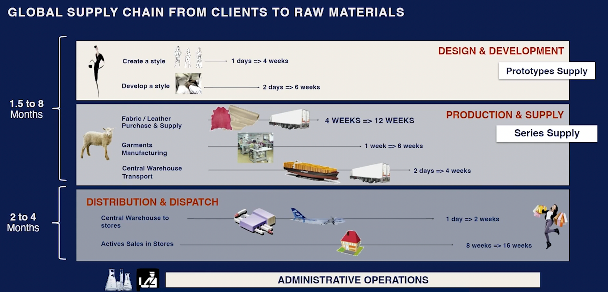
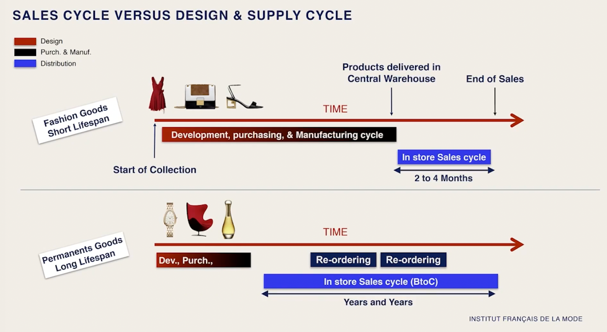
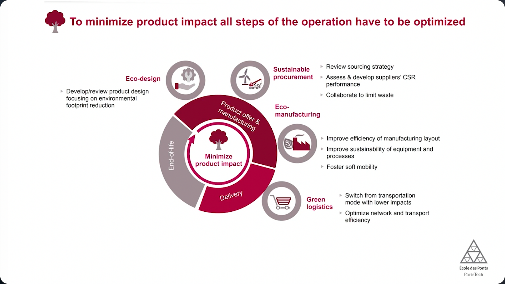
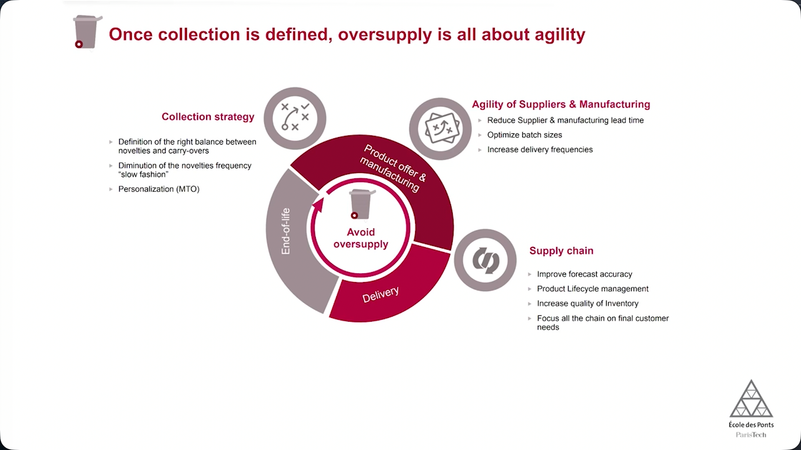
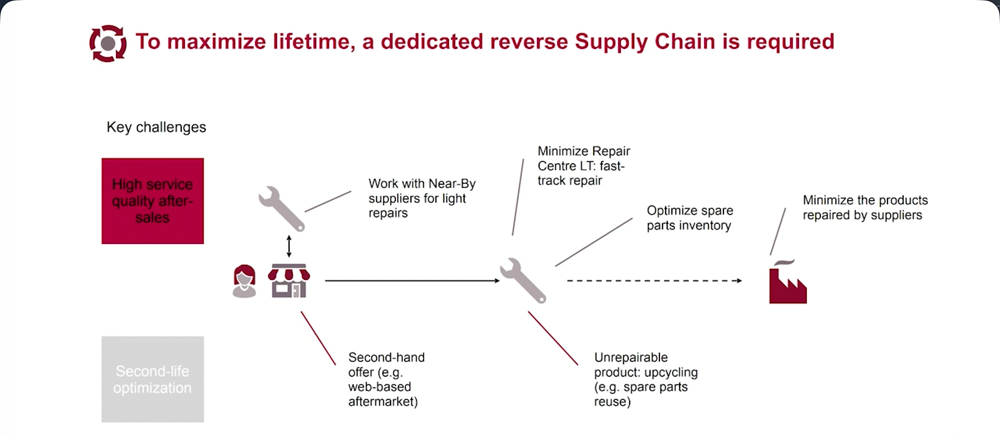

# Operations & Supply Chain
## OPERATIONS WITHIN THE LUXURY INDUSTRY
### Welcome to your course!
#### Welcome to this elective course! 

It is now time for you to discover the world of Operations, where quality, sourcing, supply chain, logistics and sustainable manufacturing shape how products reach clients worldwide.

1. **Operations within the luxury industry**: Hear from renowned professors to get a first glimpse of Operations in the luxury industry.
2. **Operations at LVMH**: Get an overview of Operations at LVMH and discover how Data is transforming our Maisons' Manufacturing and Supply Chain processes.
3. **Immersion into Manufacturing at LVMH**: Let us take a deep dive into the first step of Operations, focusing on Manufacturing through various examples from the Group and its Maisons.
4. **Sourcing at LVMH**: Delve into the essential role of Sourcing within the LVMH Group.
5. **Overview of the Supply Chain at LVMH**: Explore the unique aspects of the Supply Chain of our Maisons through various examples.
6. **The floor is yours**: Challenge yourself with a case study about the last mile delivery!
7. **Test your knowledge**: A 10-question quiz to assess your understanding of Operations and Supply Chain. You need 70% of right answers to pass and can retake it several times.

### A 360° view of Operations
#### Operations & Supply Chain in luxury
Professor of Sustainable Supply Chain Management **at Kedge Business School, Anicia Jaegler** uncovers the definition and application of Operations within the luxury industry, and reveals how this field enables brands to **create value for brands**.

Hello and welcome to this module on Operations and Supply Chain Management. My name is Anicia Jaegler, I am professor of Sustainable Supply Chain Management at Kedge Business School, one of the top 10 business schools in France. In 2020, I received the second award of the Global Women Supply Chain Leaders in the category Supply Chain Academic Excellence. Let me take you through a brief introduction to Operations and Supply Chain Management, particularly in the luxury sector.

##### How do you define OPERATIONS AND SUPPLY CHAIN?
Operations encompasses all activities involved in a *product's lifecycle* from the *extraction of raw materials* to its *end-of-life stage*. This chain of activities is referred to as the Supply Chain. This includes
- Manufacturing
- Distribution
- Packaging
- Usage
- Reverse logistics

Let me illustrate this concept with the leather supply chain. Luxury brands such as Louis Vuitton, Celine, and Loewe are central players in this industry. To manufacture a bag, these brands require leather, which originates from livestock farming, especially cattle. The animal hides then undergo various treatments, such as tanning. LVMH owns several tanneries dedicated to transforming raw hides into high-quality leather, which is then used in the production of luxury bags.

These bags are distributed to consumers through retail stores and online platforms. Over time, they can be repaired, resold, or repurposed. Eventually, at the end of their lifespan, they may be recycled or discarded. These types of supply chains tend to be integrated, as LVMH controls most of the key activities, including tanneries, manufacturing, and boutiques. The Watches & Jewelry sector follows a similar structure. In contrast, other supply chains, such as cosmetics or Wine & Spirits, tend to be less integrated.

##### 3 Important Decisions FOR OPERATIONS & SUPPLY CHAIN MANAGEMENT
Let me take you through an overview of the most important Supply Chain & Operations decisions, segmented into three layers:
- Strategic
	- Long term
	- Supply chain design
- Tactical
	- Mid term
	- Demand planning
	- Supply planning
- Operational
	- Short term
	- Daily Operations

Each layer plays a crucial role in optimizing efficiency, resilience, and sustainability. The first layer focuses on the design of the Supply Chain, which includes
- Deciding on the **location of production plants**
- Selecting **strategic suppliers**
- Structuring the distribution network

These long-term choices require substantial investment, particularly in automation and sustainable infrastructure. Additionally, sustainability is embedded at this level by prioritizing ethical sourcing, and reducing the environmental footprint of Operations.

The second layer is Supply Chain Planning, which ensures resources are allocated efficiently while minimizing waste and environmental impact. It consists of two key components.
- **Demand Planning**: accurately forecasting demand to **avoid overproduction** and **reduce waste**, ensuring only the **necessary resources** are used.
- **Supply Chain Planning**: optimizing **resource allocation**, **inventory levels** and **transportation methods** to minimize **emissions** and **energy consumption** while maintaining **responsiveness**.

Companies that incorporate sustainable planning focus on lean inventory management, route optimization for lower fuel consumption, and sourcing from suppliers with responsible environmental and labour practices.

The third layer involves the management of daily operations across
- Manufacturing
- Logistics
- Transportation

Achieving operational efficiency while promoting sustainability requires for example:
- **Process optimization** to reduce material waste and energy consumption.
- **Empowering employees** with training on sustainable best practices.
- **Adopting circular economy principles**.

Each of these decisions must align with the goal of building a resilient, efficient, and sustainable supply chain.

##### What do we mean by SUSTAINABLE PERFORMANCE?
The first step in achieving sustainability is to set clear, relevant, and achievable objectives, aligning them with the 17 Sustainable Development Goals established by the United Nations in 2015. Once objectives are defined, companies must identify specific actions and track their progress using key performance indicators (KPIs).

For a company wishing to fight against global warming and reduce inequalities, the delivery of a product to its final customer, its use and then its end of life, imply the implementation of numerous activities. Most of these leave traces in the environment. On land, through biodiversity or terrestrial pollution, in the air, such as air pollution, and in the water. These operations can also have a social impact on the company's employees, external stakeholders such as customers, users, service providers and suppliers, as well as on society in general. They also have a financial impact. The most common financial KPIs are turnover, margin and inventory value. 

By measuring and analyzing these impacts, businesses can refine their strategies, ensuring that sustainability efforts translate into improved performance, compliance, and long-term resilience.

##### Supply Chain & Operations MANAGEMENT IN THE LUXURY SECTOR
Let us now explore what makes Supply Chain and Operations Management unique in the luxury sector. The industry is distinguished by its focus on high-value, high-quality products, often featuring some level of customization. Production is typically concentrated in specific countries, such as France and Italy, while distribution spans the globe. Additionally, luxury brands must balance a mix of permanent collections and seasonal products, requiring agile and ad hoc management.

##### Collaboration and Resilience IN SUSTAINABLE SUPPLY CHAIN
Collaboration, both internal and external, is crucial for driving efficiency, innovation and sustainability within supply chains. Externally, partnerships with public authorities are essential for urban logistics and last-mile delivery, while supplier collaboration ensures long-term sustainable procurement strategies. Internally, integrative cooperation, characterized by teamwork and inclusivity, helps break down silos and promote a collaborative and diverse workplace culture.

The importance of collaboration lies in its ability to streamline operations, and enhance sustainability efforts. It not only drives efficiency but also fosters innovation by encouraging cross-functional problem-solving. Furthermore, a strong collaborative culture attracts and retains talent, and the Supply Chain sector faces a workforce shortage. Ultimately, collaboration is a *strategic driver of long-term success*, promoting *adaptability* and *resilience* in a rapidly evolving *landscape*. The Supply Chain must adapt and remain resilient amid evolving regulations, shifting geopolitical landscapes, the growing impact of climate change and new consumer expectations.

##### The New Challenges OF OPERATIONS AND SUPPLY CHAIN MANAGEMENT
"Sustainable Supply Chain 4.0" and "Industry 4.0 technologies" are two emerging concepts reshaping business strategies to drive companies toward sustainability performance. Supply Chain actors must recognize the transformative role of technologies such as Blockchain, Internet of Things, Big Data and robotics in their activities shown by the Supply Chain Operations Reference Model, which can significantly impact their sustainability initiatives. 

However, realizing this potential requires seamless collaboration among stakeholders, to ensure a continuous and reliable flow of data, which is an essential component for these technologies to function effectively. While digitalization enhances efficiency, reduces waste, and optimizes resource management, it also introduces challenges, including
- High energy consumption
- E-waste
- Ethical concerns

Striking a balance between digitalization and sustainable practices is crucial to achieving long-term sustainable development goals. As luxury Maisons undergo this transformation, Operations and Supply Chain Management play a pivotal role in integrating customer-centric strategies with sustainability imperatives.

For early career professionals, this evolution presents **a unique opportunity to**:
- Engage with **cutting-edge innovations**.
- Develop a blend of **analytical and interpersonal skills.**
- Contribute meaningfully to **the future of sustainable luxury supply chains**.

### Focus on Fashion Supply Chain management
#### Get the basics of Supply Chain management in Fashion.
In the following videos, **Laurent Raoul,** Co-founder and Head of the Supply Chain Department**at L'Institut Français de la Mode**, provides a specific focus on **Fashion** **Supply Chain management**.

The Supply Chain is a key topic that has become even more important today. Learn about its **definition, role, and key steps, as well as its specificities related to the fashion industry.**

Good evening, everybody. My name is Laurent Raoul. I am one of the founders of the French Fashion Institute, it was in 1985. And I am heading the teachings of Supply Chain for the last twenty years. I am also, in parallel, managing a consulting company which is called XLc, which is specialised in the Supply Chain. And today I have the duty to tell you in a few words, in a few minutes, what Supply Chain is. It is a hard challenge and I will try to make it as well as I can.

##### What is *Supply Chain Management*?
First of all, maybe we could start with a definition. What is Supply Chain Management? Supply Chain Management means all resources, all methodologies, all tools, aiming at
- Deliver the right *item*
- Deliver the right *place*
- At the right *moment*
- At the right *quantity*
- At the right *quality*
- At the lowest *cost*

So that is the tricky thing, which is to say if we had so much money to spend on airplanes, high means, I would say to deliver the market, it would be good. But the idea is to make it as much as we can in terms of quantity, quality with the lowest investment as possible. That is the first definition, it is a global definition, very theoretical of course.

It covers two kinds of practices, the first one being very classical. It means what we call logistics. We will see afterwards the global history of Supply Chain, a rapid history of Supply Chain Logistics, meaning everything that is physical. Physical, meaning factories
- Purchasing
- Manufacturing
- Warehousing
- Distribution
- Transportation
- Administrative Tasks

everything that is physical and that everyone of us knows. When you purchase something for Amazon or DHL, whatever, you can imagine what it is made of. This is the physical part, what we call Supply Chain Execution, the quite classical part of our Supply Chain Management.

But there is another one, which is less known, this is the hidden part of the iceberg of the Supply Chain, which we call Supply Chain Planning. Planning, meaning
- Sales & Operation Planning
- Forecasting & Anticipation
- Allocation & Inventory Management
- Balancing & Replenishment Management

If we proceed, now we know the target, now we know basically the different practices which are behind the Supply Chain, let us look at the history.

##### History of *Logistics And Supply Chain*
This history is kind of simple. It comes from the beginning of the 19th century, with the element of Art of War, an English book that has been made during the Napoleonic Wars, during which, and in this book, the word 'logistics' appears, it was not in the dictionary before. And it covers everything that is behind the war, meaning bringing something to eat for the soldiers, meaning bring the weapons, the ammunitions and everything like this. That was logistics. Beginning of the 19th century.

Let us move to the beginning of the 20th century with Ford. The US, the 20s, the 30s, the science of production, the 40s model, if you know this history, which is the Taylorism, the production, the mass production and everything dealing with manufacturing, how to organise, to supply the market, in a very fast growing market. This is a second milestone which is important in the history of logistics and Supply Chain.

The third one, this is the appearance of the word 'Supply Chain' during the 80s. So it is not such an old practice and an old science, the Supply Chain, it comes from the 80s. The word appears in a famous book about Supply Chain Management. And then we have another milestone which is important during the beginning of the 21st century, which is continuous replenishment, 'never out of stock' goods. This is an important milestone when Porterian companies like in perfumes, like in the food industry, try to deliver the market as much as they can with a continuous flow of production.

And the last one was the beginning of the 21st century: this is the appearance of the Green Supply Chain Transparency and we are in this moment of time, this important moment of time, when the Supply Chain does not aim only at delivering the goods, but also to make it with the lowest impact on the environment and the planet. So it is an important task, which is coming, I will tell a little bit afterwards.

Okay, that is basically the definition, the practice and the history.

##### What is the role *of Supply Chain Management*?
If we look at the context, which is much more important, because if we look at before the 80s, the Supply Chain did not exist. So how could we supply the market if Supply Chain did not exist? Does it mean that it was useless? Does it mean that it is a kind of superficial practice that is useless? No, it is not.

We have two different sides in the market. We have the market itself, the sales, which has its own behaviour, sales curve more and more chaotic. This is the market. We do not know what is happening, the evolution is really chaotic and we have the market on one side. The other side, the second side, at the opposite, is the production and manufacturing side with its own behaviour, its own mandatory practices and the movement of the two, the market and the production side, is not exactly the same.

If I had an image to describe the Supply Chain, it is a kind of damper: it is a damper between the demand, the market and the offer, the production and the supply. That is basically what Supply Chain aims at, which is to balance the two, because the rhythm of the industry and the rhythm of the market are not the same, so we have to put a damper to balance it the proper way.

And to damper those two sides we only have two levers: either we make the products in advance, it is the inventory that we produce at the initiative of the supplier of the brand, or we do not provide anything to the market, we wait for the market to express an order and in this case we are providing lead time delay because the customer, if the product is not on hand, has to wait for the product to be produced, to be purchased, to be transferred up to him, and that is the two levers we can work with: either we make stock or we make lead time. And the Supply Chain, basically, aims at balancing the two, playing on the two, the lead time and the stock.

Okay, that is basically the context that explains why supply chain is so important. When I started my career in the early 80s, as I said, it was not that important, because the market was more stable and, especially, the products had a longer lifespan. And that is probably what explains, especially in the Fashion world, why the Supply Chain is so important.

##### What are the Key Wording Element *in Supply Chain Management*?
If we look a little bit further to describe the Supply Chain, let us look at the wording of the Supply Chain. We have three different main parts of the Supply Chain. It is a chain, so we have three main moments in the Supply Chain. Because we are in Fashion and novelty is important, every year, we have to supply new products to let the designers provide new creations.

We have the first phase, which is important, more than in the perfumes, more than in other industries, which is the design moment, the design phase. Second, we have to manufacture. This is the real Supply Chain moment. Supply means to provide something to the market. And the last one is the demand.

And that is why we have three words that we can hear listening to people working in the Supply Chain, demand chain, which is turned to the market, the downstream of the part of the Supply Chain. Supply Chain, which is manufacturing and purchasing and Global Supply Chain that we call also Value Chain that covers everything from the designer to the consumer.

##### In Concrete Terms, *What is Part of a Supply Chain*?
Let us move a little bit further and let us look at what makes a part of the Supply Chain more practically. It goes almost from the designer and the sheep on the image that I have behind. You see a sheep at the beginning of the story, and at the end of the story, you have the consumers. What I want to tell you throughout this image is that there are many many different steps to cross between the original creation, which is the designer, the original raw materials, the sheep and this image on the consumer. And you have to cross many many different steps. 

And the most important one, I have to say, is the raw materials. People forget that to supply bags, to supply garments, to supply shoes, the most important and the longest lead time to provide is the raw materials. This is something that has to be taken into account because when we play the Fashion Supply Chain, we have an eye on the raw materials because this is the longest lead time.


##### What Are the Specificities *of the Fashion Market*?
And because of this, if we look at the balance between the supply, the upstream part, design plus manufacturing part, and the downstream side, which is the market, the products available in the stores, the relation between upstream and downstream is one and a half months to eight months to provide the product to the market, and only something like eight to sixteen weeks of life of the product on the market.

And if you look at this balance, the manufacturing, or the fact of providing, is far longer than the product, the lifespan of the product on the market. And that is a typical problem we have to solve the Supply Chain in the Fashion world, which is that when we launch a product, we do not have any view on what the market will purchase or not. It is based on the taste, it is based on the excitement of the consumer to say 'this appeals to me' or not. And when you are providing this product you do not have any image of the history of the product, because it is brand new and that is the main difference between Fashion and the other consumer goods industries, which is that we launch like rockets in the sky without knowing where it could fall. That is the image that we have, that the Supply Chain upstream is longer than the Demand Chain, the moment of the market.

And if we make the opposite, let us take why not a perfume, a perfume may last for decades on the market and we have time to resupply and resupply. We have data about the history of the product, which helps to know what is the consumer behaviour, so the forecasting is much easier and that is the problem of Fashion and the industry of luxury today which is, we have products that have short lifespan like the ready-to-wear women for instance, which is the most unstable, I would to say, and chaotic market, up to some very stable luxury goods like the perfumes, like, why not, the iconic bags like the Lady Dior for instance or the Neverfull at Louis Vuitton, for instance.

Okay. Saying that, we have many many different products to work within the luxury industry, from this women's ready-to-wear up to the fragrances, we have many many different kinds of products with many different means of product with different behaviours on the market and the Supply Chain is supposed to solve this question of how to balance the production and the demand. 


##### What are the challenges that we have to face?
One of the most exciting in the new Fashion world, we have multi-cycles to cope with. If you look at the tradition of the Fashion, this is the Fashion 'défilés', the Fashion Weeks that everybody knows, Paris Fashion Week, London Fashion Week, New York Fashion Week, Milan Fashion Week. And this was a big moment, every two times a year, four times a year progressively. And this classical *rhythm* of the Fashion is vanishing.

We have collaborations, we have capsules, we have drops, we have many market events now, red carpets, whatever it is. So the rhythm itself, of the Fashion, has evolved a lot, and what was the kernel and the main milestones of the Fashion world, which were the 'défilés', is now less and less important. And we have to cope with many many different cycles to work at the same time and to have synchronisation between very different cycles upstream and downstream. This is one of the first goals we have to solve, and it goes to a very big and interesting moment we have in front of you, which is the gathering of three different industries.

Those three industries were sometimes gathered all together, like in the LVMH Group: fragrances, hard luxury, meaning jewels and watches, and Fashion. Those three worlds, in terms of Supply Chain, had very very different practices of Supply Chain. Now it is converging. And more and more, Fashion adopts the behaviour of fragrances, of hard luxury, hard luxury adopts the rhythm of Fashion, and that kind of mix makes that with global cross merchandising, meaning, when we have an occasion, an event on the market, we may have the fragrances, we may have the watches, we may have the jewels, we may have the bags, we may have the garments all together, even if those three worlds are completely different in the way the Supply Chain is organised. This is another big issue that we have to face: gather those three different Supply Chains in one, just to synchronise, and to make that market, we look at the luxury offers as one, as a global one.

Another, which is important: the raw materials. With the CSR, the compliance with the eco-friendliness that the market is waiting for, we are discovering that products are made of **raw materials.** It is something that we underestimated during the last 30 years maybe. And the raw materials are coming up front, especially because people want to know what they purchase. What is it made of? where does it come from? Is it natural, is it bad for my body and for my health? And the raw materials will come up front and of course, because it is far from the market, we have to make this connection with the transparency and this traceability that we want to have from the farm to the clothes.

And that will be an important moment in the Supply Chain industry, which is to have a global view up to the farms, up to the beginning of the raw materials, to the end consumers and bringing those back office informations to the front office. And what people and markets are waiting now is to know: how is it made? Where is it made? Which different steps did this product cross before being delivered to me? And this is the front-to-back and back-to-front philosophy that the Supply Chain will have to cope with during the next, I would say, five to ten years, and it is very exciting.

And for all people, wanting to, willing to join the Supply Chain, I thinking in the luxury industry, there are many many interesting jobs to connect to.  

### Focus on Sustainability
#### A key challenge for Operations
**Fabrice Bonneau**, Chairman of the Industrial Engineering Department at **Ecole des Ponts**, introduces Operations and Supply Chain management from an **environmental perspective**.​  
​  
He explains how brands strive to **reduce their environmental impact** from the sourcing of raw materials all the way to the distribution phase.

My name is Fabrice Bonneau. I am the Chairman of the Industrial Engineering Department at Ecole des Ponts, Professor of Supply Chain, and the school's Chairman at the 'Supply Chain of the Future' Chair, In partnership with four companies: Louis Vuitton from LVMH Group, Renault, Michelin and Casino. I am also Managing Director of Argon & Co consulting firm, specialized in operations and supply chain. I am going to take a few minutes of your time today to introduce operation and supply chain management from an environmental angle. In other words, from a new and fascinating "green" perspective.

##### Environmental Awareness *is Growing in the Luxury Industry*
The environmental awareness of manufacturers, particularly in luxury, is not new, but it has become much stronger, since 2018/2019, when it became a major preoccupation, not just a desire to greenwash, but as a genuine performance objective, to do as well as their competitors and sometimes even better.

Why? The first reason, of course, is an evolution in consumer awareness, with customers now seriously considering the environmental impact of their purchases. The second reason is the increase in initiatives allowing consumers to assess a product's impact. It is what Yuka is doing right now, for example. And thirdly comes the binding changes in legislation, particularly in France, where in 2022, the destruction of unsold non-food products will be banned. And the Covid crisis, which is - in some way or another - linked to the environment, has also accelerated this **awareness**.

##### The 3 Challenges to Improving *Environmental Impact*
What do we mean when we talk about improving environmental impact in manufacturing? It is about addressing three challenges:

The first, most obvious challenge is to reduce the environmental impact of each product: Obviously, when we produce something, we consume materials and we transport them, which has a significant environmental impact. The second is to avoid destroying products, because making products that are not going to be used should always be avoided. And the third, which we often overlook, is to maximize the products' lifetime.

If you look at a leather handbag, its environmental impact is significantly greater than a denim bag's, except you will throw away the denim bag after six months, whereas the leather bag will last 20 years. So the impact over time is not at all the same. You have to assess it by looking to the end of the equation. This is why the best way to resume the global environmental impact is to take the impact of a product, multiply it by everything you do it or by everything extra you do it, and divide by its lifecycle. And that gives you the formula for the global environmental impact.

##### Minimizing *Products' Environmental Impact*
So let us look at these three factors again, the first being to minimise environmental impact, meaning the cradle-to-gate impact, from raw material extraction to the purchase of a product in shop, which takes us to the end of the cycle.

The extraction of raw materials in the luxury industry, especially with leather goods, textiles and shoes, is very impactful, accounting for **60~80%** of the product's total impact. The choice of raw materials is therefore key.

The second point, the second link in the chain, is the suppliers, who need to be eco-responsible. That is why, for example, at LVMH there is the EcoVadis program, which ensures that its suppliers are doing things right environmentally.

The third factor is manufacturing, because when you produce, you consume energy and make CO2. Or perhaps you use lots of water and create waste water etc. And not forgetting the people who come to work. All that has to be measured.

The most visible link in the chain - though it does not count as much as the others - is transport. When you make products in France, which the luxury sector does a lot and is proud to do, and you deliver in Asia or the USA, in some cases transportation is made by plane, and even the boutiques themselves have an environmental impact, so it is all this we must measure.

​
##### Avoiding *Destruction*
To avoid the destruction of products there are two main levers:

The first is the collection size. With larger collections, there is a risk that some products will not sell, which increases the risk of waste. One way to get around this is by personalizing products - listening to the client placing the order. This way, you are sure the product will be sold and not destroyed. This is an important trend for the sector.

The second lever is actually a mix of levers: agility, and the supply chain performance, and we could also include, of course, reducing the cycles of suppliers, implementing smaller batch sizes, otherwise the risk of waste is high. And the better forecasting of sales, is also key. It is not easy to predict sales, but there are techniques and process tools that can help.

There are specific processes to approach with caution, like lifecycle and the end of life of products. If you do not anticipate the end of the product's life, you will be overstocked. Generally speaking, you make sure your supply chain is optimized. What does that mean? It means that the fabrication of your product, its distribution and your decision-making, must match the demand of your clients to avoid overstocking and waste. 


##### Maximizing *Products' Lifetime*
The third and final lever is the lifecycle of a product - which inevitably has marketing elements, like offers for second-hand products and rentals etc. But there is also a supply chain element, because if you want to encourage your client to repair a product, the process must be efficient with short cycles and plenty of information visibility. There is nothing worse than having a watch repaired and not knowing when it will be ready. And once again, the answers to this lie in supply chain and operations.


So in a nutshell, we have looked at how supply chain and operations are impacted by these three levers, and how complex it all is, and implies trade-offs between service quality, stock management and cost. And now there is a fourth important dimension that needs taking into account: Sustainability. 

## OPERATIONS AT LVMH
### 360° of Operations
#### Driving Operational Excellence at LVMH
Join **Mohamed Marfouk**, LVMH Operations Director, as we delve into the **definition of Operations** at LVMH and its **main challenges**.

Hello, my name is Mohamed Marfouk, I am Operations Director of LVMH. Before joining LVMH, I spent 20 years in the FMCG (Fast-Moving Consumer Goods) sector in Organization, IT, Finance, Supply Chain and General Management. I joined LVMH in 2009 and witnessed since an incredible development of the Group from 17 to 86 billion euros and the professionalization of LVMH Operations team with now more than 8,000 talents in our Maisons.

##### Defining OPERATIONS
What is behind the word operations? Operations cover all steps to transform a *creative design* into a *product delivered* to the *final customer*. To achieve this, we need excellent talents at each of our four stages.
- Planning
- Sourcing
- Manufacturing
- Logistics

Let us now talk about one of those four stages: manufacturing. It is more than just production. It starts with product development and industrialization, moving from a drawing into a prototype, an ability to produce hundreds of items. This is a crucial step that requires mastering our *artisan savoir-faire* inventing new ones, working *hand in hand* with *design and manufacturing*. Then, we move to production, including quality assurance at each step and quality control. **To support production, we need**:
- Engineering
- Continuous improvement
- Intra logistics
- Planning teams

They all play an important role to produce the right product at the right time in line with our quality expectations. 

LVMH's main challenge in operations is to continue to offer *excellence* to our *end clients* despite a *never-ending volatility* of our environment. To achieve this, we are building agile and resilient end-to-end supply chain based on three pillars.
- People
- Process
- Systems

Let me start with planning. Planning needs to determine how many bags do we need to ship to Japan tomorrow and how much whisky we need to distill and age for our 2034 sales, ten years from now. To achieve this, we need talents with *excellent analytical skills* as well as *soft skills* to be able to talk to Sales, Marketing, Manufacturing, Procurement, Finance and drive consensus. This work is based on our robust sales and operational planning process that planning community continues to enhance through best practices sharing. Our talents and processes are supported by very sophisticated forecasting and planning systems. We are using AI at different stages to gain more insights, to have the right product at the right place, at the right time. Let me now give you another example in logistics. At Sephora, and during some peak events, like Mother's Day, we may have to pick, pack and deliver a million units. There is no way to achieve this without skilled logistic teams supported by automated warehouse from shuttle to cobot and the warehouse management and a warehouse execution system.

##### Operations: WHAT SETS LVMH APART?
In term of Operations, LVMH is unique in the sense that we are the only Luxury Group present in *5 different sectors*:
- Fashion and Leather Goods
- Watches and Jewelry
- Perfumes and Cosmetics
- Wines and Spirits
- Selective Distribution

with very different operations. Add to that a high level of autonomy given to each Maison, and you end up with the community that has developed excellence in different areas based on the needs of each Maison. This excellence is then shared and becomes the foundation for further enhancements. Our decentralization allows us to *minimize risks* by *experimenting different processes, systems and automations* within different Maisons before *scaling the winning options*.

##### CSR AND OPERATIONS
Regarding CSR, we have global shared conviction within LVMH: our success can only be achieved if we take care of
- People
- Planet
- Profit

Let me take this opportunity to talk about sourcing. 95% of our CO2 footprint is in scope three. This is the CO2 generated by our suppliers and partners. Most of our suppliers are medium and small artisan factories. LVMH Sourcing is working hand in hand with our partners to *develop their teams and practice* to *preserve their savoir-faire* and reduce their *environmental impact*. This is now part of our LIFE 360 Business Partners Program, as well as our commitment to enhance working conditions, along our supply chain, such as living wages.

##### Improving Operations AT LVMH IN THE FUTURE
To further improve operations practices in the future, there is still a huge potential for LVMH and we need to leverage our scale and diversity to **attract talents** and develop those talents through the communities animation and internal academies. Two, continue to strive to become the **preferred customer** of suppliers & partners. Three, continue to invest in **appropriate technologies and systems**. And to conclude, operations are at the *heart of LVMH*. If you are, like us, obsessed by quality, time to market, efficiency, circularity, biodiversity, health and safety, living wages, reducing carbon footprint, transparency, traceability. There are plenty of opportunities for each of you to express your talent and develop new skills in one of our five sectors. 

### Focus on Data
#### The importance of Data

**Anca Marola**, Chief Data Officer at **LVMH**, speaks about the importance of Data & Artificial Intelligence in transforming our Maisons' Manufacturing and Supply Chain processes. ​  
 ​ 
Hi, my name is Anca Marola, and I am Clienteling and Data Director at LVMH Global Headquarters. My role is to accompany Maisons in their Customer Relationship Strategy, as well as their Data and Artificial intelligence transformation. I entered LVMH eight years ago, working at Louis Vuitton in the CRM department and then started at LVMH as Digital Analytics Manager. And very quickly we advanced on exciting topics such as Artificial Intelligence.

##### What is *Data & Artificial Intelligence*?
What is Data and Artificial intelligence? Are you using Google Search, Alexa or watching Netflix? Then you are already using Artificial Intelligence in your daily life. In this class, we will learn what is Data and Artificial Intelligence, and also its concrete applications for a retail business such as LVMH.

First thing first, what do we mean by data? In an environment like LVMH, we have a multitude of types of data that we can use, such as customer transactions, product attributes, sales, users and cookies behaviour, social media and images, conversations, Customer Service Center conversations and so on.

In the last two years alone **90% of the world's data has been created**. This is due to the emergence of the Internet and especially of the mobile phone, which allows us to connect anytime, anywhere, and therefore we generate new data with our interactions. Connected objects, such as our connected Tag Heuer watch or our smart home appliances also contribute to this. 

Artificial Intelligence **analyzes** these massive amounts of data, this is what we call Big Data, and their variety, structured like transactions. An example of this is Amazon book recommendations, and unstructured like pictures and conversations. This is what the Google Images search, for example, is employing, or Alexa.

Artificial Intelligence is a subbranch of computer science, and it refers to simulating the human intelligence in machines, such as learning, reasoning and perceiving. The **Machines** use a mix of mathematics, computer science, linguistics, psychology and more in order to be effective.

A subset of Artificial Intelligence is machine learning, which refers to the concept that computer programs can automatically learn from and adapt to new data without being assisted by humans. Deep learning techniques enable this automatic learning through the absorption of huge amounts of data that is unstructured, such as text, images or video.

##### Concrete Applications *for Operations*
Now that we know what Data and A.I. mean, let us learn about its concrete applications for operations. A.I. is useful to **optimize** profitability reduce costs across all the different processes of Supply Chain, such as plan, source, make, deliver, and return.

For example, to optimize sourcing and production in a vineyard, we can analyze the weather and the soil conditions with the help of connected devices and predict when is the right moment to pick the grapes in every batch in order to avoid waste and optimize our harvest. 

Second, we can optimize inventory in a Fashion Maison to increase sales and reduce out-of-stock, thanks to advanced modeling on historical transactions. And we can go up to each store level to improve allocation and replenishment.

Third, Machine Learning and Robotics are useful to optimize the Logistics and Warehouse of a brand like Sephora, for example, as it allows us to maximize the storage space while optimizing a speedy shipping to stores or clients.

Four, returns, from e-commerce can be reduced by giving customers more accurate predictions of the size and fit of the product they would like to buy, by employing A.I. to analyze their profile versus other customer transactions and returns of those items and similarly looking products. 

## IMMERSION INTO MANUFACTURING AT LVMH
### A critical role at LVMH
#### Its definition and challenges
**Florent Nguyen,** former New Product Development Group Manager at **LVMH**, explains how Manufacturing is essential in any industry. He details what does it entail within LVMH and its Maisons and what are its main features. ​

**Manufacturing is more than just the transformation of raw materials into finished products at LVMH.** Indeed, all aspects of manufacturing reflect the Group's values, heritage and expertise.​

In my daily work, I have three main missions:​  
- **Attract new talents** to the Group and support the development of LVMH Operations teams, for example through our Manufacturing and Supply Chain Academy. This academy helps managers build new skills and strengthen their expertise in Manufacturing and Supply Chain across the Group.  
- **Being a key sparring partner** for each Maison to support their operations and help them accelerate on transformation projects.  
- Facilitate the **sharing of best practices** between our Maison. To foster a spirit of innovation, I am responsible for keeping Maisons' teams up-to-date with external trends or breakthrough initiatives.​

**Common values & shared specificities: our strength​**

At LVMH, we have various business sectors with different industrial processes. ​  
Making a lipstick, a leather bag, a bottle of wine or a watch involve different equipments, processes and expertise.​ Despite this variety, each Maison shares the same culture and follows **three fundamental** principles when it comes to production:

First, **Savoir-Faire.​**  
Our Maisons are the custodians of an exceptional heritage of traditional craftsmanship and creative skills. This savoir-faire is still very present in all our processes.

Second, **Quality.​**  
Quality is of fundamental importance to our work. Our talents rely on a continuous improvement mindset to ensure the highest standards of product quality, industrial processes and working conditions for our teams.​

Last but not least, **Agility.​**  
In a company where creativity and innovation are core values, our manufacturing sites have to be **agile**.  ​

We define it as the **ability of an organisation to respond quickly and effectively** to expected and unexpected changes in a fast, flexible, and cost-effective manner. It is nurtured in all areas of operations, resulting in a sustainable long-term competitive advantage.​

**Challenges: translating innovation into production** 

​In today's fast-changing world, there are **major challenges** to be tackled both within our Group and across Maisons, as well as externally.​

To sustain the **growth** of our Maisons, we need to be able to answer to **increased demand** while maintaining each brand's savoir-faire. For example, our manufacturing sites have to strengthen their production capacities, thus we need new talents to whom it is key to transmit our savoir-faire and expertise.​

We have to **adapt to changes in demand**. For instance, fluctuation might occur if an influencer, who has set his heart on a specific product, has provoked a peak in demand among clients. On the other hand, with the pandemic situation in 2020, the question has suddenly been how to cope with decreased demand in some regions and how to adapt production. ​

The Maisons within the Group are **constantly innovating**, with a continuous renewal of products. Our job (and challenge!) is to manage industrially the **complexity of large product portfolios**. Another challenge is the permanent effort to reduce time to market. We need to react quickly so that the time between the idea of a new product and its delivery to the stores is kept to a minimum. ​

We eventually deal with **critical resources** such as rare and precious materials. In our constant quest of improving LVMH and our Maisons' environmental footprint, we need to continuously **optimise our resources management and give consumers transparent information**.

**Manufacturing at LVMH: the opportunity to work in a variety of worlds​**

Working in the manufacturing field at LVMH is a **unique experience.** The Group is home to over 75 Maisons rooted in six different sectors, so it provides a rare opportunity to discover and work within several different industrial processes.​Also, each of the Group's Maisons maintains a strong focus on the **exceptional quality** of every product, therefore it is an honour to participate in the process of making LVMH products.​  
 ​  
The "value" of our products strongly relies on the exceptional work being done in our factories. In terms of manufacturing jobs, the workers' expertise has been gained through years of experience, and this is something that is very noble. Being at the heart of the industrial process allows you to work alongside with **highly experienced people**. ​  

**Technology & Savoir-faire​**

We are in the era of **manufacturing 4.0**, a technological transformation is currently occurring in our factories. Data is now digitized to increase efficiency, improve quality and ease the work of our operators.​ ​  
**However, technology must remain at the service of savoir-faire.** Therefore, technology will only be integrated where it is really needed and when we are convinced that it will have a positive impact.​  
 ​  
In a nutshell, we believe in collective Human Intelligence before Artificial Intelligence. ​

### Manufacturing and Production at TAG Heuer
#### Learn about the innovations and challenges of a watchmaking Maison
**Guillaume Boilot**, Chief Operations Officer at **TAG Heuer,** highlights the key manufacturing and production processes in the watchmaking industry.

**As a Chief Operations Officer (COO) at TAG Heuer, what does your role involve?​**  
As the COO of a watchmaking company like TAG Heuer, my role involves overseeing and optimizing the production processes from start to finish. This includes managing the supply chain, logistics, manufacturing, new product development, client service and quality control processes to ensure that the company produce high-quality timepieces efficiently and effectively, while also ensuring compliance with all relevant regulations and standards.​  
 ​  
**Could you tell us about your day-to-day responsibilities?​**  
Overall, my role is essential to ensure that the company is able to meet its business objectives, maintain its position as a leader in the watchmaking industry, and provide our clients with exceptional products and experiences.​

**In detail, my key responsibilities include:**

- **Developing and implementing strategies** to drive innovation and product development, keeping TAG Heuer at the forefront of the watchmaking industry.​
- **Optimizing of the production process** to ensure that the company can meet demand while maintaining the highest levels of quality:​
    - Implementing new technologies
    - Implementing streamlined processes​
    - Working closely with suppliers and partners​
    - Ensuring that materials and components are available when needed​
- **Managing our global distribution network** and ensuring that our products are reaching our clients in a timely and efficient manner.​
- **Managing the workforce** and ensuring that employees are properly trained and equipped to perform their jobs to the best of their abilities:​
    - Developing training programs
    - Implementing performance metrics​
    - Providing ongoing feedback and support to help employees excel in their roles​
    - Fostering a culture of continuous improvement and innovation throughout the organization, encouraging all employees to contribute to our success​
- **Overseeing our financial performance** and ensuring that we are meeting our profitability targets.

**How would you describe the manufacturing process at TAG Heuer?​**

The manufacturing process for watches at TAG Heuer involves a series of intricate and precise steps:​  
1.  **Design** of the watch​  
2.  **Creation** of a prototype and the selection of materials  
3.  **Production** and assembling of components such as movement, dial, hands and case by highly skilled technicians​  
4.  **Quality control measures** process to ensure that each watch meets the company's exacting standards​. In terms of the stakes, quality is of paramount importance. Clients expect their watches to be reliable, accurate, and durable.​

In a VUCA (Volatile, Uncertain, Complex, and Ambiguous) world, it is essential for companies to be agile and adaptable. This means being able to quickly adjust production processes, supply chain management, and other operations in response to changing market conditions.​  
 ​  
**Innovation is at the center of your activities. Could you please highlight some examples?​**  
Indeed, TAG Heuer is a brand that has a long history of innovation, having developed several groundbreaking models over the years, such as the Monaco and the Carrera. The brand has also been at the forefront of developing connected watches and has a strong focus on performance and sport.​  
   
**Moreover, there are further innovations that need to be mentioned:**

**SMARTWATCHES**: One of the most significant innovations in recent years has been **the development of connected watches, also known as smartwatches**. These watches are equipped with sensors and other technologies that allow them to connect to the internet, track fitness metrics, provide notifications, and perform other functions beyond simply telling time. Companies like Apple, Samsung, and Garmin have been at the forefront of this trend.

**MATERIALS & TECHNIQUES**: **Another area of innovation** at TAG Heuer has been **the use of new materials and manufacturing techniques**. For example, we have experimented with using carbon fiber, ceramic, and other high-tech materials to create lighter and more durable watches. One very interesting new material we are now using at TAG Heuer is lab-grown diamonds. These diamonds are created in a laboratory setting using advanced technology that replicates the natural process of diamond formation. With these diamonds, we offer new shape and texture that you cannot get with natural ones and new customized design to our clients.

**BLOCKCHAIN TECHNOLOGY:** Finally, a few numbers of watch companies have also been exploring **the use of blockchain technology to track the authenticity and ownership** of their watches. By using blockchain, companies can create a tamper-proof record of a watch's history, which can help to prevent counterfeiting and improve transparency in the supply chain.

**Going forward, what are the next challenges?​**  
Based on current trends in the high-end Swiss watch industry, here are some potential challenges and opportunities that companies might face:​

- **Sustainability commitments:** Consumers are increasingly concerned about the environmental impact of their purchases, and high-end Swiss watch companies will need to address this issue in order to stay competitive. This may involve using more sustainable materials, reducing waste in the manufacturing process, or partnering with environmental organizations to promote conservation efforts.​
- **Innovation as a key asset for the future**: The high-end Swiss watch market is highly competitive, with many established brands and new entrants vying for market share. Companies will need to stay ahead of the competition by developing innovative new products, improving their marketing strategies, and building strong relationships with clients.​
- **Evolving consumer preferences**: The preferences and priorities of high-end Swiss watch consumers can shift rapidly, and companies need to stay attuned to these changes in order to remain relevant. For example, there may be increased demand for watches with more sustainable materials or those with advanced technological features such as connected capabilities.​
- **E-commerce**: The growth of e-commerce has disrupted traditional retail channels and the high-end Swiss watch industry has been slow to adapt. However, with the rise of online marketplaces and the convenience of e-commerce, companies will need to build and improve their online presence to compete and grow their business.​  

These are just a few potential challenges and opportunities that high-end Swiss watch companies may face in the coming months and years. By staying ahead of the curve and addressing these issues proactively, TAG Heuer continues to grow in key markets.

### A Celine production site
#### Agility for a production site
We saw an overview of Manufacturing in the Watchmaking sector.​ Now, let us explore a fashion Maison in Italy.​  
 ​  
**Jean-Marie Tizon**, from **Celine**'s Leather Goods Production team, shares an exclusive insight into the day-to-day at Celine's **production site** in Tuscany (Italy), and on the importance of creating an **agile production line** in an ever-changing world.

We are in La Manufacture at Radda in Chianti. We are in the heart of the vineyards in the hills of Tuscany, which is a place where Celine has been founded for industrial activities back in the 70s, and where we have built this new factory, slightly more than one year ago. Globally we manufacture about five hundred thousand bags per year. We have an internal workforce composed of about 400 people, between craftsmen and the supporting team working alongside with them for the manufacturing.

##### What is the biggest challenge *for the industry*?
The main challenge for the luxury industry in the future will be to face the VUCA environment, that you may know as a Volatile, Uncertain, Complex and Ambiguous environment, we have been living in for the past years and that accelerated with the Covid pandemic.

We need to be quick, but more than anything else, we need to be able to *change directions*, to adapt to the changes of business. Agility is a daily capacity of the people to change the assembly line, to learn a new product, a new craft, to change a physical organisation, the layout of the workshop, and to be able to find new suppliers to double source.

It is all these small activities that drive *agility* - not a concept, but a daily reality. 

### Focus on production processes in Champagne
#### Main stakes of a Production Director in the Wines & Spirits Division
**Could you please introduce yourself?​**  
My name is Ghislain Bonnet, I have been working within the LVMH Group since 2019 and currently I am the Production Director of the Maisons Moët & Chandon, Dom Pérignon, Ruinart and Mercier. Before joining the LVMH Group, I had an initial experience of 10 years in the food industry where I had different types of responsibilities in project management, logistics and production. ​  
 ​  
As the Production Director of four champagne producers, I can say that there are many similarities between these Maisons. Such similarities would be for example the Champagne region, their centuries-long heritage and their production processes. Most importantly though, I would say that all four Maisons have been able to develop themselves throughout their history, and they are able to continuously improve the quality of their products, respond to new markets and ultimately, to increase their volumes.

**You worked in other industries before joining LVMH and the Wines & Spirits sector. Could you explain the specificity of working in Manufacturing for Champagne Maisons?​**  
Champagne production draws its added value from the ageing of time, whereas most other industries are always looking to shorten production time. This drives us to implement operational excellence programs specific to our production processes. And more than in any other industry, we also invest over several years to improve the quality and the way we develop our products.​  

> "**Our purpose: enhance the value of our products after several years of ageing.**" *Ghislain Bonnet*

**What are your key missions as Production Director?​**  
My main mission is to meet the production needs requested by the Maisons in terms of quantity and quality. ​

I also have to project the evolution plan of the industrial sector to achieve the strategic objectives of the Maisons for the next ten years. For example, the challenge of dividing our carbon footprint by two by 2030 is certainly one of the most structuring and exciting challenges for my department and me. To do so, my team and I are working in collaboration with other departments such as Marketing, Supply Chain, Oenology, Technical Services, Human Resources, Quality, Packaging Development and Finance.​

Last, but absolutely not least, my key role is to lead the production teams. I manage more than 500 people in my team spread over four production sites. In my team, there are operators, machinists, technicians, managers and engineers. As a director, it is part of my role to establish with them their individual and collective targets, their progression and development plan as well.​

**What are the key stakes for the future?​**  
In our manufacturing process, major investments are regularly made to modernize our facilities, meet the new needs of our Maisons in terms of quality improvement, control of our processes and efficiency.​

Some of our installations, such as our traceability system or our auto-guided trolleys, are truly at the forefront of industry 4.0 facilities. Moreover, we have set up a single-bottle traceability system using UV ink specially developed for printing on glass bottles.​  
   
Personally, when I joined the Group, I was positively surprised by the incredible balance between historical "savoir-faire" and the modernity of some of our facilities. After working at the Group for some years, I believe the key word for Production Managers at Moët & Chandon is development.​  
   
Looking at the future, we not only need advanced specialists, as we highly value the curiosity and interest that one shows in our products and practices. With new, fresh perspectives, together we will be able to further develop the workforce, organizations, practices, and ultimately, our business.​

### Product Compliance at Sephora
#### Excellence and quality first!
All products developed must be compliant with **international regulations**. ​  
 ​  
**Noémie Saillon**, Development Director at **Sephora**, talks about the importance of **compliance in the cosmetics world**.​

Sephora Collection is different from the retail activity. It is a brand in its own right. And we develop products under the Sephora brand.

##### What is the specificity *of working with cosmetics*?
Cosmetics are heavily regulated. All the products that we develop must be compliant to Asian, European and US regulations. It means that the composition of the products has to be carefully checked by the regulatory team. The quality-control side of my job is to be sure that all production, which is one hundred percent subcontracted, meets our standards.

##### Can you describe *your day-to-day*?
My daily job could be to go and visit a new factory, or check the new production of a product. It could also be to work with the regulatory team to check the compliance and all the tests that have been done on the product.

##### What is it like *working at LVMH*?
There are a lot of advantages to work within the Group. We can work with different Maisons of the same branch and also with other branches. It means that we share a lot of best practices for quality and regulatory control. The Group also provides a lot of information on new regulations, new ingredients and laws that are coming. Compliance to regulation is a must for the Group. As a result, regulatory affairs are crucial and always listened to.

##### Any advice *for the next generation*?
To the students who would like to start their career within LVMH, I would like to tell them to dare to speak up, dare to share their achievements and their work.

## SOURCING AT LVMH
### A major stake at LVMH
#### The strategic role of Sourcing at LVMH: its definition and challenges
**Christian Galichon**, Group Purchasing & Travel Director at **LVMH**, explains how Sourcing is essential in any industry. He details what does it entail within LVMH and its Maisons and what are its main features.

**Sourcing, which can be called also Purchasing or Procurement is essential in any company**. But what does it mean within LVMH and its Maisons? What are its main rules, targets and challenges?  
   
Sourcing is not only about purchasing services or products. It is to bring added value all along the complete process called S to P: Source to Pay. The added value is covering 5 issues: Quality, Cost, Delay, Innovation and Risk. Of course, our added value is seen differently if we are in a market which is growing or if we face lower sales or if we have key geopolitical issues.

As LVMH Director of the Sourcing Coordination, my team and I are working around three pillars: 

- **Category** **Expertise:** To be able to bring added value when a team is looking for a new product, we need to speak the same language. It means that I need to have in my team, professional purchasers who know the category they are covering. The main categories we are covering are: IT/Digital, Marketing & Communication, Finance, Retail Capex and Opex, Business Travel, Human Resources, Facility Management, Energy, Logistic and Transportation, etc.
- **Advisory:** As the purchasing maturity is still in progress in some of our Maisons, we help them following their needs, such as putting in place a purchasing team (where do we start?), implementing a procurement tool (which specification for which scope?), building a strategy by category, etc.
- **Transversal topics:** As we are the only team not specifically linked to any Maison, we have the responsibility to build and animate our Maisons' community networks on different transversal items.The 3 main topics are:

    1) Animation of the community through different **governances**.  
    2) Leveraging and managing issues on **Sustainability** in our Supply Chain.  
    3) Running a **Purchasing Academy** with different modules linked to the level of maturity of our purchasers.

##### Scope of Actions
As we are dealing with suppliers, our added value is based on 2 criteria: **the level of specificity of the purchase and the organization of our supplier market.**

 Let us take some examples:  
- We need an IT suite to run our laptops. This requirement is not specific to each of our Maisons, as we have a single global supplier. In this case, there is an added value to creating a contract at the LVMH level so all our Maisons can benefit from the deal.  
- All our Maisons need electricity wherever they are and for all types of activities (headquarters, stores, plants, warehouses, …). This need is not specific to a particular Maison, but the supplier market is still organized at country level. In this case, my team is implementing contracts at country level for all LVMH and Maisons sites.  
- To produce champagne, we need grapes that come from the Champagne area! A dedicated team based in Champagne is responsible for sourcing these grapes. The sourcing is specific, and the market is local. My team has no added value in this purchase, it is managed at Wines & Spirit Division level.

##### Direct and Indirect purchasing
Based on the two criteria mentioned before, the **direct purchasing** is the sourcing of products which will be in the COGS (Cost of Goods Sold): ingredients, raw material, textile, primary packaging, sub-contracting of some parts or finished products, etc. These categories are specific to each Maison and are typically managed at that level. However, they can also be handled at the Business Group level if the organization is structured that way. For instance, the Beauty Division manages sourcing for all direct categories, and the same applies to the Wines & Spirits division.

In this case, my team is not involved unless we find suppliers that are shared across several Maisons but are not currently collaborating. For example, many Maisons use the same tanneries for leather sourcing. Sharing information about these suppliers, like price trends, lead times, quality, innovation, and compliance, makes sense. In such cases, presenting a unified front to the supplier can add significant value.

**The indirect categories** are the ones which are not part the COGS. The main ones in terms of spending are Marketing & Communication (events, visual merchandising), Logistic and Transportation, IT and Digital.

To manage these categories, we have put in place an organization at different levels:

- Categories managers based in LVMH HQ in Paris are dealing with **worldwide suppliers**, managing contracts at this level.
- For **regional suppliers**, my team in Paris handles those in Europe. Teams based in New York, Shanghai, Hong Kong, and Tokyo manage suppliers in their respective regions and ensure that global contracts are properly implemented at the local level.
- At **country level**, we have purchasers in Italy and Switzerland which are 2 large countries in terms of sourcing, with many specificities. The energy and gas supply are organized at country level. We are managing contracts for all sites in France, Italy, Spain, Portugal and Swiss.

##### What are the major challenges of tomorrow and new sourcing trends?
Our main challenges are linked to the VUCA (Volatility, Uncertainty, Complexity & Ambiguity) situation we are facing today.

- Our supply chains are very often disrupted (Covid, taxes, boycotts, etc.).
- Our industry has to be more and more compliant with new regulations (Corporate Sustainability Reporting Directive, Corporate Sustainability Due Diligence Directive).
- The level of stock for raw materials has to be quickly adjusted in case of downturn.

Due to these issues, we need to be flexible. Our different purchasing teams have always been integrating this flexibility, actively participating to the performance of LVMH!
### Focus on direct and indirect purchasing
#### Focus on sourcing in Marketing and Communication at LVMH
From events to uniforms procurement, the scope of **Valérie Revol**, Head of Sourcing in Marketing and Communication at **LVMH**, is very large.​  
 ​  
Watch this video and discover all the processes that are part of direct and indirect procurements as well as the main goals of the procurement department.

Hi, my name is Valérie Revol, and I am currently Head of Sourcing, Marketing & Communication at LVMH Holding. I have been part of the Group for more than 25 years working at Chaumet, then Louis Vuitton and now in the LVMH Sourcing team at the Holding.

My title is not so easy to understand. I work in the Operation department and particularly on the purchasing side. I am expert on Marketing & Communication procurement with a very large scope. I handle:
- Events
- Image
- Digital
- Visual Merchandising (VM)
- Packaging
- Art of Gifting
- Uniforms

##### Direct and Indirect PROCUREMENT
Procurement encompasses the entire end to end process of acquiring goods, services or works from external sources. It includes:
- Identifying needs
- Sourcing
- Negotiating
- Purchasing
- Receiving and inspecting goods
- Invoicing
- Payment
- Managing suppliers

while saving cost, reducing time, and building win-win supplier relationships.

###### Direct procurement
Also known as production procurement, involves the purchase of goods and services that are directly used in the production process, or are essential for the manufacturing of the company's final products. These items are directly related to the *core business activities of the organization*.

Example of direct procurement:
- Raw materials
- Components
- Machinery
- Equipment
- Specialized tools required for manufacturing

Direct procurement is critical for ensuring the production process runs smoothly and efficiently, and any disruptions in the supply chain can directly impact product quality and delivery.

###### Indirect procurement
also known as non-production procurement or indirect spend, involves the purchase of goods and services that are not directly used in the production process, but are essential for the overall operation of the business. These items are considered *overhead* or support items that *enable the organization to function smoothly*.

To give you some examples of indirect procurement, you have:
- General Expenses
- Facility Management
- IT
- Travel
- Marketing & Communication
- Transportation

Indirect procurement focuses on *optimizing cost-effectiveness, supplier relationships and process efficiency*. As these items do not directly impact the end product, but can have a significant impact on overall operational costs.

##### Main Goals OF THE PROCUREMENT DEPARTMENT
We have to secure our purchases. We need to manage the risk in terms of:
- Process
- Partners
- Regulation

Well, now let us focus on my specific part: indirect procurement on Marketing & Communication. In marketing, we speak of *trends*, which evolve on a *yearly or half-yearly basis*. Our strategy will therefore need to be agile in order to respond to the **vagaries of our customer market**:
- Economic/Geopolitical crisis
- Rapidly growing or shrinking market
- Unavoidable technological innovations

It is important to adapt these changes and purchasing needs to be a source of ideas. In-house customers or internal clients are very independent and really at LVMH level. Often acting in a hurry, operating on an emotional level and with little or no purchasing culture. Buying in Marketing & Communication means *taking up challenges on a daily basis* and knowing how to *think out of the box*, while *staying within it*.

##### Sustainable PROCUREMENT
At LVMH, we are highly encouraged to embrace sustainable procurement practices and responsible sourcing. We always consider environmental and other social factors when collaborating with suppliers who promote ethical sourcing. I can say that striving for sustainable supply chain management will allow our business to *contribute to a better future for the world*.

##### Skills Required IN PROCUREMENT
I think that the top skills required in procurement are
- **Strategic thinking**
- Understanding of the **global market** and ability to **manage risk**
- Being **agile** and **collaborative**
- Great **relationship management** and strong **negotiation skills**

In the coming years, a strong focus on understanding and enhancing sustainability will be fundamental. First of all, this is a strategic function. As you are well aware
1. The purchasing function has evolved **from a support function to a strategic one**.
2. Procurement is **transversal in nature**. Transversal within the procurement, from the expression of need to its satisfaction, and transversal within the company.
3. This is a relationship based profession. **Good interpersonal skills** and an **appreciation of human contact** (both internally and externally) are essential for **success**.
4. Important to **balance firmness and openness**. A good buyer is a good communicator.

So as a conclusion, I would say a purchaser is a strong business partner. 

#### Purchaser at Parfums Christian Dior
How can direct purchasing drive our business forward?

Join **Constança Malheiro**, purchaser at **Parfums Christian Dior**, as she explores her key missions, the balance between cost-effectiveness and sustainability, and how to adapt to ever-changing market demands.

Hi, my name is Constança Malheiro, I work as a Purchaser at Parfums Christian Dior since 2021. I began my career at LVMH with an apprenticeship program which allowed me to learn and become a real operational purchaser. When I finished the year of apprenticeship, there was an opportunity in the same department I was working in, so I had the chance to stay! 

##### Purchaser Roles and Responsibilities
As a purchaser, my role is divided in different main missions. I participate in the launches of new Parfums Christian Dior's products. I collect marketing briefs, analyze and challenge them in line with the ambitions of increasing the desirability of the brand and profitability objectives. I do call for tenders, negotiations, allocations and project monitoring with other internal stakeholders.

At the same time, I manage the purchasing portfolio, so I follow economic and supplier performance, I secure our sourcing and I work on logistics optimizations and on improving our tools. We also have to be proactive and implement value-analysis plans with the aim of reducing costs, improving agility, eco-design and high quality.

Finally, I ensure a good commercial relationship with our suppliers and fluid teamwork within operations. I aim to be our suppliers' favorite customer. I aim to be our suppliers' favorite customer. What I like the most is to do a job in which I can collaborate with internal stakeholders such as marketing and developers, but also collaborate with external stakeholders. And therefore, have a vision outside the company. My passion is guided by an active participation in the launches of our beautiful products, from the creative idea to its industrialization.

##### Balancing Cost and Sustainability
In this new era, it is a challenge for us to find suppliers capable of meeting our CSR goals while maintaining competitive costs. As an example, if we use more recycled materials in our packaging, which is obviously better for the planet, we must be good negotiators to limit the cost impact it may have.

Also, in this new volatile market driven by social networks, we are looking for agile suppliers who are responsive and capable of providing us with our products quickly to serve the markets.

##### Adapting to Market Demands
I was talking about supplier agility, and one great project I manage was linked to that issue. We have a lip product that appeared on a social media video and completely went viral. In a short time, we were facing plus 160% of volumes.

So, we worked on building a tool that would allow us to evaluate our capacities, and the production bottlenecks to make a quick decision on the necessary expansion. Thanks to this, we were able to react quickly and, thus, avoid disruption.

##### Ideal Qualities of Purchasers
Required skills are obviously: a good sense of communication because we communicate a lot with internal and external contacts of Dior and LVMH, team spirit, adaptability, curiosity, autonomy and rigor and obviously, good negotiation skills.

##### Growing at LVMH
After three years at LVMH, I have the chance to work daily with people from different professions who are really experts in their fields, so, I learned a lot.

And to conclude, I have to say that I recommend 100% the apprenticeship program. In my opinion, we learn the most when we have the right balance between autonomy and support. And the apprenticeship program is very empowering while being supervised. So, it really allowed me to be ready for a real position and then to progress in the Group. 

## OVERVIEW OF THE SUPPLY CHAIN AT LVMH
### A Key Business driver at LVMH
#### Deep dive into the specificities of the LVMH Supply Chain
**Valérian Pham-Ngoc**, Head of Supply Chain Excellence at **LVMH**, explains the essential role of Supply Chain in all industries. He details what this concretely entails within a luxury group such as LVMH and what are its main features. 

##### What is the Supply Chain?​
A Supply Chain refers to the management of the flow of products and services, namely providing the right products and services, at the right time, with the best quality, with the right quantity, and at the right cost. There are numerous elements to it, including strategic design of the production and distribution network, demand forecasting, production and distribution planning, stock sizing, transportation … ​  
​  
This is why Supply Chain is at the heart of the client promise: having the right product availability in stores or online, being able to deliver it in a seamless way to the client, by respecting the delivery lead time, with a seamless return experience… This is definitively the key to ensuring client satisfaction and loyalty.​ But more recently, the Supply Chain has also been about embracing structural changes and transformation to adapt to the VUCA (Volatile, Uncertain, Complex, & Ambiguous) world.​

##### What are the key specificities of the LVMH Supply Chain?​
First, there is not just one LVMH Supply Chain, but almost as many Supply Chains as we have Maisons, since the LVMH group is very decentralized.​

Nevertheless, all these Supply Chains share the same specificities:

- **A worldwide distribution**: products are distributed all over the world.​
- **A wide diversity of products**: from limited edition of premium products (e.g. Chaumet Tiara) to products being sold in large quantities (e.g. bottles of Moët champagne).​
- **A wide diversity of clients** with large variety expectations (in terms of products, services, delivery lead time, cultural differences…).​
- **A wide diversity of sales channels** (Retail, Wholesale, e-commerce, marketplace…).​
- **With a lot of manufacturing and sourcing constraints**: raw materials scarcity, limited manufacturing capacity…​
- **But most importantly - with a high focus on Product Quality & Client Experience.​**

Coming from an engineering background, due to its complexity and diversity, the LVMH Supply Chain is one of the most stimulating and challenging Supply Chains that I could have found as a Supply Chain Expert.​

> "**The Supply Chain of LVMH Maisons is one of the most complex, but by extension, one of the most stimulating and challenging in the world!**" *Valérian Pham-Ngoc*

##### Within LVMH, the Supply Chain transformation is based on 5 key pillars:
###### Sustainability and Corporate Social Responsibility
To make sure that our products are not only beautiful, but also green.

The LVMH Group is committed to reducing greenhouse gas emission, and continuously implementing improvements in Supply Chain activities, such as raw material production and transportation
###### Agility
As we never know what we will need to deal with in the coming months or years. Our only certainty is that something could happen and that the most agile and resilient Supply Chains would thrive.

For example, a few years ago, we could not have imagined that we would have to manage a sanitary crisis, an Evergreen container ship stuck in the Suez canal, the Ukraine/Russia war, an energy crisis... And yet we were able to react quickly and efficiently! During lockdown, for instance, Louis Vuitton has created a virtual showroom in record time to allow teams across the world to see the latest collections and place orders.

###### E-Commerce
Luxury initially struggled with e-commerce due to its focus on rarity, conflicting with the internet's accessibility. The in-boutique experience has always been central to our client relationship.

Over the last decade, changes in consumer behaviour have driven luxury Maisons to include digital components, gradually incorporating technology into everything - from client service and product innovation to the end-to-end Supply Chain.Technology allows us to better serve our clients.

E-commerce will be 30%+ of the sector's sales by 2030, if not more, making Supply Chain a growing key success factor for brands.

The dichotomy between digital and physical is blurring, with customers often discovering collections online, reserving products, and then trying them on in stores. The goal is to offer fluidity between these two worlds, while maintaining our standards of excellence.

###### Artificial Intelligence
The Supply Chain departments of the Group's Maisons are increasingly benefitting from the contribution of AI to improve their performance.

For example, sales forecasts - a pillar of the Supply Chain - can rely on machine learning technology. But AI can also be used to optimize the distribution of stock in different stores and warehouses or report operational alerts. Our teams are actively observing the development of the AI to identify and test the next use cases.

###### People
Behind successful Supply Chains, there are great people and teams, all around the world.

At LVMH, people make the difference.Therefore, we are convinced that we need to attract and develop new Supply Chain talents to help us tackle these numerous but incredibly interesting challenges.

##### What does the role of a Head of Supply Chain Excellence within LVMH Holding entail?​
LVMH has created a center of expertise at the Holding level to help all our Maisons address the key challenges of their Operations  (growth, agility, efficiency, quality, sustainability, etc.) while building the Operations of tomorrow. ​  
   
This Group Operations department brings together the following three areas of expertise: Supply Chain, Manufacturing and Purchasing. ​ ​  
   
My role as Head of Supply Chain Excellence is to support the Maisons through all their Supply Chain challenges via the following levers, all while respecting their autonomy.   
   
What I can say for sure, is that the positioning of this team (on all supply chain issues, in concern to strategic and operational aspects), as well as its transverse vision of the Supply Chain issues of the Group's Maisons, is definitively unique and one of a kind!
### Deep dive in LVMH Maisons' Supply Chain
#### Supply Chain & Logistics at Louis Vuitton​
From sales forecast to the distribution of products in store, the Supply Chain is really an "end-to-end organization".​  
 ​  
Learn more from **Vincent Barale**, Senior Vice President Logistics and Supply Chain at **Louis Vuitton**, about this transversal department.​

Hello everyone, my name is Vincent Barale, I joined Louis Vuitton in 1996 and since October 2003, I am in charge of Logistics, Supply Chain, Repairs and Indirect Purchasing.

Supply Chain is really an end-to-end organization. We are taking care of the sales forecast of the company, we are planning the production and we are distributing the product until the store. There is a Logistics organization which is more dedicated to the physical flows of the merchandise. So, we transport the goods from the suppliers to our warehouse. We build the warehouse and we manage the warehouse all over the world. We clear the goods with the Customers organization. The Supply Chain organization is really a *transversal organization* and it is *end-to-end*.

##### Job Responsibilities IN THE SUPPLY CHAIN AT LOUIS VUITTON
What are the different job responsibilities in the Supply Chain organization of Louis Vuitton? To produce the sales forecast, of course we need managers taking care of the sales forecast. So they are dealing with marketing, with finance, with retail, and with stores to produce the best sales forecast ever.

When the sales forecast is done, we have to plan the production. So we have managers within the Supply Chain organization, **planning the production every day**. And then we have a **distribution team** which is taking care of **the flows** and determining every day which quantity to be pushed to every region. The team is based in central and based in the region as well. We have transportation managers, people taking care of the customs clearance, and people dealing with all our transportation companies all over the world.

##### Specificities OF THE SUPPLY CHAIN AT LOUIS VUITTON
If you want to understand the specificity of the Supply Chain of Louis Vuitton, first, you have to understand our **business model**. Our business model is based on two very important principles.
1. Goods only distributed in Louis Vuitton stores
2. None of the products have discounts

So, it is putting on the Supply Chain organization a very huge pressure. Every day, we have to plan the right product at every workshop in order to be sure that everything that is going to be produced will be sold somewhere in the world.

###### AGILE
To do so, we have to be very much agile. If I am thinking about the sales, forecasting organization, we issue the sales forecast every week for the next 18 months, and if we need to change some data, we are able to change the data within the day. We have to plan the production as well. So we plan the production every day, and everything which is planned will be received in the central warehouse, seven days later.

And then as well, something which is very important, because we do not know what will be the turnover tomorrow, we have to distribute at the last minute, from the central warehouse, the merchandise to every region. Every morning at 5:30, we calculate the orders for every regional DC in the world. We are managing 11 regional DCs in the world. Our objective is to make sure that everything that has been determined today will be in the region as quick as possible.

In the region, after receiving the product in the warehouse, we have to distribute the goods to every store. And again, we do not know what will be the turnover store by store. So, we wait the last minute to distribute the product in every store, and we distribute to the store every day, seven days per week. 

###### STRATEGIC IMPORTANCE OF LOGISTICS  
There is a second specificity, which is very important in our organization. Logistic is key. We do not know what we are going to sell tomorrow and the world is totally disturbed. The Logistics organization is absolutely strategic in our capabilities to deliver the *right product*  at the *right destination* at the *right time*.

So as I was saying, we operate our own warehouse in France and we subcontract our warehouse elsewhere in the world. But in order to distribute the product at the last minute, we are using the same WMS (WAREHOUSE MANAGEMENT SYSTEM) everywhere in the world. It means that whatever the location, Singapore, Tokyo, Shanghai, Piscataway in US and others, everyone is working under the same organization. There is a third specificity of our Logistics and Supply Chain organization within Louis Vuitton. 

###### LONG-TERM RELATIONSHIP WITH PROVIDERS
If we want to get the best Supply Chain ever, we have to organize a long-term relationship with our providers. So, we are working with many transportation companies or many logistics providers, and we are always proud to say that we are able to organize real long time relationship. The oldest transportation company we are working with, has been selected in 1987. We have a strong philosophy within our department.

###### BEST INFORMATION SYSTEM IN THE MARKET
Our philosophy is that the information system has to be the best one. So we do not want to adapt ourselves to the information system, but we want the opposite. We want to be able to make some changes in our information system when it is needed. So, everything has been developed for more than six or seven years on Anaplan sales forecasting, production planning, distribution, central distribution, regional distribution on Anaplan. We have the best Supply Chain tools to guarantee *end-to-end agility*.

The good news is that this software is developed internally. So, if one day you join our team, you will not be recruited only to provide a sales forecast, the production planning or to distribute the goods to the store, you will be as well recruited to develop our information system.

##### Supply Chain Challenges AT LOUIS VUITTON
What is very good is that there are still plenty of challenges within our Louis Vuitton Supply Chain organization. One, of course, is still about agility. Today, to allocate the product to every region, we have to wait to receive the goods in our central warehouses. Very soon, we will *allocate the products* while they are *still in the trucks*. At the end of the day, we load the trucks because we know what are the merchandise loaded in every truck, we will allocate the production just after the shipment. It means that when the truck will arrive at a central warehouse, we will directly move the product right to the port or right to the airport. By *reducing the inventory*, we avoid producing products that could *become obsolete*.

Another example, is that we are going to open a warehouse fully dedicated at Roissy airport to Louis Vuitton. A warehouse, which is going to be totally automatized and which will help us to produce our air freight pallets and to make sure that we can again reduce the leap time and ship our merchandise as quick as possible.

##### Sustainability & THE SUPPLY CHAIN
Sustainability is the most complex subject ever. In the luxury business, if you look at the carbon footprint, you can realize that the most important origin of CO2 emissions is coming from raw materials you are using to produce the product. So, the conclusion is: if you want to make your company sustainable, you have to avoid to buy and use raw materials, metallic spare parts that will end up in an obsolete product at the end. You have to
1. reduce your inventory, and you have to be sure that 100% of the production will be sold somewhere in a store.
2. **repairs**: a luxury is a product that could live for life. So our responsibility is to make sure that every product that are going to be sold somewhere can still be repaired for the next 20 years.
3. **decarbonizing transport**: Transport is the second origin of CO2 emissions. So, the first action is to try to ship by sea. This is our ambition. In 2026, we want that 100% of our bestsellers, not only Leather Goods, but Leather Goods, Ready-to-Wear and shoes should be shipped on a boat. The second way to decarbonize transport is about air freight and air freight, we have to accept to pay more and to buy the famous Sustainable Aircraft Fuel (SAF), which is very expensive, is 4 to 5 times the air freight cost. Within Louis Vuitton, we are ready to pay a more *expensive transportation price* in order to *decarbonize the flows*. 

To conclude, to **succeed in supply chain organization**, you have to come with **new ideas** to make your **organization as agile as possible**! 

#### Focus on Inventory & Distribution​ at Louis Vuitton
Now that you have learnt more about Louis Vuitton's Supply Chain with Vincent Barale, discover with **Martin Saraux**, Global Inventory and Distribution Manager for Leather Goods at **Louis Vuitton**, the missions and key challenges of the Inventory & Distribution Department.

Hi everyone, I am Martin Saraux. I have been working for Louis Vuitton for 14 years. I joined Louis Vuitton right after my engineering studies at Ecole des Ponts ParisTech in France. I discovered Vuitton, during my one-year internship during my studies so I am what we called "a baby Vuitton".

I started as a distribution planner for the Latin-American market, then I was for two years central distribution planner for Japan. I had then to opportunity to be appointed Project manager, where I was in charge of transforming all our Supply Chain IT system using a new, agile planning tool, before becoming two years ago global inventory and distribution manager for Leather Goods.

As a global inventory and distribution manager, I am in charge of a term of 10 people. The team has three main missions.
1. Ship the manufactured product to the distribution network
2. Give the production targets to the industrial team
3. Dimension the stock to sustain the sales ambitions

My team is part of the Supply Chain organisation which has a key role within Louis Vuitton. As you may know or not, Louis Vuitton has a fully integrated network from our *30 leather goods workshops* in Europe towards our *450 stores* worldwide. Therefore, the overall mission of Supply Chain is to make sure that we decide every day, which products need to be manufactured, shipped, and sold within this network. Right *product* at right *place* at the right *time*, to fully satisfy our clients, we must make sure that they will find in each of our Boutiques the product of their dreams.

We are currently facing three main challenges.
1. **Agility**: One of the first pillar of Louis Vuitton Business Model is not to discount any product to guarantee our customers the value of their purchase. Therefore, one of the key challenges within our moving environment geopolitical, product launches, product getting out of the collection is agility, so we make sure that every manufactured product will be sold within our network.
2. **Sustainability**: Louis Vuitton has a commitment to reduce its carbon footprint by 55% by 2030 and Supply Chain has a key role to play, especially when talking about transportation.
3. **Omnichannel**: We are coming from a world where our products were available in our stores to a model where we will take more-and-more orders for our clients.

As a conclusion I would like to give you my personal advice. What I really enjoyed through my whole career was the trust of my managers, who pushed me to dare to challenge the process, the system and my job by giving me the freedom to transform and model it for a better outcome. I encourage you to dare and propose ideas, so that you can also challenge the *future*!

#### Supply Chain at Fendi​
Learn from **Maurizio Zaccuri**, Supply Chain and Logistic Manager for Europe and Middle East, about the key roles of **Fendi**'s Supply Chain, and get to know which three fundamental flows the Maison is following.

Good morning, my name is Maurizio Zaccuri and I work for the Supply Chain of Fendi for Europe and Middle East. In 2019, I started my adventure in Fendi with the role of Demand & Distribution Planner and now for two years I am the Supply Chain and Logistic Manager for Europe and Middle East.

In fact, in my current role, I am responsible to measure the performance about *70 stores* and to grant them the fuel, to oil the gears of the business and allow the stores make clients' dreams come true. All this, in *19 different markets* for about 70 stores with different needs.

In a snapshot, we have 3 key flows to follow:
1. **Demand flow**: to plan in advance the stock needs to anticipate the demand.
2. **Distribution flow**: to uplift the availability of our incredible new products in stores and maximize the stock efficiency.
3. **Delivery flow**: increase the shipment services to the customers in an omnichannel perspective.

To describe the Supply Chain deep inside Fendi, I would say that it is like the brain and the muscles of the company. We are at the heart of the business and a key business partner of the top management. Working in cross-departments and coordinating the various activities along the chain, the Supply Chain is capable to add value enhancing customer perception or lose value not optimizing the stock with a huge financial impact.

In a world changing 5 times faster than 10 years ago, the Supply Chain must be *adaptable* in a short time, with a fast-paced speed. But there is a "fil rouge" connecting all these different days: we are building the Supply Chain 5.0 and this is the part I love most about my job: we are building new processes, putting always ourselves out of the comfort zone, trying to be pioneers and pursuing excellence.

Managing the Supply Chain in luxury company means *boosting* and *developing excellence* in every single part of the chain. 

#### Learn about Sephora's Supply Chain performance factors
As part of the Selective Retailing sector, Sephora offers unique shopping experiences across the world.​  
 ​  
Learn from **Muriel Wojdyniak**, Supply Chain Performance and Process Manager at **Sephora**, about the indicators followed by the Maison and its Supply Chain stakes for the future.​

Hello, my name is Muriel Wojdyniak and I have worked for Sephora for six years now. I joined the company as a Supply Chain Project manager focusing on the Digital activity, while the eCommerce was plummeting all over Europe & Middle East. Implementing the logistic activity in different countries such as Spain, and Portugal. Improving the current processes and tools to fit the market. Then, seven months ago I moved to the position of Supply Chain Performance and Process manager, still for the EME region. 

##### Sephora's *Supply Chain Vision*
What is our Supply Chain vision at Sephora? Our vision is to be the most effective omnichannel customer centric supply chain community. Indeed, always keeping in mind that the Supply Chain is the final image the customer gets from the company. Availability of the product in store or delivery to the e-customer, like an essay conclusion or a dessert.

##### Our Supply Chain *Key Roles*
Translating our vision into operations, our role within the Maison is to be flexible, agile, excellent, and also ahead of the business. Implementing new tools, technology and processes, which allow the business to grow smoothly.

For example, one of our challenges with eCom orders is to cope with the Black Friday volumes, equivalent to seven times the usual! So
- **flexible**: accept the challenge. 
- **Agile**: benchmark with our experts and partners to find a solution.
- **Excellent**: keep the preparation of the orders qualitative.
- **Ahead of the business**: anticipate the natural growth each year.

Most specifically, my role within the Supply Chain is to assure that the performance target decide with the supply chain Directors in Central and on the countries are reached.

##### Which are *the Targets of Performance*?
Targets on stock levels, delivery lead time for e-commerce orders, on-shelf availability of the products in the stores, supplier fill rate, and the CO2 emission. These are the main indicators that show a healthy supply chain.

##### How to Reach *these Targets of Performance*?
Through two main pillars: first one by monitoring the main Key Performance Indicators and building action plans with the countries to reach the targets. As an example, we just opened our first store in the UK and the success was and still in incredible, but this success led to shortages. I monitored on the daily frequency, the on shelf availability, making sure that the store gets enough stock to satisfy the sales planned for the day.

Second, by animating the Supply Chain Community to share the best practices and solutions to the different challenges faced by the team. Creating the link between the collaborators in different countries through seminars, monthly calls and country visits. For example, organizing workshop between the French e-logistic manager and the Romanian team that started to work with a warehouse a couple of years ago, or having the Turkish team explain the tester tracking tool implemented locally to the whole EME supply chain.

Those two pillars require three skills, communication, expertise, and rigor.

Now, the Supply Chain cannot succeed in its mission on its own. We must collaborate closely with all the companies departments. Offer team needs to forecast the stock of new products for each country. Negotiation team needs our recommendations regarding logistics specifics. Delivery to the warehouse, packaging allowed, documents needed. Digital team needs to align on the promotion plan to evaluate the peaks of activity in the warehouse. IT team needs to ensure stability on our tools. Finance team needs to validate the stock expenses. Human resources needs to find a best training for the collaborators and a lot more.

Having said that, you will ask me what about sustainability? And you are right. Logistics and transport have a huge impact on the planet. This is our current and future challenge: how to balance *efficiency* and *sustainability* in the current context. Being super speedy deliveries, frequent renewal of the product range, fitting with the demand volatility.

But the challenge cannot be solved only by Supply Chain. We must inform our customers of the impact of their requirements and work together with all the departments to always integrate sustainability as a criteria of decision in the decision making chain. We all have a role to play.

#### Inventory Planning at Sephora
**Karina Grobelny**, Inventory Planning Manager on the Makeup team at **Sephora US**, mentions the three key components of a planner's role at Sephora to stay competitive in the beauty sector.

Hi, my name is Karina Grobelny, I work at Sephora headquarters in San Francisco, California, in the Supply Chain department. Specifically, I most recently took on the role of Manager of Inventory Planning on the Makeup team. I have been at Sephora for almost seven years now. I was fortunate to join Sephora in August 2017 as an inventory planner and became promoted to senior planner a few years later, before transitioning to manager.

I would like to briefly walk you through an overview of my career path and journey. I was fortunate to attend a university that had a robust retail studies program, where I was enrolled in several courses and participated in an internship at a popular home goods store. Growing up, I always knew that I wanted to work in *corporate retail*. I was intrigued by *the behind-the-scenes work that goes into operating a business*, specifically a business where *tangible goods* are being sold to customers. I like the idea of mixing numbers and data with actual products.

So right after college, I joined a very well-known apparel company in San Francisco as a data coordinator on the planning team supporting the planners. This is where I learned real life Excel application and basic planning concepts. I grew my career to associate planner, followed by planner. Several years later, I receive the opportunity to join another large clothing retailer company, also in San Francisco, as a buyer. And finally, I ended up at a company where I can confidently call home. Landing a job at Sephora was a dream come true.

##### Role of A PLANNER
What does a planner do? How does a planner know how much inventory to buy? What are the upcoming trends in the beauty space? How many types of blushes can we possibly sell? The list goes on.

Being a planner at Sephora is a highly collaborative roll. You work with several cross-functional partners, including Merchants, Demand Planners, and Distribution, to name a few. A key part of the Planner role is *forecasting*, both *tops down* and *bottoms up*. I would like to focus on three key components of the planner at Sephora. First is Open-to-Buy. Second is forecasting newness launches. And third is brand relationships.

Open-to-Buy is a crucial part of the planner role, as it is a monthly process of reforecasting sales, inventory and margin. Open-to-Buy is forecasted at the brand level and rolled up at the total department level, as well as total company level. This is an important task since it is a *measure of how each brand is performing in sales*, and it directly impacts *how much inventory we can buy for each brand* to support the sales we are forecasting and expecting. It is crucial to ensure we are not over or under buying inventory.

Next, I would like to walk you through newness launch forecasting. As a planner I work closely with the merchant team on forecasting all newness products that they have aligned to launch in Sephora in upcoming seasons. Depending on each brand's lead times and production, some brands will require forecast half a year out. While other brands may demand forecasts a year and a half out. Merchants can assess upcoming sales trends and work closely with the brands on actions to drive sales such as marketing activations, animations, app previews and emails, to name a few.

In order to generate a sales forecast, the merchant and planner look at sales data and history to understand how comparable categories and products have performed. The historical data can be dissected and analyze in many different ways to than inform us on our future forecast assumptions. Additionally, the size potential of the category, as well as size of the brand's sales volume is important and will help guide the forecasting decisions.

Lastly, a rewarding part of my time as a planner has been working with brands both big and small. This relationship is very important as we are all working towards a common goal of
- Delivering **quality products** to our customers while **growing the brand**
- Maximizing **sales**
- Driving **productivity**

I have had the honor of working with several brand founders and seeing their passion come to life, as they launch their dream products with their perfect formulas. With Sephora's large focus on *diversity and inclusivity* several of the brands in my portfolio are the *15% pledge brands* and I have loved watching these brands grow in *both size and brand awareness*.

Planners meet with their brand partners on a regular basis to align on key deliverables, plan and collaborate together, and ensure stores and Dotcom are properly stocked with inventory to sell. Other points of discussion could include marking down and unproductive or exiting product, working through overstock inventory, and so forth. Each brand is *so unique* and has *its own story and vibe*.

Client experience across brands within our channels of brick and mortar, which corresponds to our physical stores and Dotcom is important, as brands want their DNA to shine through and create a seamless experience no matter where and how you are shopping. Forecasting inventory for stores is different than forecasting for Dotcom, since stores require presentation minimums for our shelves to be stocked. Cosmetics are *so personal* and many times clients want to play with the product formulas and shades *in real life and stores*, so the *store experience is crucial*. Having the *right amount of inventory* in the *right products* in the *right stores* is the goal.

Dotcom is a different space and clients can shop from anywhere at any time. Here, digital assets and how-to videos on the site help *educate the clients* and *demonstrate the products* through *swatches* and *visuals*. Having too much inventory means that your Open-to-Buy dollars are tied up in unproductive inventory. Conversely, having to little inventory means missed sales opportunities. Finding the *right balance* is *key*!

##### Adapt TO TRENDS
I would also like to emphasize that the world is ever changing and so must our business adopt. One huge trend right now is *social media*, mainly *TikTok* that has made a tremendous impact to the business. Virality has completely transform *the retail space*, especially in beauty with social media so widely available at our fingertips, it is so easy to publish and spread content with the click of a button.

As you can imagine, viral moments are not always planned or premeditated. Lots of times, they can happen organically and catch you by surprise. So, when does moments do happen, they can profoundly *impact our sales and inventory*.

Here at Sephora, we have a wide offering of products across many brands. To stay competitive in the landscape, it is important to
- Offer clients the **best product**, including **exclusive brands** that **can only be purchased** at Sephora
- Stay on top of the relevant trends
- Turn **digitalization** into an **opportunity**
- Be nimble in the way we **operation**

And I have no doubt that Sephora will be able to deliver.

### Focus on packaging and shipping at Hennessy
##### Production and Shipping at Hennessy
**Hello, can you please introduce yourself?​**  
I am **Sandra Domenech**, and I have been Director of Production & Shipping at **Hennessy** since January 2022.​  
 ​  
After graduating as a food industry engineer, I started my career in continuous improvement in various food-industry groups. I joined Guerlain in 2007 as a continuous improvement engineer and later became production manager. After that, I discovered packaging procurement before joining the Maison Hennessy in Cognac in 2015.​  
 ​  
I was lucky to be able to grow through the different missions entrusted to me – first as production supervisor for two bottling lines, then as logistics manager for storage and shipping of finished products. In January 2022, I was appointed Director of Production and Shipping.​

##### Where does your interest in the Wines and Spirits sector come from?​
I have always been attracted to production and continuous improvement. I find it exciting to watch the synchronization of the machines and the flow of products as they pass through each step in just a few minutes.​  
 ​  
I discovered Wines and Spirits, Cognac in particular, at the start of my career with Guerlain, when I took an interest in the Group's products and shared ideas with colleagues in the LVMH realm. It was when I arrived in Cognac that I learned how to appreciate this spirit and understand all its different dimensions, thanks to enthusiastic and stimulating colleagues.​  
 ​  
Working at Hennessy means becoming part of a local ecosystem: you live in the middle of the vines and work in close collaboration with our 1,600 wine-grower partners. You are at the heart of a network of local suppliers (60% of our suppliers) in a region governed by the AOC Cognac designation of origin. Given our position as leader in the sector, every decision we make has to be carefully measured since it could have repercussions on an activity that sustains more than 60,000 people.​

##### Can you explain your role as Director of Production and Shipping at Hennessy?​
My role entails coordinating over 350 people, from the delivery of materials (bottles, stoppers, boxes, labels) to our 10 packaging lines located on three sites, plus the storage and shipping of the finished products across the world.​  
 ​  
Most importantly, I make sure that I give every employee the means to grow at Hennessy, so that each of them can give the best of themselves every day, in a safe environment, to produce products that meet our standards in terms of food quality and aesthetics.​  
 ​  
We have a broad range of products and activities. On the one hand, our volumes are driven by the VS and VSOP age categories bottled on modern, automated, high-performance lines. On the other hand, we produce exceptional XO-category cognac in decanters, including Baccarat crystal decanters – unique objects that are shipped to clients by white glove delivery. This wide spectrum calls for a broad range of skills and know-how blending modernity and fine craftsmanship. ​

> "**Operational excellence is our daily obsession. It leads us to surpass ourselves to stay ahead of our peers while bearing in mind the values that guide our action: elegance in our relationships with clients and partners, and a commitment to sustainable development.​**" *Sandra Domenech*

##### How do you interact with other departments?
Within the Operations team, I collaborate on a day-to-day basis with:​

- **The Quality team**, to ensure constant and irreproachable quality. We talk about being "Right First Time" at each step of production;​
- **The Supply Chain team**, to convert market needs into shipping plans and production schedules;​
- **The Technical team**, both for investment in new machines or sites and monitoring, and technical maintenance of our existing facilities;​
- **The Packaging Development and Purchasing teams**, who help production teams and suppliers develop marketing projects;
- **The Continuous Improvement team** to deploy new collective initiatives in our search for progress.

##### My days just fly by!​
I have regular meetings – I call them rituals - with my team of 12 supervisors, one-on-one or collectively, to align our practices and our messages. It is a broad spectrum: we have a safety and environment supervisor, a dry materials supervisor, production supervisors, a flow, storage and shipping supervisor and others responsible for personnel management and indicators or project management.​  

It is important that we share the same vision and the same way of approaching topics such as safety messages, organization of our teams, deployment of new tools or software, etc.​

I oscillate between the very short term, involving rapid and effective decisions - for instance, opening up a second shift on production lines to handle a product launch or a client request - and the medium/long term, through strategic reflection on the future and the transformation of our Maison to support growth and new projects. This work may involve developing multi-skilled teams, setting up a new workshop dedicated to Rare Editions, or choosing new machine technologies, for instance.​  
This oscillation between long-cycle activities (the ageing of our _eaux de vie_ over several years) and short-cycle activities (filling bottles, packing them in thousands of boxes in a few days, then shipping them to more than 160 countries) is defining and singular to our Maison.

At Hennessy, we have the human and financial resources to tackle extraordinary projects and bring them to fruition.​  
As production supervisor, I was also project leader for the new production unit on a new bottling site under construction. Working with a team of operators, I was able to design intuitive, ergonomic, live-production management software, develop workstations adapted to each section of the line, and challenge machine suppliers to come up with innovative solutions, allowing us to make further progress in terms of ergonomics and quality requirements.​  
Today, I support my teams on projects that are just as ambitious and important for the future of the Hennessy Maison.​

##### What challenges are yu facing?​
The world is changing fast and consumers are looking for new experiences.​  
Guided by long-cycle considerations, which are key to the exceptional quality of our cognacs, we need to step up the pace of innovation in packaging and client experience. This means showcasing our know-how (calligraphy, use of decorative threads and personalization of our exceptional decanters) while also developing the agility to produce limited editions on machines that operate at 20,000 bottles an hour.
## THE FLOOR IS YOURS
### What is the "last mile"?
#### This practical case makes you reflect upon LVMH products' delivery process. 
**Let us talk about "last mile delivery": the last leg of the delivery process, all the way from the distribution center, or store, to clients' doorsteps.​ What is at stake?​  
**LVMH and its 75 Maisons aim at offering a **high quality experience** and the best **service to clients**. **The client delivery experience** has to be at the same level as our whole client experience, with the highest standards of excellence.​

It is an opportunity for the Group to set up those standards in the area of delivery, and not just eliminate frictions & pain points. The LVMH group wants to use **this last mile delivery** to **strengthen the desirability of our Maisons** and add the **touch of magic** that makes the difference.​

The challenge of this project relies on matching the unique experience offered to LVMH clients VS the market delivery standards that can be somehow disappointing in terms of **client service, shipping options, tracking, delivery, unboxing experience and returns**… and that does not take into account environmental & social impact.
### Practical case
Let us talk about the client experience all along the delivery phase.

5 key dimensions were identified by LVMH Maisons to reinvent the delivery client experience:
1. A delivery on a precise time-slot with possibility to reschedule as desired (as opposed to express delivery)
2. A sustainable approach (from an environmental & social point of view)
3. A process 100% available and adapted to client requirements and needs
4. Customisation of the client experience
5. A human-based relation

Please take 15 minutes to reflect upon what LVMH could do to improve the delivery experience in each one of those dimensions (delivery options, sustainability, availability, customization, human-based).​  
 ​  
Find 2-3 examples from **your personal experience and what you found on internet.**
```text
1. Precise & Reschedulable Delivery: Implement a system similar to premium courier services, offering clients specific delivery windows (e.g., 2-hour slots) via a dedicated app. This app would allow for real-time tracking and one-click rescheduling, providing ultimate convenience and control.
    
2. Sustainable Approach: Adopt electric or cargo-bike fleets for urban deliveries, as seen with companies like UPS. Furthermore, utilize reusable and premium recycled packaging that clients can easily return for recycling or refill programs, aligning with the Group's LIFE 360 environmental commitments.
    
3. Availability & Adaptation: Ensure 24/7 customer service access via chatbots for simple queries and a direct human hotline for complex issues. The delivery process should be adaptable, offering options like "leave with concierge" or "in-car delivery" to fit diverse urban living situations.
    
4. Customisation: Personalize the unboxing experience by allowing clients to add a handwritten note or select a sample gift during checkout. For high-value items, offer bespoke delivery slots outside standard hours, creating an exclusive, tailored service.
    
5. Human-Based Relation: Train delivery personnel to be brand ambassadors, equipped to handle products with care and offer brief, knowledgeable insights. For iconic products, a "white glove" service could be offered, where a specialist from the Maison performs the delivery, ensuring a memorable and personal connection.
```

### What did LVMH implement

#### It is time to learn more about one of LVMH's initiatives: The Last Mile Delivery project

To wrap up, we would like to show you how LVMH and our Maisons are currently tackling this topic today in Paris, **with a test and learn approach**, to ensure that **client needs and expectations are addressed**.

##### The 5 dimensions of the client delivery experience

1. **Precision and flexibility**: delivered at the right time and place
2. **Sustainability from the social and environmental point of view**
3. **Availability at any time for the customers**
4. **Human and relationship**: perceive attention and human contact during my delivery experience
5. **Personalization**: can choose to give a personal touch to my delivery

##### How does it work?

For every purchase made by a **Client** in store or by phone, the **Consultant of the Maison** offers the **Client** the home delivery service and agrees with him on the desired delivery time slot. The **Consultant** then goes to the Courier website to provide the delivery instructions as well as a personalized message.

As soon as the delivery is registered, the **Client** receives a confirmation SMS message. The **Consultant** prepares the products with at least the same care that is given to all in-store orders. Meanwhile, the **Courier** receives a notification with the details of the delivery.

At any time, the **Client** can reschedule his delivery via a dedicated hotline. One day before the delivery, the **Client** receives a reminder SMS message. One hour before, the **Client** receives an SMS with the delivery time slot refined to 10 minutes.

The **Courier** comes directly to collect the shopping bags in the store. Delivery information and personalized message are upstream transmitted to the **Courier**. The **Courier** carefully hands over the bags to the **Client**, while conveying the personalized message of the **Maison's Consultant**.

The **Client** can then fully enjoy his products. If he wishes, the **Client** can make an immediate or planned return of the products. The **Maison's Consultant** calls the **Client** back to understand the reasons for his return and propose a replacement solution. A Caring Call is systematically made by the **Maison's Consultant** within 24-48 hours.

## FINAL QUIZ

### Test your knowledge!

- In order to distribute the product at the last minute, Louis Vuitton is using the same Warehouse Management System everywhere in the world.
	- [x] Agree
	- [ ] Disagree

- What are the main levers to minimize the impact of a product on the environment? _Choose the wrong answer_
	- [ ] Choice of raw materials
	- [ ] Choice of suppliers
	- [x] Marketing budget allocation

- Machine learning refers to the concept that computer programs can automatically learn from and adapt to new data without being assisted by humans.
	- [x] Agree
	- [ ] Disagree

- At Sephora, some performance targets for the Supply Chain are: targets on stock levels, delivery lead time for ecommerce orders, on-shelf availability of the products in the stores, supplier fill rate and the CO2 emission level.
	- [x] Agree
	- [ ] Disagree

- Open-to-buy is a monthly process of forecasting sales, inventory, and margin.
	- [x] True
	- [ ] False

- What is the first step in achieving sustainable performance in Supply Chains?
	- [ ] Implementing blockchain technologies
	- [ ] Reducing inventory levels
	- [x] Setting clear, relevant and achievable objectives

- What are the two new challenges of Supply Chains?
	- [ ] Collaboration and Resilience
	- [x] Digitalization and Sustainability
	- [ ] Resilience and Sustainability

- At LVMH, in the cosmetics area, all the products developed must be compliant to Asian, European and US regulations.
	- [x] True
	- [ ] False

- According to Mohamed Marfouk, what are the different stages of Operations?
	- [ ] Development, Design, Prototyping, Testing
	- [x] Planning, Sourcing, Manufacturing, Logistics
	- [ ] Producing, Quality control, Packaging, Distribution

- According to Mohamed Marfouk, how many talents are working in Operations in all LVMH Maisons?
	- [ ] 4000
	- [ ] 6000
	- [x] 8000+